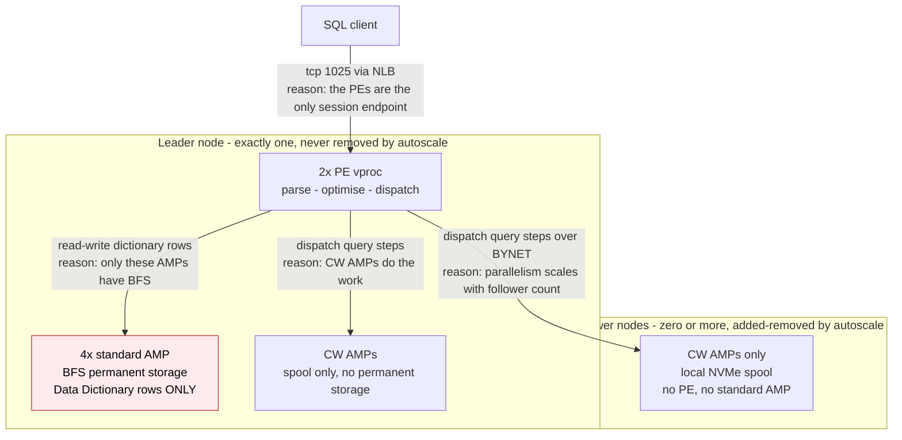
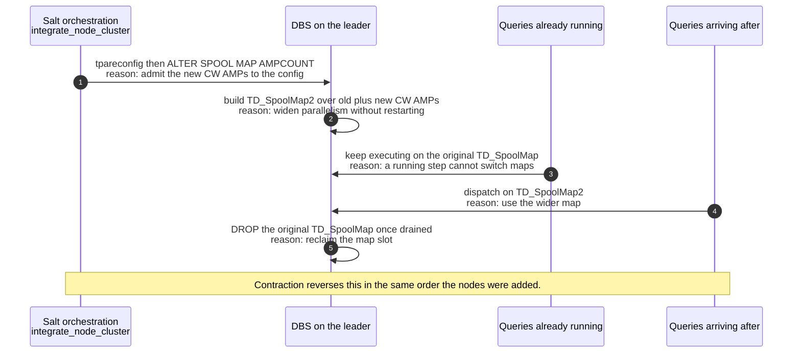
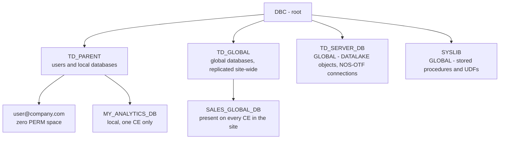

# CE Data Plane — inside the engine, and how database objects survive it

**What this covers:** what actually runs inside a Compute Engine (vprocs, maps, spool),
and the OMS/MCS machinery that makes an ephemeral cluster look persistent to its users.

**Why it exists:** the rest of this corpus documents the *control plane* — who provisions
what, who writes which status. That leaves the SOP's four largest fault domains
under-served: `CE-DEBUG-SOP.md` §4 counts **D3 metadata/MCS/BCM 51** (annotated *"largest
open cluster, least documented"*), **D4 DBS 52**, **D5 data access 229**, **D6 auth 76**.
This document supplies the vocabulary those domains need. Two concrete examples of the gap
it closes: the KB tells you `MCS API returned 400` means a bad `collection_id` without ever
defining a collection ([§6](#6-collections--what-collection_id-actually-names)), and it
quotes `ALTER SPOOL MAP ... AMPCOUNT` / `DROP SPOOL MAP` without saying what a spool map is
or why autoscale has to version one ([§2](#2-maps--and-why-autoscale-versions-the-spool-map)).

> ## Provenance — read before citing anything here
>
> Every other document in `references/` was verified against the service repos. **This one
> was not.** It is derived from internal design documentation, not from code or logs. The
> exact pages are listed in [§13](#13-sources) — the corpus rule is "cite the code path or
> the log line", and where no code path exists, naming the source document is the closest
> honest equivalent. It also makes every claim here falsifiable.
>
> It therefore introduces a fourth marker alongside the three in
> [`CE-KNOWLEDGE-BASE.md` §0](CE-KNOWLEDGE-BASE.md#0-accuracy--code-drift):
>
> | Marker | Meaning | Precedence |
> |---|---|---|
> | **[design-doc]** | Stated in an internal design document. Design intent, which the deployed system may never have matched or may have since diverged from. | Below `[current]` and `[as-deployed]`; above `[inferred]`. |
>
> Unless a claim below is marked otherwise, treat it as `[design-doc]`. Where it collides
> with a code path or a log line, **the code and the log win** — that is the corpus rule
> (`SKILL.md` "Epistemics"), and it is not relaxed for this file. Two known collisions are
> recorded in [§12](#12-conflicts-and-open-questions); resolve them before quoting either
> side in an RCA.

---

## 1. Inside a CE: leader and follower nodes

Every CE has **exactly one leader node** and **zero or more followers**. They are not
interchangeable, and the difference decides the blast radius of losing a node.



| | Leader | Follower |
|---|---|---|
| Parsing Engines | 2 | none |
| Standard AMPs (BFS/permanent) | 4 — Data Dictionary only, never user data | none |
| CW AMPs (spool only) | several | all of them, each with local NVMe spool |
| Removable by autoscale | no | yes |

**Consequences that show up in tickets:**

- **All sessions terminate on the leader.** There is no failover and no session manager; if
  the leader dies, every session dies with it. VantageCloud Lake's Session Manager does
  re-route and restart — CE has no equivalent. Do not import Lake assumptions into a CE
  incident.
- **The 4 standard AMPs are a single point of failure for the dictionary**, and their
  contents do not survive a stop — hence [§5](#5-why-objects-need-omsmcs).
- **Follower loss is survivable capacity loss; leader loss is an outage.** When triaging a
  `DOWN/HARDSTOP` (SOP domain D2), establish which node index died — `001` is the leader.

---

## 2. Maps — and why autoscale versions the spool map

A **map** in Teradata names the set of AMPs that a given piece of work or data lives on. A
CE is created with several, and the optimiser's choice between them is the single biggest
determinant of query performance on a CE.

| Map | Covers | Purpose |
|---|---|---|
| `TD_SpoolMap` | **all** CW AMPs, leader + every follower | Query execution. Widest parallelism, so the optimiser strongly prefers it. |
| `TD_MAP1` | the 4 standard AMPs on the leader | Rows that need BFS storage |
| `TD_DictionaryMap` | the 4 standard AMPs on the leader | Internal Data Dictionary access |
| `TD_GlobalMap` | every AMP in the cluster | Full-cluster operations |

**The performance trap:** a staging table created as a normal table lands on `TD_MAP1` —
**4 AMPs** — while a `VOLATILE` table uses spool and lands on `TD_SpoolMap`, i.e. every CW
AMP in the cluster. On a wide CE that is an order-of-magnitude difference. "Rewrite staging
tables as `VOLATILE`" is not a style preference on a CE, it is how the engine is designed to
be used. Expect this to be the answer to a meaningful share of "the CE is slow" reports
before assuming a defect.

### Spool-map versioning during an expand

This is the mechanism behind the Salt steps the KB quotes but does not explain
(`orch/integrate_node_cluster.sls` runs `tpareconfig` then `ALTER SPOOL MAP ... AMPCOUNT`;
`orch/decommission_node_cluster.sls` runs `DROP SPOOL MAP` — see
[`CE-KNOWLEDGE-BASE.md` F9](CE-KNOWLEDGE-BASE.md#f9--autoscale-expand--contract)).



No query is interrupted by a healthy expand or contract. Two corpus entries are direct
consequences of this design, and both read very differently once you know it:

- **Registry #36** (`suterrcy/awtcat/nodegetgforctgmap/nodegetg` backtrace, REGULUS-3580) —
  the spool map was marked in-use only at dispatch time while the dispatcher compared step
  map numbers against the *live* GDO GlobalVersion, so an online reconfiguration could drop
  the map between planning and execution. That is exactly the window between steps 2 and 5
  above.
- **`QUERY_DRAIN_TIMED_OUT`** in the F9 state machine is step 5 failing to complete: a
  long-running query never released the original map, so it could not be dropped.

---

## 3. The entry point is not a router

Every CE sits behind a Network Load Balancer, and it is worth being explicit about how
little that NLB does:

- **It does:** forward client traffic (DNS name to current IP to leader PE). Layer-4
  pass-through.
- **It does not:** route intelligently, balance across PEs, or fail over. A dead leader is a
  dead session.

**DNS name is stable, IP is not.** The CE's DNS name persists across every stop/start; the
IP changes on every reprovision. A client or ETL job that pinned the IP will fail after the
next resume, and it will look like a network defect (SOP domain D6/D1) when it is a client
configuration problem. Ask what the client connects to before opening an investigation.

---

## 4. Workload management: the FirstConfig ruleset

Every CE carries a **subset** of TASM called the **FirstConfig ruleset** — not full TASM:

- All work runs at **medium priority** by default.
- A small number of rules govern concurrency by query count and memory use.
- Four priority buckets exist, but reaching anything other than medium requires the
  administrator to assign **account strings** to users.
- Workload-management APIs are available for additional workloads, throttles and filters.
- Full TASM (complex classification, exception actions, SLO tracking) is **not** available.

This is the ruleset `CE-DEBUG-SOP.md` §5 has in mind when D4 evidence collection asks for
"TDWM/TASM rulesets". Note the SOP's related warning that `ctl`/`xctl`/`dbscontrol` settings
**legitimately differ between pooled and dedicated** (COG-15055) — a diff is not by itself a
finding.

---

## 5. Why objects need OMS/MCS

A CE has no persistent block storage except the leader's 4 dictionary AMPs, and those are
released when the engine stops. Without intervention every view, UDF, macro, authorization
object and foreign-table definition would have to be recreated by hand on every start.

**OMS + MCS are the answer: a version-control system for database objects.**

| Service | Expansion | What it does | Where it runs |
|---|---|---|---|
| **MCS** | Metadata Capture Service | Hooks the engine's **RSG vproc** (Relay Services Gateway), which relays DDL off the node as it executes. Captures the object, checks for name conflicts across the **VSG** (Virtual System Group), forwards JSON to OMS. On provisioning it replays DDL/DCL back onto the new CE in creation order. | On the OMS VM, inside the site — **not** global |
| **OMS** | Object Metadata Service | REST API over **MongoDB** (CSP-managed, one per site). Durable store of object definitions, organised into collections. | One instance per site, co-located with MCS on the same VM |

Co-locating them on one VM is deliberate: it keeps networking and credential management
simple and improves isolation. External callers (GCS) reach OMS through the **VCE Site
Gateway** over OAuth2/JWT; internal OMS-to-MCS traffic uses **mTLS**.

```mermaid
flowchart LR
    USER["Data Curator SQL session"]
    RSG["RSG vproc - Relay Services Gateway<br/>relays DDL off the node"]
    MCS["MCS"]
    VSG{"name unique<br/>across the VSG?"}
    OMS[("OMS<br/>MongoDB, one per site")]
    MCS2["MCS replay"]
    CE2["Freshly provisioned CE"]

    USER -->|"CREATE VIEW - UDF - PROC - AUTH - FOREIGN TABLE<br/>reason: user defines an object"| RSG
    RSG -->|"emit object metadata<br/>reason: nothing in the dictionary survives a stop"| MCS
    MCS --> VSG
    VSG -->|"no - reject<br/>reason: global names must stay unique"| MCS
    VSG -->|"yes - POST object JSON<br/>reason: durable store outside the engine"| OMS
    OMS -->|"replay set in creation order<br/>reason: dependencies must exist first"| MCS2
    MCS2 -->|"submit DDL and DCL<br/>reason: rebuild the dictionary on new hardware"| CE2
```



Capture is automatic and continuous. No administrator triggers it. **The CE is stateless
infrastructure that MCS makes look stateful.**

**Why the RSG.** The Relay Services Gateway is a stock Teradata vproc, one per node, whose
documented job is exactly this: the database hands it a DDL statement and it forwards the
statement over TCP to an external metadata service. Teradata's own Meta Data Services uses
the same path. MCS is not a bespoke hook into the engine — it is a consumer of an existing
relay, which is why object capture needs no engine modification. `[current]` for the vproc's
role (public Teradata documentation); `[design-doc]` for MCS being the consumer.

The VSG conflict check is worth remembering during D3 triage: the KB records
`MCS API returned 400` as meaning *"duplicate registration, bad `address`/`collection_id`/
`engine_id`, or the site not in a valid MCS state"*
([`CE-KNOWLEDGE-BASE.md` F6](CE-KNOWLEDGE-BASE.md#f6--post-provisioning-oms-querygrid-viewpoint-stc-copy-secret)).
"Duplicate registration" is this check firing.

---

## 6. Collections — what `collection_id` actually names

OMS stores objects in **collections**, and there are exactly two kinds:

| Collection | Scope | Created by | Example |
|---|---|---|---|
| **CE collection (local)** | 1:1 with one CE config | any authorised Data User / Curator, via SQL | a VIEW that exists only on CE1 |
| **Global collection** | replicated to **every** CE in the site | Org/Site Admin, via the Console | a shared AUTHORIZATION object or VIEW available everywhere |

A CE registering with OMS is registering *a collection binding*. That is the field in the
400 the KB reports and does not explain — a malformed or mismatched `collection_id` means
the CE and OMS disagree about which collection this engine is bound to. Registry rows **#2**
(`MCS API returned 400` on pooled start) and **#22a** (`Disconnected` + `Pending: Active`)
both live on this path.

---

## 7. The database hierarchy on every CE



**PERM space is allocated explicitly**, and it is scarce: the source says permanent tables
have only **~60 GB** available, without stating whether that ceiling is per database, per CE,
or the whole PERM allocation — establish the scope before quoting the number. Space flows
`DBC -> TD_GLOBAL -> global databases -> TD_PARENT -> local databases -> user databases`.
To move it:

```sql
CALL TD_GLOBAL.ChangeSpace('database_name', bytes, :msg);
```

Requires the Admin role — or Data Curator while Admin is disabled ([§10](#10-known-limitations--check-here-before-opening-an-investigation)).

---

## 8. Roles

Three RBAC roles are created on every CE at provisioning. There are **no locally
authenticated users** — no DBC-managed passwords; every identity arrives from the customer
IdP over OIDC, optionally with SCIM group sync.

| Console role | Database role | Can |
|---|---|---|
| **Data User** | `TD_ACCESS` | SELECT, EXECUTE, INSERT/UPDATE/DELETE on granted objects. Cannot create schema objects. |
| **Data Curator** | `TD_CREATOR` | Data User plus create databases, views, UDFs, procedures, DATALAKE and AUTHORIZATION objects under `TD_PARENT` and `TD_SERVER_DB`. |
| **Admin** | `TD_ADMIN` | Data Curator plus PERM-space adjustment and privilege elevation. |

**Service accounts** are a `clientID` from the customer IdP, added with a role, connecting
with `LOGMECH=CRED`, `LOGMECH=BEARER` or `LOGMECH=SECRET`.

This is the role vocabulary behind SOP domain **D6**, whose evidence step asks for "grants
present in `dbc` vs expected" — the expectation is a role grant at database scope, per
[§9](#9-the-persistence-contract).

---

## 9. The persistence contract

The rule to give any user who asks: **anything you want to keep must live in object storage
or be tracked by OMS.** Permanent tables are neither.

| Survives a stop/start | Does not survive |
|---|---|
| VIEWs, UDFs, stored procedures, macros | data in PERMANENT tables inside the CE |
| AUTHORIZATION objects (object-store credentials) | DBQL / session / event logs (purged every 6 h) |
| FOREIGN SERVER and DATALAKE objects (Iceberg/NOS connections) | UDFs compiled with the shared-library prefix (`SL`) |
| GLOBAL databases and their access rights | grants made to a **user**, or at **object** scope |

Two rules follow directly, and both are common support answers:

1. **Grant `ACCESSRIGHTS` to a ROLE at DATABASE level.** Grants to an individual user, or on
   an individual object, are not replayed and vanish on the next start.
2. **An INVOKER `DATALAKE` object inherits the reach of its AUTH object.** Put the AUTH
   object in a LOCAL database and the DATALAKE exists on that one CE only; put it in a
   GLOBAL database for it to appear on every CE in the site.

Objects are recreated **just-in-time** during start, so a query issued seconds after the
console says Running may fail on an object that has not been replayed yet. That is expected
behaviour, not a defect.

---

## 10. Known limitations — check here before opening an investigation

A set of documented behaviours — grants that were never going to survive, dotted database
names, `SL`-compiled UDFs, just-in-time repopulation, purged DBQL — produce symptoms
indistinguishable from D3/D6 defects and account for a large share of "objects are missing"
reports.

**They live in [`CE-SIGNATURE-REGISTRY.md`](CE-SIGNATURE-REGISTRY.md), section *Documented
product limitations*, not here.** That is deliberate: dedup (SOP step S2) is a single grep of
the registry, and one canonical copy cannot drift from the other. The registry rows carry the
confirm step and the Jira key; [§9](#9-the-persistence-contract) above explains *why* they
happen, which is what stops the next one being a surprise.

OMS GA-readiness work is tracked under epic **COG-12376**.

---

## 11. Triage hooks

Where this document plugs into `CE-DEBUG-SOP.md`:

| Domain | Read first | For |
|---|---|---|
| **D2** on-host | [§1](#1-inside-a-ce-leader-and-follower-nodes) | Which node died, and whether that is capacity loss or an outage |
| **D3** MCS/BCM | [§5](#5-why-objects-need-omsmcs), [§6](#6-collections--what-collection_id-actually-names), [§9](#9-the-persistence-contract), [§10](#10-known-limitations--check-here-before-opening-an-investigation) | What was supposed to be replayed, and whether the symptom is a documented limitation |
| **D4** DBS | [§2](#2-maps--and-why-autoscale-versions-the-spool-map), [§4](#4-workload-management-the-firstconfig-ruleset) | Map selection, spool-map versioning during autoscale, priority |
| **D5** data access | [§9](#9-the-persistence-contract) | Whether the AUTH/DATALAKE object should exist on this CE at all |
| **D6** auth | [§8](#8-roles), [§9](#9-the-persistence-contract) | What grants should be present, and at which scope |

---

## 12. Conflicts and open questions

Resolve these against code or a current design owner before quoting either side in an RCA.

1. **OMS expansion.** This document says **Object** Metadata Service, from the OMS API and
   "Database Objects" design pages. `CE-KNOWLEDGE-BASE.md` §10.1 says *Operations Management
   System*. The KB's own functional gloss ("CE registration / Unity metadata + CDC")
   describes object capture, and KB §10.3 states the OMS repo was never in the verified
   workspace — so the KB expansion was never code-checked. Treat *Object Metadata Service*
   as more likely correct, but confirm.
2. **LMO expansion.** Design docs give *Last Minute Orchestrator* (an internal nickname) with
   the formal name *Global Orchestration Service*. The KB says *Lifecycle/Management
   Orchestrator*. Unresolved.
3. ~~**`DSA`.**~~ **Resolved.** `DSA` is **Data Stream Architecture**, Teradata's
   backup/archive/restore (BAR) stack — not "Dictionary Space Archive" or "Dictionary Space
   Analyzer", both of which appear in the design docs and are wrong. Notably the **RSG vproc
   provides the socket interface DSA uses**, so the same relay underpins both the archive
   path and the DDL-capture path. That makes the restore question in §12.5 sharper, not
   vaguer.
4. **Node counts.** "2 PEs and 4 standard AMPs on the leader" is a design-document constant.
   It has not been confirmed against a running CE at every size, and sizes run 1x to 32x.
5. **Two restore mechanisms are described, and never reconciled.** §5 above documents the
   OMS/MCS path: MCS replays captured DDL onto the new engine. The CMS design page instead
   gives a four-step provisioning order in which step 3 is a **dictionary restore from a DSA
   archive** and step 4 is DDL replay for users and authorization objects — with views,
   macros and UDFs attributed to the DSA archive rather than to OMS.

   Now that `DSA` is known to be Data Stream Architecture (a real Teradata BAR product, not a
   documentation typo), the likeliest reading is that the two are **complementary**: an
   archive restores the dictionary wholesale, and DDL replay layers on the objects that must
   be reconstructed per-CE. But that is `[inferred]`, and the split decides a real
   investigation — "my view did not come back" is a different hunt depending on whether views
   travel by archive or by replayed DDL, and the two mechanisms fail in different places.
   **Establish which path owns which object type before concluding anything about missing
   objects.** This is the highest-value open question in this file.

**Not covered here:** SCOrch, CIDS, Valtix, ServiceNow and Viewpoint internals (see
`CE-KNOWLEDGE-BASE.md` §10.3); the QueryGrid *provisioning* sequence (see
`CE-PROVISIONING-DEPROVISIONING.md` §10.1) and its runtime topology (see
`CE-KNOWLEDGE-BASE.md` F6).

---

## 13. Sources

The design documents this file was built from. Confluence pages are in the **CLDI** space;
cite them by ID, since titles get renamed. Verify against these before trusting anything
marked `[design-doc]`, and prefer the code if you have it.

| Page ID | Document | Supplied |
|---|---|---|
| 759893960 | CE Metadata Service — Database Objects (CMS/OMS deep dive) | §5–§9: capture and replay, collections, hierarchy, roles, the persistence rules |
| 849774462 | CE Object Metadata Service (OMS) — API spec | §5–§6: OMS as a REST/MongoDB service, collection model |
| 535004638 | AIU — Unified Architecture for Cloud Enterprise and Lake | Why one architecture serves both VCE and VCL sites |
| 604043454 | Global Compute Service | GCS role model and API surface |
| 579567617 | Unified Pooling for AIU Compute Engines | Warm-pool design, instance-type policy, capacity reservations |
| 768558083 | Compute Engines Standard Deployment — Networking Requirements & Design | Three-phase network build; account boundaries in KB §2.5 |
| 713917748 / 707462310 / 731059421 | AWS Architecture / Azure Architecture / Internet Connectivity | Per-cloud instance types and connectivity options |
| 1184006312 | Global Orchestration Service (LMO) | LMO deployment and workflow model |
| 663850010 | Compute Engine Metadata Service — Initial Release WIP | What CMS stores, including the disputed restore order in §12.5 |
| 516731689 | AIU Compute on VCE Architecture | The original POC-era design |
| 910327882 | 2.0 Architecture | The planned event-driven successor to today's synchronous provisioning. **Not deployed** — do not describe it as current behaviour |
| D043941 | Compute Engine Basics: The Architecture and How it Works (internal, Nov 2025) | §1–§4: vprocs, the map system, spool-map versioning, the NLB's non-role, FirstConfig |

Also: the Elastic Compute **Admin** and **Database** user guides, and the Cloud Elastic
Compute OCI deck (SharePoint, not linked here — they live under personal drives; ask the
doc owner). Those three are the customer-facing view and the source for the product-level
limitations in §10.
