# Teradata VantageCloud Lake — Compute Engine (CE) Knowledge Base

> **What this is.** A single consolidated reference for everything learned about the Compute
> Engine platform across **232 pi coding-agent sessions** (2026-05-15 → 2026-08-03) spanning
> **21 project directories** under `~/workspace/compute-engine`. It explains **how the CE
> functionality actually works, flow by flow**, and records the incidents, root causes,
> defects and operational recipes that were discovered along the way.
>
> **Ground rule used throughout.** Every claim below was derived from source code, live
> CloudWatch logs, DynamoDB items or Jira during a session — not from README/spec files
> (those were repeatedly found to be stale, see §9.4). Where something is inferred rather
> than proven, it is explicitly flagged **[inferred]**.

---

## How to use this document

| If you want to… | Go to |
|---|---|
| Understand the system in 5 minutes | [§1 Orientation](#1-orientation) + [§2.1 labelled call graph](#21-control-plane--labelled-call-graph) |
| See what a customer's SQL actually traverses | [§2.2 Data plane](#22-data-plane--what-a-sql-client-actually-traverses) |
| Know who owns which piece of state | [§2.3](#23-who-owns-which-piece-of-state) then [§5](#5-state-models-the-vocabulary-problem) |
| Trace one specific flow end-to-end | [§4 The flows](#4-the-flows) — F1…F20 |
| Know which status means what, and who writes it | [§5 State models](#5-state-models-the-vocabulary-problem) |
| Debug a live CE that is stuck/failed | [§7 Incident casebook](#7-incident-casebook) then [§8 Runbook](#8-operational-runbook) |
| Find the AWS account / log group / table / endpoint | [§8.1](#81-account--environment-map) and [§8.2](#82-where-the-logs-and-data-live) |
| Know what changed since the incidents were investigated | [§0 Accuracy & code drift](#0-accuracy--code-drift) and [§5.6](#56-behaviour-changes-you-must-know-about) |
| Know what is broken by design | [§9 Defect & design-gap register](#9-defect--design-gap-register) |
| Know what this document does *not* cover | [§10.3 Known limits](#103-known-limits-of-this-document) |

**Companion documents in this repo** (deeper, narrower):

| Document | Covers |
|---|---|
| `CE-PROVISIONING-DEPROVISIONING.md` | Repo-by-repo provisioning/deprovisioning walkthrough, API matrix, CFN/Salt/Packer detail |
| `CE-LIFECYCLE-AND-AUTOSCALE-ANALYSIS.md` | Exhaustive notification catalogue (H1–H29, A1–A13), the six state machines, autoscale internals, the "degraded" defect chain |
| `diagrams-mermaid-code.md` | 8 architecture/sequence diagrams |
| `script/log-extract/ce-provisioning-sequence.md` | The single provisioning sequence diagram (OMS wait + QG independence) |
| `script/log-extract/ce-failure-decision-tree.md` | Failure decision tree (which component failed → what status) |

This KB is the **umbrella**: it summarises those, adds everything they don't cover
(onboarding/identity, incidents, runbooks, cross-service auth), and cross-references them.

---

## 0. Accuracy & code drift

This document contains two kinds of statement, and mixing them up will mislead you:

| Marker | Meaning |
|---|---|
| **[as-deployed]** | The behaviour observed **in the incident**, on the code that was running in that environment at that time (mostly June–July 2026 preprod). This is what the logs show. |
| **[current]** | The behaviour in the **checked-out working tree** at the time of the last verification pass. |
| **[inferred]** | Not proven — a hypothesis consistent with the evidence. |

**Why this matters:** several incidents in §7 have since been fixed, and the fix *changed the
state machine*. If you read only the incident description you will debug the wrong system.
The most important example is the pooled OMS gate — see [§5.6](#56-behaviour-changes-you-must-know-about).

### Verification stamp (last pass)

| Repo | Branch checked out | Last commit date |
|---|---|---|
| `cog-global-compute` | `GPSC-3907` (fork of `ga2base`) | 2026-07-29 |
| `accp-metadata-service` | `gav2-release` (`version-1.1.2`) | 2026-07-28 |
| `accp-network-service` | `azurepreprod` (`version-2.0.0-rc1`) | 2026-07-12 |
| `svc-vce-lmo` | `oms-preflight-checks` | 2026-07-09 |
| `cog-compute-engine-pooling-service` | `azure-preprod-v2` | 2026-07-22 |
| `cog-compute-metering` | `main2` (`2.6.4`) | 2026-06-23 |
| `cog-compute-engine-autoscaler` | `main` (`v1.0.6`) | 2026-07-27 |
| `avcd-vce-engine-configure` | `develop` | 2026-05-26 |
| `avcd-vce-engine-provision` | `master` (`v0.2.18`) | 2026-04-06 |

> ⚠️ **Line numbers drift between branches.** All `file.go:NNN` references are anchors for
> `grep`, not addresses. Search for the quoted symbol or comment instead. Where a reference was
> re-verified in the working tree it is marked ✅; where the symbol has since been renamed or
> removed it is marked ⚠️.

---

## 1. Orientation

### 1.1 What a Compute Engine is

A **Compute Engine (CE)** is an on-demand Teradata database cluster (TDBMS on EC2/Azure VMs)
that runs inside a customer **VantageCloud Lake "site"**. Each CE is described by a
**Compute Engine Config** stored in the **Metadata Service**, and is realised by one of two
**provisioner backends**:

| Provisioner | Backend | Tenancy | Realised by |
|---|---|---|---|
| **STANDARD / DEDICATED** (`SCORCH`) | SCOrch launches a per-CE "lifecycle container" that runs CloudFormation/Bicep | Single-tenant | `avcd-vce-engine-provision` container → per-CE CFN stack of EC2 instances |
| **POOLED** | Pooling Service allocates nodes out of a warm EC2 Auto Scaling Group | Multi-tenant warm pool | `cog-compute-engine-pooling-service` → detaches pooled instances into a cluster |

Every request enters through the **Global Compute Service (GCS)**, which reads the config
and branches on `compute.type` (`router_helper.go:127`): `POOLED` → Pooling Service,
anything else → SCOrch.

### 1.2 Key identifiers (you will see all of these in logs)

| ID | Shape | Meaning |
|---|---|---|
| `site_id` | `TDICAM00000EX01`, `ESAZ00000EXAZ01` | The VantageCloud Lake site. `TDICAM`=AWS site, `TDICAZ`/`ESAZ`=Azure. Partition key for most data |
| `config_id` / **CE Site ID** | `CEAMEXAMPLE10001X`, `CEAZEXAMPLE10001A` | 17-char ID minted by Metadata Service: `CE` + platform (`AM`=AWS, `AZ`=Azure) + 8-char org name + base36 counter |
| `cluster_id` / `component_id` | UUIDv7 (`019f7e96-5a80-…`) for pooled, `comp_xxx` for SCOrch | The realised cluster / SCOrch component |
| `org_name` / `ERP` | `<ORG_NAME>` / `<ERP>` | Customer organisation and its ERP number |
| `run_id` | UUID | An **LMO** workflow run |

### 1.3 Service catalogue (14 repos + the externals)

| # | Repo | Runtime | Role in the CE lifecycle | Writes CE status? |
|---|---|---|---|---|
| 1 | **`cog-global-compute` (GCS)** | Go; Lambdas `api`, `authorizer`, `status-monitor`, `privatelink-monitor`, `whitelist-ip`, **`health-monitor{,-discover,-trigger,-poll,-report,-quota}`**, **`rca-poller`** + ECS Fargate `scheduler` | **Central control plane.** Routes create/start/stop/delete, reconciles status, drives OMS/QG/VP/PrivateLink, runs schedules & auto-suspend, **fleet health monitoring, resource-quota tracking, RCA orchestration, gateway auto-remediation, and the Global Database (DB-Admin) API** | **Yes** — its own DynamoDB `status` **and** metadata `state` |
| 2 | **`accp-metadata-service`** | Go; API-GW Lambda + `event-processor`, `config-change-processor`, `deletion-poller`, `org-sync-processor` | **Canonical config store**; owns org/site onboarding, CE-Site-ID minting, network kick-off, **and hosts the metering event processor** | **Yes** — `state`, autoscale fields, infra snapshot |
| 3 | **`cog-compute-engine-pooling-service`** | Python Litestar + ALB on ECS Fargate; PostgreSQL + `pgmq` | **Pooled cluster manager**: warm pools, leader claim, node config, OMS trigger, DNS/PrivateLink, **ML-based warm-pool capacity forecasting**, pool accounting | **Yes** — own PG `cluster.state`; pushes to GCS; PATCHes metadata |
| 4 | **`accp-network-service` (GNS)** | Go; ECS Fargate `:8080` | Per-site VPC/subnets/NAT/SG/OMS-NLB/endpoint-service; per-CE PrivateLink + NLB target registration; Valtix; Site-Gateway ingress | PATCHes `compute.connectivity` |
| 5 | **`svc-vce-lmo` (LMO)** | Python Litestar (Granian `:8000`) + Celery on ECS Fargate; **SQS-FIFO broker + Redis result backend** | **Async flow engine**: `ce-postprovisioning` (QG+VP+STC), OMS create/delete, secret copy/delete/rotate, manifest sync, health checks | Indirect (run outputs + signed webhooks) |
| 6 | **`cog-compute-metering`** | Python systemd agent **on the engine leader node** | Emits CE state + autoscale events to **SNS** every 5 min; hosts `127.0.0.1:23000/scale` for the autoscaler | **Yes, indirectly** — sole writer of `STOPPED` |
| 7 | **`avcd-vce-engine-provision`** | Bash container + CFN/Bicep/Terraform, launched by SCOrch | Actually provisions/destroys **one dedicated CE** (`COMPONENT_JOB_TYPE=CREATE/DELETE`) | No (drives SCOrch component status) |
| 8 | **`avcd-vce-engine-configure`** | SaltStack → RPMs | Engine bootstrap states + the **autoscale expand/contract orchestrations** + `cluster:state` grain + `state.idp` | Engine-local only |
| 9 | **`avcd-vce-engine-packer`** / **`avcd-vce-image-bom`** | Packer HCL / YAML + Odin | Bakes the multi-cloud engine image from the BOM; ships `avcd-healthcheck-service` and `ce-autoscaler` RPMs | No |
| 10 | **`workspaces-event-scheduler` (WES)** | Go; on the engine, gRPC `:50051` + REST `:50061` | Idle detection → auto-suspend POST to GCS; telemetry (Parquet via `WRITE_NOS`) + crashdumps | No (triggers stop) |
| 11 | **`mcld-mariners_vce-dns-service`** | Python; Chalice proxy → FastAPI Lambda + Route53 | CE endpoint DNS records (A/CNAME/TXT) | No |
| 12 | **`ce-agent`** | Go + Bedrock; ECS Fargate; A2A + MCP + REST | LLM agent for CE ops, onboarding/offboarding and RAG over CE docs. **Not read-only** — has `start_cluster`/`stop_cluster` | Indirect |
| 13 | **`ce-assistant`** | Go + Bedrock; ECS Fargate | Read-only sizing/cost advisory | No |
| 14 | **`cog-ce-diagnostic-agent`** | Python + Bedrock; Streamlit app + VS Code Copilot agent; ECS/EC2 | Cross-account **RCA investigation engine**. GCS's `rca-poller` submits investigations here and polls for results | No |
| 15 | **`cog-compute-engine-autoscaler`** | Go daemon (RPM + systemd) **on the engine leader** | The `ce-autoscaler`: scrapes Teradata metrics, evaluates step-scaling gates, drives Salt orchestration + cloud scaling groups (ASG / VMSS fleet / MIG) | No (drives `cluster:state` indirectly) |

**External / platform services:** SCOrch (via **Site Gateway** `https://{site_id}.gateway[.{env}].cloud.<CORP_DOMAIN>`),
**OMS** (`/oms/ce-admin/v1`), **QueryGrid**, **MCS**, **CIDS** (RBAC), **Ping Identity / SSO**,
**SCIM**, **Valtix** (firewall/egress), **ServiceNow** (CMDB — site records, cloud account, pooled-site
availability), **CSM** (Central Secrets Manager), **Viewpoint**, **STC**, **Artifactory + Odin**.

### 1.4 The one-paragraph mental model

> A user asks **GCS** to start a CE. GCS reads the config from the **Metadata Service**
> (including live IdP settings and user→role mappings), and hands it to **SCOrch** (dedicated)
> or the **Pooling Service** (pooled). Those bring up EC2 nodes running the baked engine image,
> which configure themselves with **Salt**. Once compute is up, GCS asks **LMO** to run
> post-provisioning (QueryGrid + Viewpoint + STC), while OMS registration happens on its own
> track. GCS reconciles all of this into two stores — **its own DynamoDB row** and the
> **Metadata config `state`** the console renders. Meanwhile an on-node **metering agent**
> publishes health/state to SNS every 5 minutes, which the Metadata Service consumes and —
> critically — **writes straight back into the same `state` field**. Most production incidents
> in this KB are consequences of that last sentence.

---

## 2. Architecture at a glance

Four views of the same system. Read them in order: **who talks to whom and why** (2.1),
**what the customer's traffic actually traverses** (2.2), **who owns which state** (2.3), and
**which repo produces which runtime artefact** (2.4).

### 2.1 Control plane — labelled call graph

Every arrow is a real call, labelled with the API and the reason it exists.

```mermaid
flowchart TB
    subgraph EXT["Actors"]
        U["Vantage Console / REST client / ce-agent"]
        PING["Ping Identity - SSO<br/>issues customer + service-account JWTs"]
    end

    subgraph CP["Control plane"]
        GCS["<b>GCS</b> cog-global-compute<br/>api - authorizer - status-monitor<br/>privatelink-monitor - whitelist-ip<br/>scheduler - health-monitor - rca-poller"]
        MD["<b>Metadata Service</b> accp-metadata-service<br/>configs - orgs - sites - CE Site ID<br/>event-processor - deletion-poller<br/>config-change-processor - org-sync"]
        LMO["<b>LMO</b> svc-vce-lmo<br/>Celery flow engine"]
        POOL["<b>Pooling Service</b><br/>warm ASG pools - PostgreSQL - pgmq"]
        GNS["<b>GNS</b> accp-network-service<br/>VPC - NLB - PrivateLink - Valtix"]
        DNS["<b>DNS Service</b><br/>Route53 A/CNAME/TXT"]
    end

    subgraph PLAT["Platform / external systems"]
        SCORCH["SCOrch<br/>via Site Gateway"]
        OMS["OMS ce-admin<br/>then MCS"]
        QG["QueryGrid"]
        CIDS["CIDS RBAC<br/>+ SCIM"]
        SNOW["ServiceNow CMDB"]
        VALTIX["Valtix egress firewall"]
        VP["Viewpoint / STC"]
        DIAG["cog-ce-diagnostic-agent<br/>Bedrock RCA"]
    end

    subgraph ENG["Engine nodes - the CE itself"]
        SALT["Salt states<br/>avcd-vce-engine-configure"]
        HC["avcd-healthcheck-service<br/>:22222"]
        MET["metering agent<br/>leader only"]
        AS["ce-autoscaler<br/>leader only"]
        WES["event-scheduler<br/>:50061"]
    end

    U -->|"POST /clusters - DELETE /clusters<br/>POST-PATCH /configs - PATCH /site-settings"| GCS
    PING -->|"JWKS - validate customer JWT"| GCS
    GCS -->|"CIDS resolve - is caller allowed<br/>compute_engine:start_stop"| CIDS

    GCS -->|"GET provisioning-config - SA token<br/>PATCH state - PUT infrastructure"| MD
    GCS -->|"POST-DELETE scorch/v2/components<br/>dedicated CE create-delete"| SCORCH
    GCS -->|"POST-PUT-DELETE v1/clusters<br/>pooled CE create-start-stop"| POOL
    GCS -->|"POST flows/ce-postprovisioning<br/>QG + Viewpoint + STC"| LMO
    GCS -->|"DELETE compute-engines<br/>dedicated OMS deregister"| OMS
    GCS -->|"assume CEAutoRemediationRole<br/>restart stopped SCOrch-QG EC2"| SCORCH
    GCS -->|"TriggerRCA on degraded service"| DIAG

    MD -->|"POST-DELETE /networks<br/>site VPC build-teardown"| GNS
    MD -->|"POST flows metadata-create<br/>oms-deprovision"| LMO
    MD -->|"roles-map - service principals<br/>resolve group users"| CIDS
    MD -->|"site record - cloud account<br/>checkPoolingSite availability"| SNOW
    MD -->|"PUT egress - allow JWKS fetch<br/>to customer IdP"| VALTIX
    MD -->|"PATCH connectivity - regional<br/>network propagation"| POOL

    POOL -->|"POST /clusters/status<br/>status + oms_status callback"| GCS
    POOL -->|"POST flows/oms-ce-registration"| LMO
    POOL -->|"create-delete CE DNS record"| DNS
    POOL -->|"PATCH dns_name + connectivity"| MD

    LMO -->|"create qg component<br/>QG_OPERATION register"| QG
    LMO -->|"register-deregister compute engine"| OMS
    LMO -->|"register-deregister monitored system"| VP
    LMO -->|"setup-callback HMAC signed"| MD

    SCORCH -->|"launch provision container<br/>CloudFormation - Bicep"| ENG
    POOL -->|"POST /poolclusterconfig<br/>to on-node listener"| ENG

    HC -->|"cluster-health - dbs-state"| MET
    AS -->|"POST :23000/scale"| MET
    MET -->|"SNS COMPUTE_ENGINE_STATE<br/>every 300s from leader"| MD
    WES -->|"POST suspend event<br/>on idle"| GCS
    AS -->|"salt-run decommission_queue<br/>ASG SetDesiredCapacity"| SALT

    classDef cp fill:#e3f2fd,stroke:#1565c0,color:#000
    classDef plat fill:#fff3e0,stroke:#e65100,color:#000
    classDef eng fill:#e8f5e9,stroke:#2e7d32,color:#000
    class GCS,MD,LMO,POOL,GNS,DNS cp
    class SCORCH,OMS,QG,CIDS,SNOW,VALTIX,VP,DIAG plat
    class SALT,HC,MET,AS,WES eng
```

### 2.2 Data plane — what a SQL client actually traverses

The control plane above never carries customer queries. This is the path that does, with the
real ports and target-group names from `accp-network-service` `TargetGroupDefinitions`.

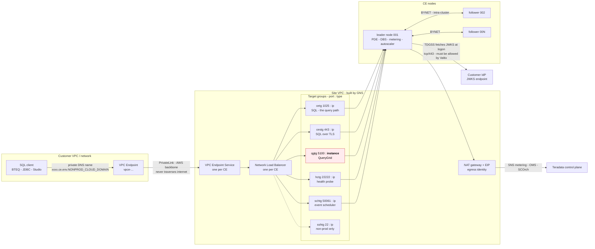

> **Why `qgtg` is highlighted:** it is the only target group registered by **instance ID**
> rather than IP. That single difference is the entire reason for the incident in [§7.8](#78-querygrid-target-registration-fails-only-for-query-grid--the-expandnlbzones-bug).

### 2.3 Who owns which piece of state

The single most useful diagram for debugging. Solid = authoritative write, dashed = derived
or best-effort.

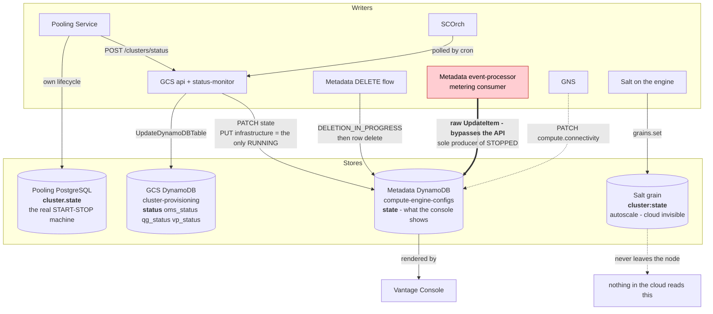

### 2.4 Repo to runtime artefact to responsibility

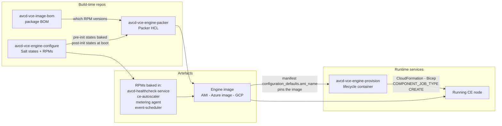

---

## 3. Environments

| Env | GCS | Metadata Service | Pooling service (region-templated) |
|---|---|---|---|
| `dev` | `https://dev.globalcompute.<NONPROD_CLOUD_DOMAIN>` | `https://dev.metadata-service.<NONPROD_CLOUD_DOMAIN>` | `https://main.%s.aws.dev.compute.<NONPROD_CLOUD_DOMAIN>` |
| `qa` | `https://qa.globalcompute.<NONPROD_CLOUD_DOMAIN>` | `https://qa.metadata-service.<NONPROD_CLOUD_DOMAIN>` | `https://main.%s.aws.prod.compute.<NONPROD_CLOUD_DOMAIN>` |
| `preprod` | `https://preprod.globalcompute.<NONPROD_CLOUD_DOMAIN>` | `https://preprod.metadata-service.<NONPROD_CLOUD_DOMAIN>` | `https://main.%s.aws.preprod.compute.<NONPROD_CLOUD_DOMAIN>` |
| `azurepreprod` | `https://azurepreprod.globalcompute.<NONPROD_CLOUD_DOMAIN>` | `https://azurepreprod.metadata-service.<NONPROD_CLOUD_DOMAIN>` | `https://main.%s.aws.azurepreprod.compute.<NONPROD_CLOUD_DOMAIN>` (Azure resolves from a **secret** + runtime region) |
| `prod` | `https://globalcompute.<PROD_CLOUD_DOMAIN>` | `https://metadata-service.<PROD_CLOUD_DOMAIN>` | `https://main.%s.aws.prod.compute.<PROD_CLOUD_DOMAIN>` |

`%s` is the **site's region** — `GetPoolingServiceURL(env, cloud, region)` ✅. Sending a site's
request to the wrong region's pooling service was a real bug (§F5).

**SCOrch environment normalisation** (`NormalizeEnvironmentForScorch` ✅): `qa` and
`azurepreprod` both collapse to **`preprod`**; anything unrecognised collapses to **`dev`**.
So the Site-Gateway host for an `azurepreprod` CE is `...gateway.preprod.cloud.<CORP_DOMAIN>`.

Other per-env endpoints seen: CIDS `https://{env}.cids.<NONPROD_CLOUD_DOMAIN>` (prod:
`https://prod.cids.<PROD_CLOUD_DOMAIN>`), SSO `https://sso-api-{env}.iam.<IAM_DOMAIN>/api`,
GNS `https://{env}.global-network-service.<NONPROD_CLOUD_DOMAIN>` (prod:
`https://prod.global-network-service.<PROD_CLOUD_DOMAIN>`), Ping token URLs
`https://login-dev.qacustomer.<CORP_DOMAIN>/as/token.oauth2` and
`https://login-stage.cloud.<CORP_DOMAIN>/as/token.oauth2`.

> ⚠️ **`azurepreprod` is a genuinely separate deployment**, not a flag. Several incidents
> (§7.5, §7.11) were "works on preprod, fails on azurepreprod" because a role, secret or
> URL existed only in the `preprod` stack. Always confirm **which stack** before comparing.

---

## 4. The flows

Twenty flows cover essentially everything the platform does. Each is presented as:
**trigger → sequence → gates → what can go wrong → where to look**.

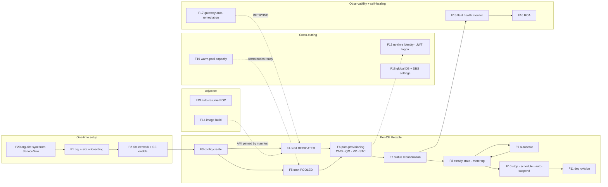

---

### F1 — Site & organisation onboarding (the hard prerequisite)

Nothing can be created until the site is onboarded. There are **two layers**, frequently
confused; the distinction matters because they have different owners.

**Layer A — Teradata-operations prerequisites (not self-service):**

1. Organisation registered in the Metadata Service (`GET /organizations?erp=<erp>`)
2. Site registered in the Metadata Service (`GET /sites/{site_id}`)
3. GCS entitlement for the ERP
4. Site BOM-stamped / provisioned
5. **Site record present in ServiceNow CMDB** (`u_cmdb_ci_siteid`, `u_asset_siteid`) — this
   supplies `u_cloud_account_id` and is read by GNS and by the PrivateLink monitor. Its
   absence is a classic silent blocker (§7.6).

Both `GET /organizations?erp=` and `GET /sites/{id}` on the Metadata Service require a
**TD-Ops service token**, not a customer token.

**Layer B — customer self-service SSO onboarding (4 steps, in order):**

| Step | What | Tools / APIs |
|---|---|---|
| 1 | **Create the IdP connection** (OIDC) and assign it to the site | SSO `POST/GET /api/v1/idp-connections` (note: `?site_access=` is **not** a supported query param — filter client-side) |
| 2 | **SCIM user provisioning** — provision a SCIM service principal for the site; issue a bearer token (90-day default) rather than exposing client id/secret | CIDS `/v1/service-principals`, `/v1/scim/...` |
| 3 | **Map IdP groups → Vantage Cloud roles** | CIDS `/v1/rbac/role-mappings`; per-CE `PUT /compute-engine-configs/{id}/roles-map` |
| 4 | **Enable Compute Engine + configure network settings** | Metadata `PATCH /site-settings/{site_id}` — see F2. Takes **20–30 min** |

Step 4 has **two required halves**: `compute_engine_setup.enabled == true` **and**
`status == SUCCESS` (enablement), **and** at least one of `pooled_network_settings` /
`dedicated_network_settings` (connectivity). Only both together mean "ready".
Config/cluster creation fails with `"network setup is not complete"` if the enable was skipped.

The customer performs the mirror-image steps **inside their own IdP admin console**
(Okta/Entra/Ping): OIDC app + claims, SCIM connector, redirect URI. Provider specifics differ
materially (e.g. Okta requires a **Native** app, not Web Application) — never guess them.

**Connectivity constraint:** *pooled* CEs support **internet or PrivateLink**; *dedicated*
CEs support **PrivateLink only**.

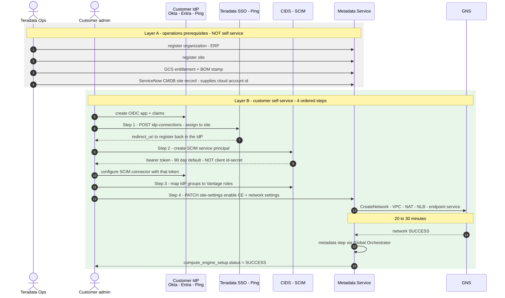

**Readiness gate — all four must be true before a config can be created:**

| Check | Tool |
|---|---|
| IdP connected to the site | `list_idp_connections { site_access }` |
| SCIM client provisioned | `get_scim_client_status { site_id }` |
| Group→role mappings exist | `list_role_mappings` |
| **Step 4 complete** — `enabled: true` **and** `status: SUCCESS` **and** at least one of `pooled_network_settings` / `dedicated_network_settings` | `get_site_settings { id }` → prefer `agent_assessment.step4_complete` |

**Offboarding** is the reverse: delete role mappings for the site, delete/detach the SCIM
service principal, detach the site from (or delete) the IdP connection, then disable CE on
the site — which triggers the teardown flow (F11.4).

---

### F2 — Site network provisioning & CE enablement

**Trigger:** `PATCH /site-settings/{site_id}` on the Metadata Service (proxied by GCS).

The handler (`managers/site/site.go:1150 PatchSiteSettings`) does:

**0. Pre-flight (always)**
- Validate body (CIDR/account mutual exclusion rules)
- `getSite` from DynamoDB
- Managed-app guard (managed sites cannot modify pooled settings)
- **`refreshPooledComputeForSite`** — asks ServiceNow whether pooled compute exists for this
  site's CSP+region

**1. `enabled: false` → teardown** (`managers/site/teardown.go:41`): refuses if active CE
configs exist, then runs steps in order `["oms", "network"]` → `TriggerOMSDeprovision` via the
Global Orchestrator. Returns **202**.

**2. `enabled: true`, setup not yet SUCCESS → Phase 1 (setup)**, step order `["network", "metadata"]`:
- **network** → `SetupNonPooledNetwork`: obtains a service-account token, calls **GNS
  `CreateNetwork`** with site_id / cloud account / ERP / region / AZ, writes
  `standard_network_details` (status, request_id, start time). Honours `IN_PROGRESS` within a
  **30-minute** timeout, then clears and retries. → **202**
- **metadata** (only after network is SUCCESS) → maps CSP→platform and calls the **Global
  Orchestrator `TriggerMetadataCreate`** with `{platform, target_site_id, oms_endpoint_ips}`.
  Completion arrives via the **LMO setup-callback** (HMAC-signed, `X-LMO-Signature`) or by lazy
  polling on GET. → **200** when all steps SUCCESS.

**3. Setup already SUCCESS → Phase 2 (settings)** (`applyPhase2Settings`, `site.go:1407`):
- `default_deploy_type`, `pooled_network_settings` (setting `connectivity_type` clears the
  opposing field — internet clears `allowed_accounts`, privatelink clears `allowed_cidrs`),
  `enable_dedicated_compute`, `dedicated_network_settings.allowed_accounts`
- DynamoDB write happens **before** propagation
- **Propagation is best-effort and non-blocking** (`context.WithoutCancel`): for each affected
  CE config with an assigned cluster, call the **regional pooling service**
  `UpdatePooledCluster`. Failures are logged only; the PATCH still returns 200.

**Key trap — `pooled_compute_available` is not stored.** It is marked `dynamodbav:"-"` and
**recomputed on every read** by calling ServiceNow
`GET /api/teop/metadata_service/checkPoolingSite?csp=<csp>&region=<region>`; `true` only when
HTTP 200 **and** `result.code == 200`, with a 24-hour in-memory cache and last-known-value
fallback. A stored `default_deploy_type: "pooled"` sitting next to
`pooled_compute_available: false` is therefore **normal and means "it used to be available"** —
see §7.7.

**What GNS actually builds per site:** VPC, subnets across AZs, NAT + EIPs, security groups,
the **OMS NLB**, the **VPC endpoint service**, Site-Gateway ingress registration, and the
Valtix firewall deployment. Teardown reverses all of it and refuses while CE slots are
occupied.

---

### F3 — CE config creation

**Trigger:** `POST /configs` on GCS → `POST /v1/compute-engine-configs` on Metadata.

- GCS decodes into `model.CreateMetadataConfigRequest` (`internal/model/metadata.go:91`) and
  **re-marshals the struct, not the raw body** — so any field not in that struct is silently
  dropped. Notably **`idp_settings` and `user_role_mappings` posted to `POST /configs` are
  discarded**; only `PATCH /configs/{id}` can carry them (`metadata.go:124-126` →
  `metadataService.go:1290`). Sample payloads in `scripts/gcs_cli/*` still show them — stale.
- The Metadata Service mints the **CE Site ID**, sets `qg_status = NOT_PROVISIONED` when
  `applications.query_grid.enable == true`, and seeds `idp_settings` from the site/org IdP
  registration.
- It also calls **Valtix** at create time (`clients/valtix_client.go:146 GrantIDPAccessForCE`
  → `PUT /transit-connectivity/api/v2/egress/{site}` with `{fqdn: <issuer host>, port: 443}`)
  so the engine can later fetch JWKS from the customer IdP. **This is called only on create,
  never on start**, and a failure is logged and swallowed (`create.go:155`) — the config still
  returns 201. See §7.5.
- Validation errors are informative, e.g. `Compute: connectivity: (private_link:
  (allowed_accounts: must be blank.))` when allowed accounts are sent for a pooled+privatelink
  config that should inherit site-level settings.

---

### F4 — Start a **dedicated** (SCOrch) CE

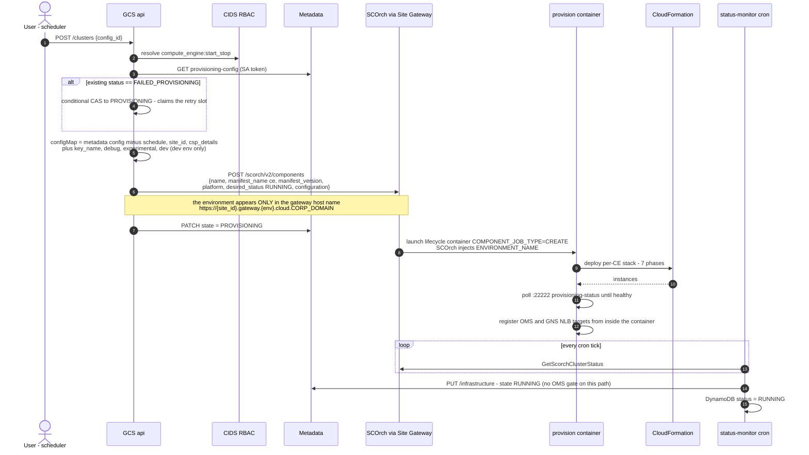

```
user / ce-agent / scheduler ── POST /clusters ──▶ GCS api Lambda
  RBAC: compute_engine:start_stop  (CIDS)
  GET metadata provisioning-config  (SA token)
  compute.type != POOLED  →  SCORCH path
  if existing status == FAILED_PROVISIONING → conditional CAS FAILED_PROVISIONING → PROVISIONING
  build configuration map:
      everything from metadata  minus schedule / site_id / csp_details
      plus key_name, debug, experimental, and dev (only when env == dev)
  POST https://{site_id}.gateway[.{env}].cloud.<CORP_DOMAIN>/scorch/v2/components
      {name, manifest_name:"ce", manifest_version, platform, desired_status:"RUNNING", configuration}
  DynamoDB status = PROVISIONING ;  metadata state = PROVISIONING   [console: "Starting"]
```

- **The environment is encoded only in the gateway URL**, never in the payload. SCOrch then
  injects `ENVIRONMENT_NAME` into the provisioning container, which stamps the EC2
  `environment` tag. Chasing "who set `environment: dev`" ends here, not in a payload field.
- SCOrch launches `avcd-vce-engine-provision` with `COMPONENT_JOB_TYPE=CREATE`, which deploys
  the per-CE CloudFormation stack (7 phases), waits for engine health, and registers OMS +
  network targets from inside the container.
- **Status is cron-polled** by `status-monitor` (`GetScorchClusterStatus`) — there is no push
  path. When it reads RUNNING it fires the **infrastructure PUT**, and the console flips to
  Running. **There is no OMS gate on the dedicated path** — the gate is
  `serviceName == POOLED`-only (`clusterService.go:2374`).

**AMI selection** (`src/aws/engine/modules/setup.sh setup_ami`), priority order:
`AWS_AMI_ID` → `AWS_AMI_NAME` → `EXPERIMENTAL` (latest alpha) → latest release AMI matching
`tdc-vce-engine-v0-5-*-*`. Because the manifest ships a **default `ami_name`**, provisioning is
normally **pinned** to that exact image — it does *not* automatically pick the newest AMI.

**Instance tags applied** (from `engine.yaml` launch template): `siteid`, `cesiteid`,
`environment`, `teradata:type=compute-engine`, `teradata:cluster:name`,
`scorch:component:id` (conditional), plus per-instance `Name` (`{stack}-001`, `-002`, …).
Tags propagate to EBS volumes and are exposed through IMDS.

---

### F5 — Start a **pooled** CE

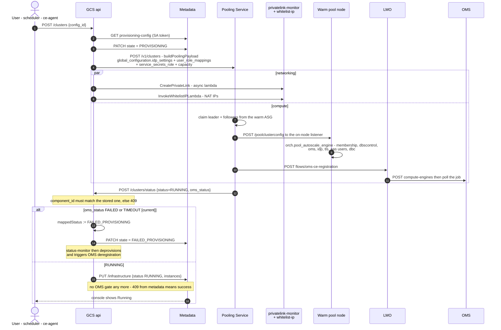

```
POST /clusters (type == POOLED)
  DynamoDB status = PROVISIONING ; metadata state = PROVISIONING     [console: "Starting"]
  buildPoolingPayload  →  POST pooling service /v1/clusters
        global_configuration.idp_settings, .user_role_mappings, service_secrets_role, capacity...
  CreatePrivateLink        → privatelink-monitor Lambda   (pooled_private_link_status)
  InvokeWhitelistIPLambda  → whitelist-ip Lambda          (nat_ip_whitelist_status)

pool-manager claims nodes, runs orch.pool_autoscale_engine via the listener, registers OMS,
then PUSHES status back:

  POST /clusters/status  { site_id, config_id, component_id, status, oms_status, oms_job_id }
      → writes DynamoDB status  UNCONDITIONALLY                       (poolingService.go:224)
      → writes oms_status
      → GATE: infrastructure PUT fires ONLY IF status==RUNNING AND oms_status==REGISTERED  (:268)
              → metadata state = RUNNING                              [console: "Running"]
      → note: RUNNING is NEVER PATCHed to metadata (skipMetadataStateUpdate, :247)
```

**Consequences worth memorising:**

1. **`RUNNING` reaches the Metadata Service only via the infrastructure PUT** — a `PATCH state`
   never carries `RUNNING`. There is no periodic re-assertion. (Root cause amplifier in §7.1.)
2. **[as-deployed]** the event path wrote `status=RUNNING` unconditionally, so the *cron*
   path's POOLED OMS gate was effectively bypassed. **[current]** that gate is gone; OMS
   failure is terminal instead — see §5.6.
3. `status = RUNNING` means **"compute is up"**, not "CE is healthy".

**Pooled-only extras:** `service_secrets_role` (assume-role ARN from the `ce-secrets`
component), DNS record creation through the DNS service, PrivateLink endpoint via the
privatelink-monitor, and NAT-IP whitelisting.

**Regional routing:** the Metadata Service must call the **pooling service in the site's
region**. A session in June 2026 found it hard-coded to one region (site in `us-east-1`,
call going to `us-west-2` → `failed to create pooled cluster`); the fix was region-aware
pooling-service URL selection.

---

### F6 — Post-provisioning: OMS, QueryGrid, Viewpoint, STC, copy-secret

This is where most "CE stuck at Starting" tickets live. **Two independent tracks.**

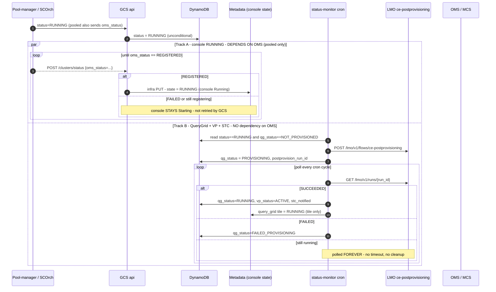

**The exact QG trigger condition** (`cmd/status-monitor/main.go:665`) — all three, nothing else:

1. `c.ComponentID != nil` (a placement exists)
2. `*cluster.QGStatus == "NOT_PROVISIONED"`
3. `cluster.Status == "RUNNING"`

**`oms_status` is never read on this path**, for pooled *or* dedicated. Dedicated has no OMS
step at all. This is the answer to the recurring question *"OMS registration failed — how did
QG still get triggered?"*: **nothing links them.**

**What "QueryGrid provisioning" actually is** (`svc-vce-lmo`): LMO creates a **SCOrch component**
named `{cluster_name}-qg` from manifest `qg`, whose configuration is
`{QG_OPERATION: "register", CE_NAME, PRIVATE_LINK_DNS}`. So we *provision a component* whose
*operation* is *register* — the QueryGrid fabric itself already exists at the site.
`operation: ""` = provision path; `"register"`/`"deregister"` = update path
(`PATCH /scorch/v2/components/{id}`).
Idempotency: it first `GET`s `?name={cluster}-qg&manifest_name=qg` and reuses the component;
a component in a `FAILED_PHASES` state raises `ScorchComponentFailedError` (needs manual cleanup).

**copy-secret (AWS only).** After the QG component is created, LMO waits up to `wait_seconds`
(300) for SCOrch to write `{SITE_ID}-{config_id}-tdqg-node` in the **source (customer) account**,
then copies it cross-account into the CE-Secrets/pooled account. The source account comes from
**ServiceNow `u_cloud_account_id`**. Two distinct failure surfaces:
- **422 at the POST** — `source_account_id` empty/not `^\d{12}$` because ServiceNow has no
  cloud account for the site.
- **202 then the run FAILs** — the `…-tdqg-node` secret never appears (e.g. **EDWless sites
  have no EDW primary to create it**) → `SecretNotFoundError` after ~300 s.
  GCS **does not poll** this run despite its doc comment, so GCS logs success while QG later
  lands in `FAILED_PROVISIONING`.

**OMS registration** (pooled) runs as its own LMO flow `oms-ce-registration`:`POST /oms/ce-admin/v1/compute-engines` → poll `GET …/compute-engine-jobs/{job_id}`. A
`OmsCEAdminJobFailedError` means LMO reached OMS fine and **OMS's own job failed** — commonly
`"MCS API returned 400"`, i.e. OMS→MCS rejected the registration (duplicate registration,
bad `address`/`collection_id`/`engine_id`, or the site not in a valid MCS state). The real
detail is in the **OMS CE-Admin logs for that job id**, not in LMO.

**Viewpoint** is registered by the Salt role `td_unlimited_viewpoint` **on the VM**, not by the
provisioning container; the container only resolves credentials, passes them into the
template, and performs the **DELETE** from Viewpoint at teardown. VP is gated on
`compute.add_system_to_viewpoint == true`.

---

### F7 — Status reconciliation: who updates whom

**The short answer: GCS writes to the Metadata Service. Metadata never polls GCS.**

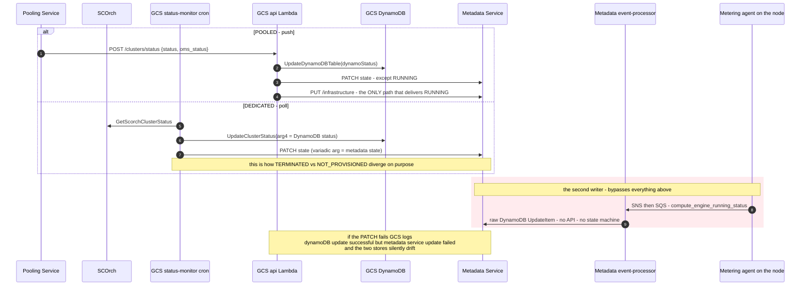

```
pooled     :  pooling service ── POST /clusters/status ──▶ GCS
dedicated  :  GCS status-monitor cron ── GET ──▶ SCOrch
                          │
                          ▼
        ClusterServicer.UpdateClusterStatus()          (clusterService.go:1205)
              ├──▶ GCS DynamoDB cluster-provisioning       "TERMINATING" / "TERMINATED"
              └──▶ PATCH /v1/compute-engine-configs/{id}   "TERMINATING" / "NOT_PROVISIONED"
                        (metadataService.go:804; :825 forces TERMINATED → NOT_PROVISIONED)
```

`UpdateClusterStatus(ctx, siteID, configID, dbStatus, delJobID, configState...)` takes the
**DynamoDB status in arg 4** and the **metadata state in a variadic arg** — that is precisely how
the two vocabularies diverge on purpose.

**Three exceptions to "GCS is the writer":**

1. **Config deletion** — the roles invert: the Metadata Service calls the pooling service and
   GNS directly and owns the state machine, finalising lazily on GET
   (`refreshDeletionStatusOnGet`) and by its own cron (`PollPendingDeletions`).
2. **Metering telemetry** — the Metadata Service's SQS event processor writes `state` with a
   **raw DynamoDB `UpdateItem`, bypassing the REST API, field policy and state machine**
   (`processor.go:241` → `metadata_client.go:176`). This is the sole producer of `STOPPED`.
3. **GNS** PATCHes `compute.connectivity.status` on the same config; GCS separately patches
   the QueryGrid and Viewpoint tiles.

If the PATCH from GCS fails, GCS logs `"dynamoDB update successful but metadata service
update failed"` and the two stores silently drift — the shape behind GPSC-3907 / GPSC-3903.

---

### F8 — Steady state: metering, health and the `:22222` service

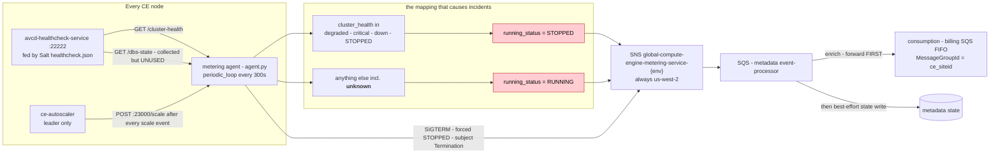

> Read the two red boxes together: a **successfully reported `degraded`** becomes `STOPPED`,
> but an **unreachable health service** (`unknown`) becomes `RUNNING`. The system is more
> forgiving of total failure than of honest degradation.

**On every engine node**, an RPM installs a Python daemon (`agent.py`) under systemd
(`agent.service`, `Restart=always`), running under Teradata's bundled Python. Every **300 s**:

```
GET http://{own private ip}:22222/cluster-health   →  {"state": "healthy|degraded|critical|down"}
GET http://{own private ip}:22222/dbs-state        →  {"pde state","dbs state"}   (collected, unused)

cluster_health_problem_states = {"degraded", "critical", "down", "STOPPED"}
running_status = "STOPPED" if cluster_health in problem_states else "RUNNING"

→ SNS publish  arn:aws:sns:us-west-2:<acct>:global-compute-engine-metering-service-{env}
   { ce_siteid, event_type: COMPUTE_ENGINE_STATE | COMPUTE_ENGINE_AUTOSCALE_STATE,
     event_timestamp, event_value: { compute_engine_running_status, autoscale_status,
                                     scale_size, total_amps, total_pes, instances[] } }
```

- **Leader-gated**: publishes only if the Salt grain `roles` contains `td_unlimited_leader`.
  Leadership is read **once at process start** and **fails open** — if `salt.loader.grains()`
  throws, the node self-promotes (`IS_LEADER_NODE = True`), so a Salt breakage causes **every**
  node to publish duplicates.
- **Always publishes**, every cycle, not only on change.
- **SIGTERM** → hard-codes `cluster_health = "STOPPED"` and publishes a `Termination` event so
  billing stops.
- **`unknown` (timeout/unreachable `:22222`) is NOT in the problem set → reports RUNNING.**
  So a *hung* health service looks healthy, while a *successfully reported* `degraded` looks
  stopped. This inversion is the core of §7.2.
- The debounce wrapper `confirm_cluster_health()` (3 × 180 s) exists but **is not wired into
  the periodic path** — `get_status()` calls the raw single-shot functions despite a docstring
  claiming otherwise.
- SNS region is **always `us-west-2`** regardless of where the CE runs; non-prod shares account
  `<GCS_NONPROD_ACCT>`, prod is `<GCS_PROD_ACCT>`. The env comes from the EC2 `environment` tag and
  **defaults to `dev` on any error**.

**Consumer:** Metadata Service `cmd/event-processor` (SQS→Lambda) unwraps the SNS envelope,
forwards an enriched event to the **consumption/billing SQS FIFO** (grouped by CE), and then
— best effort — writes `state`. Guardrails added after this bit people:
`shouldUpdateState()` only applies when the current state is `RUNNING` or `STOPPED`, and
`isAzureTelemetryStateRegression()` blocks regressions — **but only for Azure pooled engines**
(`isAzurePooledEngine`), citing GPSC-3761. AWS and dedicated engines are unguarded (§7.1).

**Port 22222 (`avcd-healthcheck-service`)** — the only on-node health API. Endpoints seen in use:

| Endpoint | Consumers |
|---|---|
| `GET /provisioning-status` → `{"engine":{"stage","state","version"}}` | provision container, pooling `InstanceHealth`, `state.finalize` |
| `GET /dbs-state` | metering agent, pooling, provision container |
| `GET /cluster-health` | **metering agent only** — the signal behind the autoscale/degraded bug |
| `GET /vprocs-not-online` | operators |
| `GET /system-info` | pooling (`infra_info_single_instance`) for the CMDB |

The `provisioning-status` content is written by Salt states through the custom
`_states/healthcheck.py` module into
`/var/opt/teradata/salt/healthcheck/healthcheck.json` — i.e. **`stage` is whatever Salt last
wrote**, which is why a stuck node reports the stage it died in (e.g. `{"state":"configuring",
"stage":"vconfig"}`).

---

### F9 — Autoscale (expand & contract)

Autoscale is driven **entirely inside the engine** by `ce-autoscaler` (leader-only Go service)
plus Salt orchestrations. **None of its state machine is visible to the cloud control plane.**

**Components** (`avcd-vce-engine-configure/src/salt/{state,pillar}/autoscale/`):

| File | Role |
|---|---|
| `pillar/autoscale/init.sls` | Tunables: `tdwm_per_cw_limit` (5 sessions per online CW), `timeout_alter` 1200 s, `timeout_drop` 7200 s, `timeout_tpareconfig` 1200 s, `timeout_vproc_clear` 300 s, `timeout_drop_retry` 1800 s, `interval_drop_retry` 15 s, `poll_interval` 15 s |
| `state/autoscale/init.sls` | Sets the TDWM throttle rule (leader), starts `ce-autoscaler` on the leader, stops it on followers, and **pauses** it immediately (dedicated only) |
| `state/autoscale/resume.sls` | `ce-autoscaler resume` — called at the very end of bootstrap |
| `state/autoscale/prep_node_local.sls` | **Phase 1 (parallel, per new node):** highstate, tags, docker/disks/bynet, refresh grains + mine, set `local_prep_complete`, fire `cluster/node/prep_complete` |
| `state/autoscale/vconfig_expand.sls` | **Phase 2 (ordered):** set `max_cluster_index`, apply `vconfig` → `clique` → `vconfig.filter`, set `vconfig_complete`, fire `cluster/node/vconfig_complete` |
| `orch/integrate_node_cluster.sls` | **Phase 3 (batched, on the leader):** start PDE → start DBS → `tpareconfig` → `ALTER SPOOL MAP … AMPCOUNT` → `cluster:state = IDLE` |
| `orch/decommission_node_cluster.sls` | Contraction: drain, `DROP SPOOL MAP`, wait for vprocs GONE, remove scale-in protection |

**Salt reactor bus** (`engine_reactor.conf`) — how it is all wired:

```
salt/minion/*/start           → assign_index        → runner cluster.assign_index()
cluster/node/index_assigned   → integrate_unconfigured → state.autoscale.prep_node_local (parallel)
cluster/node/prep_complete    → prep_complete       → runner vconfig_queue (ordered by index)
cluster/node/vconfig_complete → vconfig_complete    → runner integration_queue.maybe_trigger_batch()
cluster/node/decommission     → decommission_node   → runner decommission_queue.handle_request(targeted_amp_count)
```

Scale-**up** is implicit (autoscaler raises the follower ASG desired capacity; new minions
announce themselves). Scale-**down** is explicit via the `decommission` event carrying
`targeted_amp_count`.

**`cluster:state` grain machine — the autoscale interlock (cloud-invisible):**

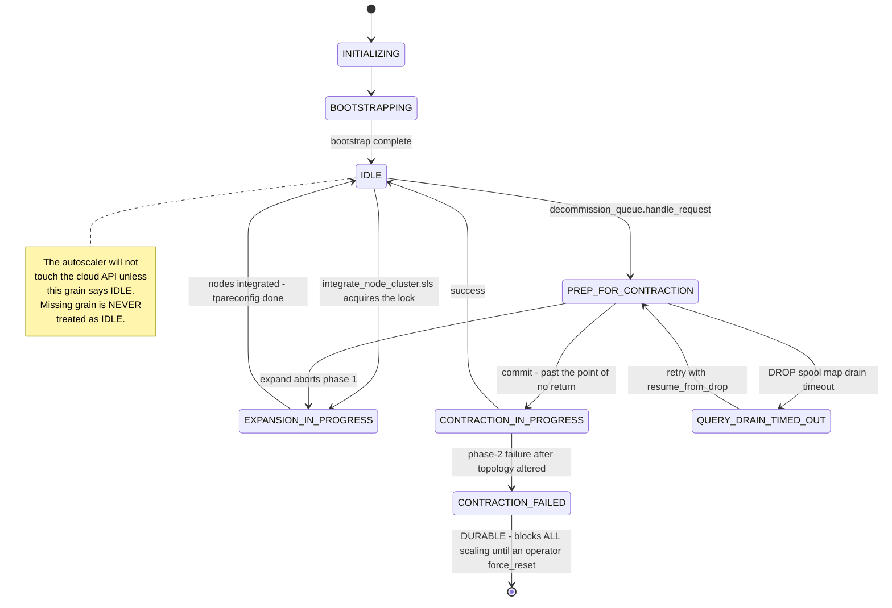

**Pooled vs dedicated differences:**

| Aspect | Dedicated | Pooled |
|---|---|---|
| Bootstrap orch | `orch/engine.sls` | `orch/pool_autoscale_engine.sls` (triggered by the pooling service POSTing to the listener `/poolclusterconfig`) |
| `state.autoscale` targets | all nodes | leader only |
| Autoscaler paused after start? | **Yes**, resumed after DB config | **No** (`onlyif: not G@features:pooling`) — starts active |
| Autoscale steps in `engine.sls` | run | **skipped** (`unless: match.grain features:pooling`) |

**What the cloud sees during a scale:** only the metering agent's
`COMPUTE_ENGINE_AUTOSCALE_STATE` events (scale_size, total_amps/pes, instances) — and, if the
scale leaves the cluster unhealthy, a `STOPPED` running-status (§7.1).

---

### F9b — Inside the `ce-autoscaler` daemon

> The KB previously treated this as an external black box. It is a **first-class Go service**
> (`cog-compute-engine-autoscaler`, RPM + systemd, leader-only) with its own architecture,
> and it is what actually decides to scale. Verified against `main` @ `v1.0.6` ✅.

#### Components

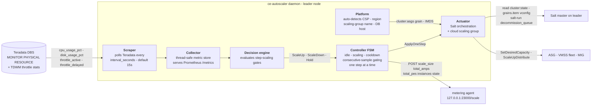

#### The step plan is built from Salt grains, not config

```
salt -G 'roles:td_unlimited_leader' grains.item vconfig:cw_count vconfig:amp_count

stepWeight = cw_count + amp_count            e.g. 4 + 4 = 8
step 1 -> 0 followers -> scaling-group weight 0        (leader only)
step 2 -> 1 follower  -> weight = stepWeight            (8)
step N -> N-1 followers -> weight = (N-1) x stepWeight
```

If `config.yaml` defines a `step_scaling.steps` map, its **keys** act as a whitelist of allowed
step labels, producing a **non-contiguous** plan (e.g. `1,2,3,4,6,8,10,12,16,24,32`) so scaling
jumps between approved sizes instead of one node at a time. Grains stay authoritative for each
step's weight. On `SIGHUP` the plan is rebuilt from fresh grains. If the grain query fails at
startup it falls back to the static map. `min_scale_size`/`max_scale_size` are **step labels**,
resolved via `IndexForStepCeil`/`IndexForStepFloor`.

#### Decision policy

| Rule | Detail |
|---|---|
| Scale **up** | **ANY** enabled gate over its `scale_up_if_gt` for `consecutive_samples` ticks (OR) |
| Scale **down** | **ALL** enabled gates under `scale_down_if_lt` for `consecutive_samples` ticks (AND) |
| Gate metrics | `cpu_usage_pct`, `disk_usage_pct`, `throttle_active`, `throttle_delayed`, `throttle_ratio` |
| `throttle_ratio` | `throttle_active / throttle_limit`; **`0.0` when no TDWM rule exists** — which acts as a permanent scale-down vote through the AND gate. Disable the gate when no rule is configured. |
| Defaults | `interval_seconds: 15`, `poll_interval_seconds: 10`, `consecutive_samples: 10` (≈ 2.5 min of sustained signal), `cooldown_seconds: 180` |
| Safety | one step per action; cooldown after every action; no decisions while scaling or cooling; pausable at runtime without stopping collection |

#### Scale-up: the parity gate and phases A/B/C

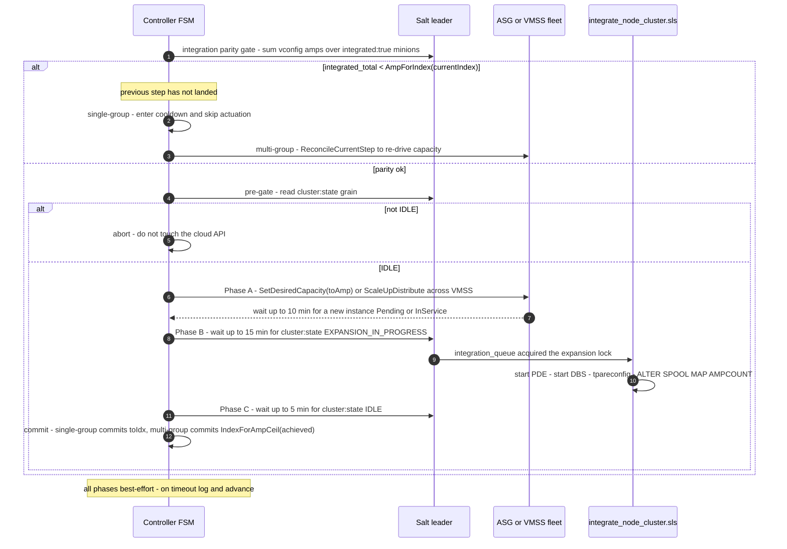

#### Scale-down

```
1. salt-run decommission_queue.handle_request targeted_amp_count=<toAmp>   (synchronous)
      SLS: ALTER spool map -> DROP old spool maps -> NEWPROC -> tpareconfig
           -> remove scale-in protection from decommissioned instances
           -> reject minion salt keys -> cluster:state = IDLE
2. wait for cluster:state == IDLE (up to 5 min)
3. salt-key -d -r -y                          (clean the master key list)
4. find ASG instances with ProtectedFromScaleIn == false   (only decommissioned ones)
5. lower ASG desired by the sum of their weights, wait for them to leave InService
6. resolve the new index via IndexForAmpFloor(reducedCapacity)   -- ASG ground truth
```

#### Operational surface

| Interface | Purpose |
|---|---|
| `ce-autoscaler pause` / `resume` | Stop/stop-and-start decisions without stopping metric collection |
| `ce-autoscaler status [--verbose]`, `run-once` | Inspect live state; evaluate policy with no actuation |
| `ce-autoscaler set-bounds --min N --max M` / `POST /scale-bounds` | Change runtime bounds without a restart |
| `ce-autoscaler random-walk start\|stop` / `POST /test` | Integration-test driver that walks the cluster through scale steps (`random` or `loop`). Requires `cluster:state == IDLE` **and** FSM idle, else HTTP 409 |
| `/metrics`, `/healthz` | Prometheus; `healthz` flags stale when the last scrape is older than `2 × interval_seconds` |
| `/run/ce-autoscaler/pause-startup` | A file Salt writes to hold the daemon at startup until prerequisites finish |
| SIGHUP | Hot-reloads gates, thresholds, `consecutive_samples`, `cooldown_seconds`, bounds, and rebuilds the step plan. **Not** hot-reloadable: `poll_interval_seconds`, `scraper.interval_seconds`, `database.*`, provider settings, `metering.*` |

**Metering notification** — after every successful scale (and once per `CONTRACTION_FAILED`
incident, edge-triggered via a latch) the controller POSTs `models.MeteringInfo` to the local
metering agent: `scale_size` (= `total_amps / leader_amps`), `total_amps`, `total_pes`,
`state` (`scale_up`/`scale_down`/`contraction_failed`), `autoscale_status` (`IDLE`/`UNHEALTHY`)
and the per-instance list. It is skipped entirely if the Salt grain query fails — the agent is
never told a wrong number. This is the **only** autoscale signal that ever reaches the cloud.

**Multi-cloud status:** AWS ASG fully implemented; **Azure VMSS fleet** fully implemented as a
multi-group scaler with preference-ordered placement and fallback when a SKU is
capacity-constrained; **GCP MIG** scaffolded (detection works, scaler methods return
`ErrNotImplemented`).

---

### F10 — Stop: schedule, auto-suspend, and the "stop = destroy" surprise

**There is no suspend-in-place for a CE.** Stopping tears the cluster down; the config record
survives in `NOT_PROVISIONED`. This is why the pooling vocabulary `STOPPED` is translated to
metadata `NOT_PROVISIONED`.

**Three initiators:**

1. **Scheduled stop** — GCS `scheduler` (Fargate) runs a per-cluster `robfig/cron`; the
   `end_time` cron invokes `DELETE /clusters/{id}` (and `start_time` invokes `POST /clusters`).
2. **Auto-suspend (on-engine idle detection)** — `workspaces-event-scheduler` on the engine:
   ```
   every PollInterval:
     SELECT COUNT(*) FROM DBC.SESSIONINFO  (excluding system users)   → active? skip
     FLUSH QUERY LOGGING WITH ALLDBQL ; MERGE MAX(collecttimestamp) → inactivemon.qrylog_ts
     COUNT(*) FROM inactivemon.qrylog_ts WHERE maxtimestamp > now - N min   → active? skip
     read SSM /compute-engine-configs-{engine} (auto_suspend enabled?)
     POST {global_compute_endpoint}  {event_type:"suspend", cluster_id, site_id, ...}  (OAuth2)
   ```
   with a "new system" guard against `inactivemon.init_time`. Note the request is sent with
   `Content-Type: application/x-www-form-urlencoded` **carrying a JSON body** — a quirk to be
   aware of when reproducing it.
   The **gRPC `EngineSuspend` → `localhost:3282`** path in the same repo is the AI-Unlimited
   workspaces path, **not** the CE cloud path.
3. **Config-change driven** — the Metadata Service's DynamoDB-stream
   `config-change-processor` emits `auto_suspend` events to a GCS **SQS FIFO** (group =
   `config_id`) whenever `state` becomes RUNNING or the auto-suspend settings change. GCS's
   scheduler consumes them and writes the auto-suspend config into the **customer account's
   SSM** (`/compute-engine-configs-{clusterID}`, SecureString, after
   `AssumeRole GlobalComputeRole`) or Azure Key Vault.

---

### F11 — Deprovisioning: four distinct teardown paths

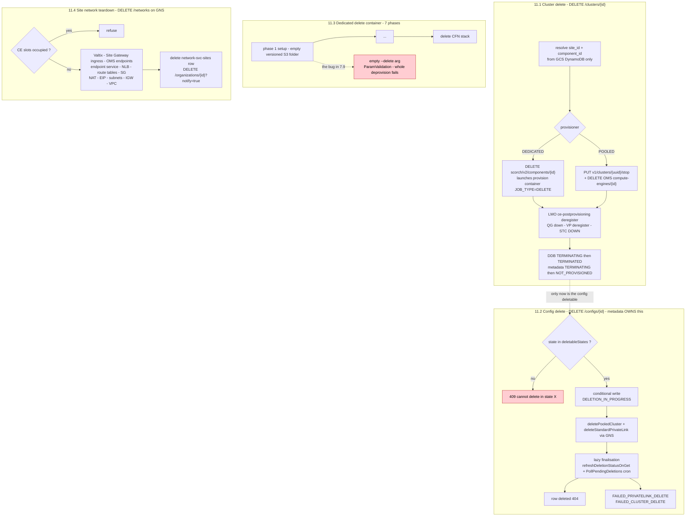

#### 11.1 Cluster delete — `DELETE /clusters/{id}`

```
resolve site_id + component_id from GCS DynamoDB   (GetItem, scan fallback)
RBAC compute_engine:start_stop
DEDICATED : DELETE /scorch/v2/components/{id}   → provision container COMPONENT_JOB_TYPE=DELETE
POOLED    : PUT /v1/clusters/{cluster_id}/stop  + DELETE OMS /compute-engines/{id}
LMO ce-postprovisioning "deregister"  → QG deregister, VP deregister, STC DOWN
DynamoDB status = TERMINATING → TERMINATED ;  metadata state = TERMINATING → NOT_PROVISIONED
```

`DeleteCluster` reads **only GCS's own DynamoDB** (`status=RUNNING`, `component_id` present) —
it never consults the metadata `state`. That is why it is the reliable escape hatch from a
wedged metadata state (§7.1).

#### 11.2 Config delete — `DELETE /configs/{id}`

Owned by the **Metadata Service**, not GCS:

```
deletableStates = { NOT_PROVISIONED, FAILED_PRIVATELINK_DELETE, FAILED_CLUSTER_DELETE }   (nil == NOT_PROVISIONED)
   anything else → 409 "cannot delete computeEngineConfig in state X"
transitionToDeletionInProgress()   (DynamoDB conditional expression → no double-delete)
   → deletePooledCluster()  /  deleteStandardPrivateLink() (GNS)
   → state = DELETION_IN_PROGRESS
finalisation is LAZY:  refreshDeletionStatusOnGet (on every GET)  +  PollPendingDeletions cron
   → row deleted (404)  |  FAILED_PRIVATELINK_DELETE  |  FAILED_CLUSTER_DELETE
```

GCS also asynchronously invokes `privatelink-monitor` with `operation=delete`, deletes the QG
component, and runs the LMO `delete-secret-aws` flow (pooled-gated).

**This is the mechanism behind VAC-3723:** the console showed `STOPPED` while the backend was
still `TERMINATING`, enabling a Delete that the API then rejected — so the UI mapping was
changed from `COMPUTE_ENGINE_STATUS.STOPPED` to `…STOPPING` until the backend actually reaches
`NOT_PROVISIONED`. (VAC-4228 later added a distinct `DELETING` for `DELETION_IN_PROGRESS`.)

#### 11.3 The dedicated-CE delete container (7 phases)

`avcd-vce-engine-provision` `COMPONENT_JOB_TYPE=DELETE` runs setup → … → stack delete. Phase 1
("setup") includes emptying the versioned S3 bucket folder — the source of the failure in §7.9.

#### 11.4 Site network teardown

`DELETE /networks` on GNS: refuses while CE slots are occupied, then tears down Valtix
(ServiceNow), deregisters Site-Gateway ingress, deletes OMS endpoints / endpoint-service / NLB,
route tables, SGs, NAT GWs, EIPs, subnets, IGW and finally the VPC; deletes the
`network-svc-sites` row and notifies Metadata (`DELETE /organizations/{id}?notify=true`).
`DELETE /networks/cleanup` sweeps orphaned VPCs.

---

### F12 — Runtime identity: `idp_settings`, `user_role_mappings` and JWT logon

This flow causes a disproportionate share of "CE is up but nobody can log in" tickets.

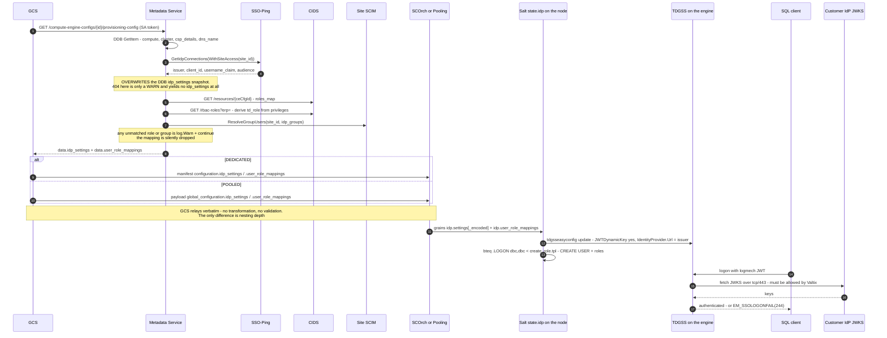

**Where the data actually comes from** (it is **not** the DynamoDB config item):

```
GCS ── SA token ──▶ Metadata  GET /v1/compute-engine-configs/{id}/provisioning-config
                     │
                     ├─ compute-engine-configs DDB → compute, cluster, csp_details, dns_name
                     ├─ SSO-Ping (PingFederate)    → idp_settings        ← LIVE, overwrites DDB
                     ├─ CIDS /resources/{ceCfgId}  → roles_map           ← lives only in CIDS
                     ├─ CIDS /rbac-roles?erp=      → td_role from privileges
                     └─ Site SCIM ResolveGroupUsers→ users[] + ce_role_for_group
                                                    └─▶ user_role_mappings
```

- `idp_settings` in DynamoDB is a **create-time snapshot** and is essentially dead weight;
  `getComputeEngineConfigSvc` overwrites it from SSO-Ping
  (`issuer ← EntityID`, `client_id ← OIDCSettings.ClientID`,
  `username_claim ← findSSOClaim(claims,"user_name")`, `audience ← site_access[site].audience`).
  A 404 from SSO-Ping is a **warning** and yields **no** `idp_settings` at all.
- `user_role_mappings` is **computed per request** and **silently skips** entries when the CIDS
  role name has no matching RBAC role, or SCIM doesn't return the group — `log.Warn` + `continue`.
  Downstream, `orchestration.py:122` omits the key and `state.idp` skips user creation, and the
  healthcheck still passes. **Silent, end to end.**

**How GCS uses them: it doesn't — it relays them verbatim.**

| Path | Wire shape |
|---|---|
| DEDICATED → SCOrch | `configuration.idp_settings` + `configuration.user_role_mappings` |
| POOLED → pooling service | `global_configuration.idp_settings` + `global_configuration.user_role_mappings` |

The only difference between the two is **nesting depth**. No transformation, no validation, no
Azure-specific branch.

**On the engine:** `state.idp` (`avcd-vce-engine-configure/src/salt/state/idp/init.sls`)
1. writes `healthcheck.configuring` (`stage: idp`)
2. renders `/tmp/idp_payload.json` from `grains.idp.settings[_encoded]`
3. runs `tdgsseasyconfig update -f /tmp/idp_payload.json` until
   `"Configuration applied. All tests Passed"` — this configures the **TDGSS JWT mechanism**
   (`JWTDynamicKey: yes`, `IdentityProvider.Url = <issuer>`, `UserNameMapping.Claim`)
4. if `user_role_mappings` is set, renders `/tmp/create_role.tpl` and runs
   `bteq .LOGON dbc,dbc < /tmp/create_role.tpl` → creates the `TD_*` roles and
   `data_user@…` / `data_curator@…` database users
5. on failure writes `healthcheck.failed`

At logon time the gateway **fetches JWKS from the customer IdP over tcp/443** — which is why the
Valtix egress grant (F3) matters.

**Three independent defects were found in this one file** — see §7.5. They stack:
a render failure (line 6) hides a credentials bug (lines 1–2), which hides an ordering bug in
the pooled orchestration.

---

### F13 — Auto-resume (POC: `autoresume-exp/resume-gateway`)

A **Teradata-protocol-aware TCP proxy** that transparently wakes a stopped CE when a client
connects. Not in production, but the design learnings are reusable.

```
Client → NLB → (CE target group weight 999 | resume-gateway target group weight 1) → CE node
```

1. Accept the connection; read **only** the PROXY protocol v2 header (16 bytes + addr block).
2. Clear the read deadline and **never call `Read()` again** until the CE is ready — the
   client's LOGON parcel sits ACKed in the kernel receive buffer. TCP flow control provides
   back-pressure automatically. **This is the entire "hold" mechanism** — there is no explicit
   pause API.
3. Trigger `POST /clusters` on GCS; **coalesce** concurrent connections for the same CE into a
   single start; treat **409 Conflict as success** ("already running").
4. Poll every 5 s (max 10 min) until `RUNNING` **and** target groups healthy.
5. Resolve the CE node IPs — `DescribeListeners` → pick the highest-weight target group that is
   **not** the gateway's own (`rgw-*` prefix, else loopback) → `DescribeTargetHealth` →
   `DescribeInstances` if targets are instance IDs.
6. Dial the node directly on 1025 (bypassing the NLB) and `pipe()` — two goroutines running
   `io.Copy`, which on Linux becomes kernel `splice(2)` (zero-copy), with **half-close**
   (`CloseWrite`) so each direction ends independently.
7. On dial failure, `Invalidate(ceID)` resets the cache; on start failure, a **60 s cooldown**
   rejects new requests without hitting the API.

**Gaps identified (worth knowing before productionising):** no graceful shutdown/drain, no TCP
keepalives (NAT/NLB 350 s idle timeouts will kill held connections), no metrics at all, no
retry/backoff on the Start call, `desired_count = 1` single point of failure, no detection of a
client that gave up while being held, and TCP-only (the mechanism does not translate to UDP).
Always-on cost ≈ **$20/month** (0.5 vCPU / 1 GB Fargate + logs + secrets).

---

### F14 — Engine image build & artifact topology

```
avcd-vce-image-bom  (YAML BOM: dev/nightly/release x intel/arm, RPM version patterns)
        ↓
avcd-vce-engine-configure  (Salt states + RPMs: pre-init baked, post-init at boot)
        ↓
avcd-vce-engine-packer     (Packer HCL → AMI / Azure image / GCP / vSphere)
        ↓
manifest  (manifests/aws/engine.json: configuration_defaults.ami_name pins the image)
        ↓
SCOrch component "ce"  →  avcd-vce-engine-provision container  →  CloudFormation
```

- RPM selection from a version **pattern** picks by the repository's ordering rules — if several
  RPMs match, the result is not "random" but is also not guaranteed to be the newest unless the
  pattern is anchored. Pin explicitly when it matters.
- **Artifactory topology:** `artifacts.td.<CORP_DOMAIN>` is the primary (push/promote target,
  used by all CI here); an `*-awsedge.td.<CORP_DOMAIN>` **Edge node** is a read-only in-AWS
  replica used for low-latency runtime pulls.

---

### F15 — Fleet health monitoring (Step Functions) and resource quotas

> **Missing from the previous revision of this KB entirely.** GCS runs a scheduled, fleet-wide
> health sweep implemented as a Step Functions **Distributed Map** over all sites, plus a
> resource-quota checker. Verified in `cdk/lib/infraHealthMonitor.go` and `cmd/health-monitor-*` ✅.

**Trigger:** an EventBridge schedule starts the state machine (`STANDARD` type, full ASL
control via `CfnStateMachine`).

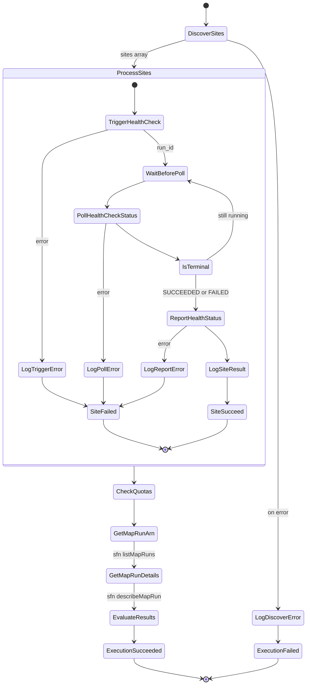

| Lambda | Role |
|---|---|
| `health-monitor-discover` | Enumerates sites → `DiscoverOutput` array feeding the Distributed Map |
| `health-monitor-trigger` | Per site: starts the LMO flow `ce-provisioning-health-check`, returns `run_id` |
| `health-monitor-poll` | Polls `GET /lmo/v1/runs/{run_id}`; carries only the fields downstream needs to stay under the **256 KB Step Functions state limit** |
| `health-monitor-report` | Writes the per-site result into the health-status table **and auto-triggers RCA** (see F16) |
| `health-monitor-quota` | Fleet-wide resource-quota check → quota-status table |
| `health-monitor` | The orchestrating entry point |

**Data model** — two DynamoDB tables created by the stack, each with a `CheckedAtIndex` GSI:

```
<stack>-health-status   : site_id, run_id, flow_id, run_status, started_at,
                          finished_at, checked_at, services{ name -> {status, url} }
<stack>-quota-status    : per-site/per-resource quota usage and status
```

**Read APIs** (all on the GCS api Lambda, backing the `ui/health-monitor` dashboard):

| Endpoint | Purpose |
|---|---|
| `GET /health-status` | Health history; **paginated with a `nextToken`** specifically to stay under Lambda's 6 MB response limit |
| `GET /resource-quotas` | Quota summary + per-record status |
| `GET /site-configs`, `/config-detail`, `/cluster-detail`, `/oms-status` | Drill-downs used by the dashboard |

`MaxConcurrency` on the Distributed Map is configurable (`DefaultHealthMonitorConfig`).
All Lambda log groups can be subscribed to a **Promtail** forwarder for Grafana/Loki.

---

### F16 — RCA: automated root-cause investigation

> Also entirely missing before. GCS links the health monitor to the
> **`cog-ce-diagnostic-agent`** (Bedrock) so the dashboard shows a pre-computed RCA rather than
> making an engineer start from zero.

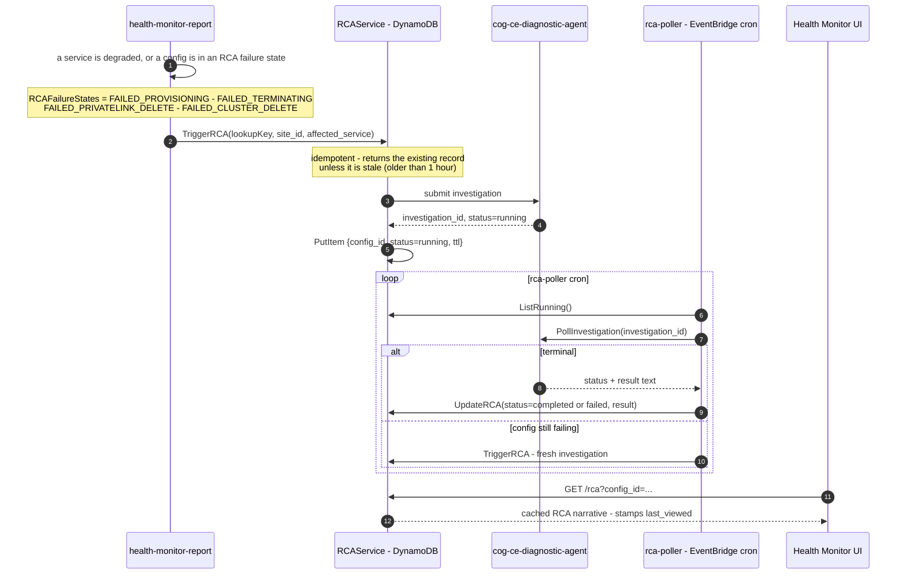

- Keys: site/service-level records use `SVC:<site_id>:<service_name>`; config-level records use
  the raw `config_id`. Both live in one table keyed by `config_id`, with a **DynamoDB TTL**.
- `POST /rca` lets a user force an investigation; `GET /rca` reads the cached one.
- Auto-trigger failures **never fail the health report** — RCA pre-fill is best-effort.
- If the RCA service is not configured (`IsConfigured() == false`) the whole path no-ops.

---

### F17 — Gateway auto-remediation and the `RETRYING` state

> This is where the otherwise-unexplained `RETRYING` state in the metadata enum comes from.
> Verified in `internal/util/retry.go` + `internal/util/ec2.go` ✅.

When SCOrch or the QueryGrid manager is unreachable because **its EC2 instance in the customer
account is stopped**, GCS does not simply fail the request — it restarts the instance.

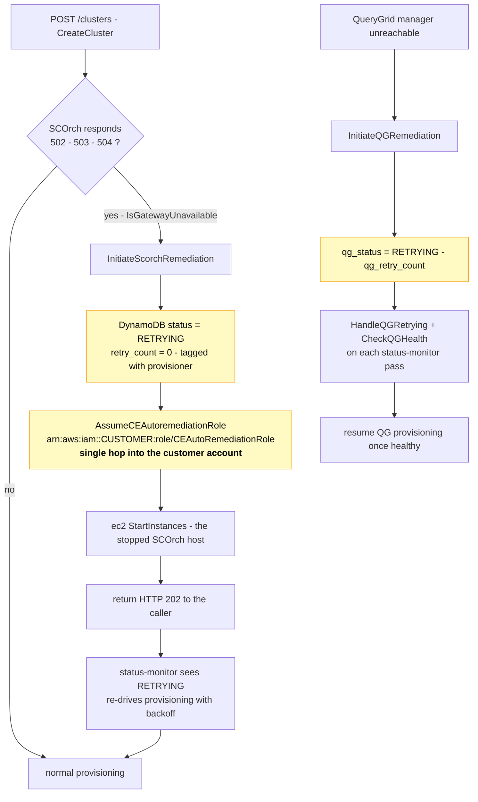

Key facts:
- The role is **`CEAutoRemediationRole`**, assumed **directly** in the customer account (single
  hop, not via an intermediate role).
- `GetNextBackoff` / `DefaultRetryConfig` govern the retry cadence; `retry_count` and
  `qg_retry_count` / `qg_retry_started_at` bound it.
- This is why you will see `RETRYING` on a config with no obvious user action — it means
  "a platform host was down and we are restarting it", not "the CE failed".

---

### F18 — Global Database (DB-Admin) API and DBS control settings

Two customer-facing capabilities that the previous revision omitted completely.

#### 18.1 Global Database management — `GET/POST/PUT/DELETE /oms/db-admin/global-databases`

GCS proxies a full CRUD + permissions surface for **global databases** (databases replicated
from the primary EDW to live CEs), served through OMS:

```
GET    /oms/db-admin/global-databases                          list  (?site_id=&pageSize=)
POST   /oms/db-admin/global-databases                          create
POST   /oms/db-admin/global-databases:batchDelete              batch delete
GET    /oms/db-admin/global-databases/{name}                   get
PUT    /oms/db-admin/global-databases/{name}                   update
DELETE /oms/db-admin/global-databases/{name}                   delete
GET    /oms/db-admin/global-databases/objects-type             object types
GET    /oms/db-admin/global-databases/{name}/objects           objects in the database
GET    /oms/db-admin/global-databases/{name}/permissions       list grants
POST   /oms/db-admin/global-databases/{name}/permissions       add grants
PUT    /oms/db-admin/global-databases/{name}/permissions       grant
POST   /oms/db-admin/global-databases/{name}/permissions:batchRevoke   revoke
```

This is the surface behind the SIT report *"No objects got replicated including authorization
on live CE"* — when replication is broken, objects and grants are missing on the CE even though
the global database exists. Note the interaction with [F12](#f12--runtime-identity-idp_settings-user_role_mappings-and-jwt-logon):
if the IdP-created users do not exist on the CE, the replay of `GRANT ... TO "user@domain"`
fails and the catalogue replay aborts — exactly the IDR-733 mechanism in §7.5.

#### 18.2 DBS control settings (`dbs_controls`) — two-level with an effective merge

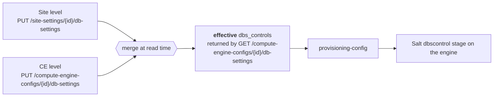

Shape: `dbs_controls: [{ group, setting, value }]`. The CE-level GET returns
`{dbs_controls, effective, site_id}` — i.e. the **overrides**, the **merged result**, and the
owning site. The `dbscontrol` Salt stage is the one that appears in bootstrap logs as
*"refresh grains before dbscontrol"*.

---

### F19 — Warm-pool capacity management and ML forecasting

> The pooled path only works because nodes are **already running** when a request arrives.
> Keeping that true is a service in its own right, including a machine-learning forecaster.

**Pool management API** (Litestar, `pool_manager/api.py`):

| Endpoint | Purpose |
|---|---|
| `GET /pools` | List pools |
| `POST /pools` | Create a pool |
| `PUT /pools` (`ensure_pools`) | **Declarative** — reconcile the whole pool definition. Also run at startup from the `startup_pools` config (`PoolsDefinition` JSON) |
| `PUT /pools/{pool_id}/scale` | Scale a pool |
| `DELETE /pools/{pool_id}` | Delete a pool |
| `GET /clusters/sizes` | Available cluster sizes |
| `GET /cluster_instances/{cluster_uuid}` | List the cluster's node IPs |
| `PUT /log_config` | Change log level at runtime |
| `GET /alive`, `/ready` | Liveness / readiness (readiness checks the DB connection) |

**Capacity forecasting** (`pool_manager/scaling_with_prediction.py`) — the part worth knowing:

```mermaid
flowchart LR
    S3[("S3 model bucket<br/>capacity_model_{csp}_{region}_latest.pkl")] -->|"load at startup +<br/>periodic refresh"| M["CostOptimizedForecaster<br/>+ region binary-forest<br/>CapacityPlanningModel"]
    H[("historical pool usage<br/>accounting table")] --> FC["FeatureComputer"]
    FC --> M
    M -->|"predicted demand per<br/>VCPU_SIZES bucket"| D["desired warm capacity"]
    D --> P["PoolRouter - scale pools"]
    M -.->|"USE_ONLINE_LEARNING"| M
    X["5 consecutive failures"] -.->|"_CONSECUTIVE_FAILURE_THRESHOLD"| FB["fall back to<br/>non-predictive scaling"]
```

- Models are **not** in the repo — they are pickles fetched from S3 keyed by
  `{prediction_mode}/capacity_model_{csp}_{region}_latest.pkl`.
- Optional **online learning** (`USE_ONLINE_LEARNING`).
- A `_CONSECUTIVE_FAILURE_THRESHOLD = 5` guard degrades gracefully rather than wedging the pool.
- **Accounting**: a Postgres `accounting` table records pool usage and is drained in batches of
  1000 (`DELETE ... USING delete_batch`) and exported as CSV to S3 — the pooled-side usage record.

**Operational consequence:** "pooled CE start is slow" is usually a *pool* problem (no warm node
of the right size in the right region), not a CE problem. Check `GET /pools` and the forecaster
logs before looking at GCS.

---

### F20 — Organisation / site synchronisation from ServiceNow

The Metadata Service keeps its org and site records in step with ServiceNow via a dedicated
Lambda, `cmd/org-sync-processor` (`managers/orgsync/processor.go`):

```mermaid
flowchart LR
    CRON["scheduled invoke"] --> LIST["ListAllOrgs"]
    LIST --> STALE{"org stale ?"}
    STALE -->|yes| SYNC["SyncOrgSites(orgID, siteIDs)<br/>pull site list from ServiceNow"]
    STALE -->|no| SKIP["skip"]
    SYNC --> WRITE["upsert site records"]
    WRITE --> GUARD{"Lambda deadline<br/>within gracefulStopBuffer ?"}
    GUARD -->|yes| STOP["stop queuing new syncs<br/>avoid being killed mid-sync"]
    GUARD -->|no| LIST
```

This is why a site can appear in (or vanish from) the Metadata Service without anyone calling
an API — and it is the same ServiceNow dependency that strands PrivateLink in §7.6 and
`pooled_compute_available` in §7.7. **One upstream CMDB, three different failure modes.**

---

## 5. State models (the vocabulary problem)

There are **six** state machines using overlapping words with different meanings. Most
cross-service confusion traces back to this table.

### 5.1 The five vocabularies

```mermaid
flowchart LR
    subgraph P["1 - Pooling PostgreSQL cluster.state"]
        direction TB
        p1["STOPPED"] -->|start| p2["PROVISIONING"] --> p3["CONFIGURING"] --> p4["RUNNING"]
        p4 -->|stop| p5["STOPPING"] --> p1
        p1 -->|terminate| p6["TERMINATING"] --> p7["TERMINATED"]
    end
    subgraph T["2 - translation - util/cluster.go MapPoolingStatus"]
        direction TB
        t1["STOPPING becomes TERMINATING"]
        t2["STOPPED becomes NOT_PROVISIONED"]
        t3["FAILED_RUNNING becomes FAILED_PROVISIONING"]
        t4["INITIALIZING - UPDATING_INFRASTRUCTURE<br/>TERMINATED - FAILED_SETUP<br/><b>UNMAPPED - pass through - 400 at metadata</b>"]
    end
    subgraph G["3 - GCS DynamoDB status"]
        direction TB
        g1["PROVISIONING - CONFIGURING - RUNNING"]
        g2["TERMINATING - TERMINATED"]
        g3["FAILED_PROVISIONING - FAILED_TERMINATING<br/>sticky - never overwritten by a non-FAILED status"]
    end
    subgraph M["4 - Metadata state - the console"]
        direction TB
        m1["NOT_PROVISIONED - PROVISIONING - CONFIGURING - RUNNING"]
        m2["TERMINATING - RETRYING - DELETION_IN_PROGRESS"]
        m3["<b>STOPPED</b> - only the metering agent writes this"]
    end
    P --> T --> G --> M
    classDef bad fill:#ffcdd2,stroke:#b71c1c,color:#000
    class t4,m3 bad
```

| Layer | States |
|---|---|
| **Pooling PostgreSQL** `cluster.state` — the only real START/STOP machine | `INITIALIZING · STOPPED · PROVISIONING · CONFIGURING · RUNNING · STOPPING · TERMINATING · TERMINATED · UPDATING_INFRASTRUCTURE · FAILED_SETUP · FAILED_INFRA_UPDATE · FAILED_STOPPING · FAILED_RUNNING` |
| **GCS DynamoDB** `cluster-provisioning.status` | `PROVISIONING · CONFIGURING · RUNNING · TERMINATING · TERMINATED · FAILED_PROVISIONING · FAILED_TERMINATING` — **no STARTING/STOPPING/STOPPED**; `FAILED_*` is **sticky** |
| **Metadata `state`** (what the console shows) | `NOT_PROVISIONED · PROVISIONING · CONFIGURING · FAILED_PROVISIONING · RETRYING · RUNNING · STOPPED · TERMINATING · FAILED_TERMINATING · DELETION_IN_PROGRESS · FAILED_PRIVATELINK_DELETE · FAILED_CLUSTER_DELETE` |
| **On-engine `cluster:state` grain** (autoscale, cloud-invisible) | `INITIALIZING · BOOTSTRAPPING · IDLE · EXPANSION_IN_PROGRESS · PREP_FOR_CONTRACTION · CONTRACTION_IN_PROGRESS · QUERY_DRAIN_TIMED_OUT · CONTRACTION_FAILED` |
| **Sub-resources** | `oms_status`: `NOT_REGISTERED → PROVISIONING → REGISTERED \| FAILED_REGISTRATION`, `DEREGISTERING → DEREGISTERED`<br/>`qg_status`: `NOT_PROVISIONED → PROVISIONING → RUNNING \| FAILED_PROVISIONING`, `TERMINATING → TERMINATED`, `NOT_APPLICABLE`<br/>PrivateLink: `IN_PROGRESS \| SUCCESS \| FAILED`<br/>GNS op: `NOT_FOUND · LOCKED · IN_PROGRESS · SUCCESS · FAILED · COMPLETED`<br/>LMO run: `PENDING · RUNNING · SUCCEEDED · FAILED · CANCELED` |

### 5.2 Translation at the pooling ↔ GCS boundary (`internal/util/cluster.go:15`)

| Pooling | → GCS / metadata |
|---|---|
| `PROVISIONING` / `CONFIGURING` / `RUNNING` | same |
| **`STOPPING`** | **`TERMINATING`** |
| **`STOPPED`** | **`NOT_PROVISIONED`** ("stopped" == torn down) |
| `FAILED_RUNNING` | `FAILED_PROVISIONING` |
| `FAILED_STOPPING` | `FAILED_TERMINATING` |
| `INITIALIZING`, `UPDATING_INFRASTRUCTURE`, `TERMINATING`, `TERMINATED`, `FAILED_SETUP`, `FAILED_INFRA_UPDATE` | **unmapped → passed through uppercased** → not valid metadata states → 400 → 500 back to pooling → **infinite retry of the same status** (live bug) |

Belt-and-braces: `metadataService.go:825` forces `TERMINATED → NOT_PROVISIONED` one last time
before the PATCH.

### 5.3 Deprovision transitions (the question people keep asking)

```mermaid
stateDiagram-v2
    direction LR
    state "CLUSTER lifecycle - config record survives" as C {
        [*] --> NOT_PROVISIONED
        NOT_PROVISIONED --> PROVISIONING: POST /clusters
        PROVISIONING --> CONFIGURING: provisioner progress
        CONFIGURING --> RUNNING: infra PUT - the ONLY path to RUNNING
        PROVISIONING --> FAILED_PROVISIONING: compute or OMS failure
        CONFIGURING --> FAILED_PROVISIONING
        RUNNING --> TERMINATING: DELETE /clusters - schedule - auto-suspend
        FAILED_PROVISIONING --> TERMINATING: auto-deprovision
        FAILED_PROVISIONING --> PROVISIONING: retry - CAS claim
        TERMINATING --> NOT_PROVISIONED: teardown confirmed
        TERMINATING --> FAILED_TERMINATING: teardown error
        PROVISIONING --> RETRYING: gateway 502-503-504 - auto-remediation
        RETRYING --> PROVISIONING: SCOrch EC2 restarted
    }

    state "CONFIG deletion - a different machine" as D {
        [*] --> deletable
        deletable --> DELETION_IN_PROGRESS: DELETE /configs - conditional write
        DELETION_IN_PROGRESS --> gone: GNS + pooling confirm
        DELETION_IN_PROGRESS --> FAILED_PRIVATELINK_DELETE
        DELETION_IN_PROGRESS --> FAILED_CLUSTER_DELETE
        FAILED_PRIVATELINK_DELETE --> DELETION_IN_PROGRESS: retry
        FAILED_CLUSTER_DELETE --> DELETION_IN_PROGRESS: retry
    }

    note right of C
        deletable = NOT_PROVISIONED
        or FAILED_PRIVATELINK_DELETE
        or FAILED_CLUSTER_DELETE
        Anything else - 409
    end note
```

```
CLUSTER deprovision (config record survives):
    RUNNING ──stop/delete accepted──▶ TERMINATING ──teardown confirmed──▶ NOT_PROVISIONED
                                          └── teardown error ──▶ FAILED_TERMINATING

CONFIG deletion (a different machine):
    NOT_PROVISIONED / FAILED_*_DELETE ──DELETE──▶ DELETION_IN_PROGRESS ──confirmed──▶ row deleted (404)
                                                        └── failed ──▶ FAILED_PRIVATELINK_DELETE | FAILED_CLUSTER_DELETE
```

There is **no `TERMINATED`** and **no `STOPPING`** in the metadata vocabulary.
`NOT_PROVISIONED` is metadata's word for "torn down, config still exists"; it also stamps
`last_terminated_at`, clears cluster info, and triggers SCIM deregistration.

### 5.4 Who can write metadata `state`

| Writer | Mechanism | Can emit `STOPPED`? | Can emit `NOT_PROVISIONED`? |
|---|---|---|---|
| **GCS** | REST PATCH + infra PUT | **No — never** | Yes |
| **Metadata DELETE flow** | internal | No | Yes |
| **Metering event-processor** | **direct DynamoDB `UpdateItem`, bypasses the API** | **Yes — sole producer** | **No — unreachable** |

`State.Validate()` only checks membership in the 12-value enum. **There is no transition table,
no ordering guard, no ETag, no reconciler.** `state` is a free-form string with three
uncoordinated writers.

### 5.5 Outcome truth table (compute RUNNING, QG enabled)

**Pooled — [as-deployed] during the §7.3 incident (June–July 2026)**

| # | OMS | QG | Console CE state | QG tile | Notes |
|---|---|---|---|---|---|
| 1 | REGISTERED | success | **Running** | RUNNING | healthy |
| 2 | REGISTERED | fail | **Running** | FAILED_PROVISIONING | CE usable; retry QG alone |
| 3 | REGISTERED | stuck | **Running** | PROVISIONING | polled forever |
| 4 | **FAILED** | success | **Stuck "Starting"** | RUNNING | OMS is the blocker |
| 5 | **FAILED** | fail | **Stuck "Starting"** | FAILED_PROVISIONING | the common incident |
| 6 | **FAILED** | stuck | **Stuck "Starting"** | PROVISIONING | limbo, **no auto-cleanup** |

**Pooled — [current] after GPSC-3811 + GPSC-3735 (merged to `main`, `ga1base`, `ga2base`, `azurepreprod`)**

| # | OMS | QG | Console CE state | QG tile | Notes |
|---|---|---|---|---|---|
| 1 | REGISTERED | success | **Running** | RUNNING | healthy |
| 2 | REGISTERED | fail | **Running** | FAILED_PROVISIONING | CE usable; retry QG alone |
| 3 | REGISTERED | stuck | **Running** | PROVISIONING | polled forever (unchanged gap) |
| 4 | **FAILED / TIMEOUT** | any | **Failed** | any | **escalated to `FAILED_PROVISIONING`, then auto-deprovisioned + OMS deregistered** |
| 5 | still registering | success | **Running** | RUNNING | infra PUT no longer waits for OMS |

Rows 4–6 of the old table no longer exist: the "Starting forever" trap was closed by making
OMS failure *terminal* instead of *blocking*. See [§5.6](#56-behaviour-changes-you-must-know-about).

**Dedicated** — no OMS axis at all: console is **Running** as soon as compute is up; QG only
tints its tile. Unchanged.

If **compute itself** fails: `FAILED_PROVISIONING`, console *Failed*, **auto-deprovisioned**,
and OMS/QG are never attempted.

### 5.6 Behaviour changes you must know about

Three merged changes rewrote the pooled status path between the incidents and the current tree.
All three are in `HandleClusterStatusEvent` (`internal/service/poolingService.go`) ✅.

```mermaid
flowchart TB
    subgraph OLD["[as-deployed] - what the incident logs show"]
        A1["POST /clusters/status<br/>status=RUNNING oms_status=FAILED"]
        A2["DynamoDB status = RUNNING<br/>written unconditionally"]
        A3{"oms_status == REGISTERED ?"}
        A4["infra PUT<br/>metadata state = RUNNING"]
        A5["SKIP infra PUT<br/>metadata stays PROVISIONING"]
        A6["console STUCK at Starting<br/>forever - no retry - no cleanup"]
        A1 --> A2 --> A3
        A3 -->|yes| A4
        A3 -->|no| A5 --> A6
    end

    subgraph NEW["[current] - GPSC-3811 + GPSC-3735"]
        B1["POST /clusters/status"]
        B0{"component_id matches<br/>the stored one ?"}
        B9["409 - reject stale event<br/>prevents out-of-order writes"]
        B2{"oms_status in<br/>FAILED or TIMEOUT ?"}
        B3["mappedStatus := FAILED_PROVISIONING<br/><b>OMS failure is now terminal</b>"]
        B4{"mapped == NOT_PROVISIONED<br/>and stored == FAILED_PROVISIONING ?"}
        B5["keep FAILED_PROVISIONING<br/>STOPPED must not mask the failure"]
        B6["write DynamoDB + PATCH metadata"]
        B7{"mapped == RUNNING ?"}
        B8["infra PUT - <b>no OMS gate</b><br/>409 from metadata = success"]
        B10["status-monitor deprovisions<br/>+ triggers OMS deregistration"]
        B1 --> B0
        B0 -->|no| B9
        B0 -->|yes| B2
        B2 -->|yes| B3 --> B4
        B2 -->|no| B4
        B4 -->|yes| B5 --> B6
        B4 -->|no| B6
        B6 --> B7
        B7 -->|yes| B8
        B7 -->|"no - FAILED_PROVISIONING"| B10
    end

    classDef bad fill:#ffcdd2,stroke:#b71c1c,color:#000
    classDef good fill:#c8e6c9,stroke:#2e7d32,color:#000
    class A6 bad
    class B3,B8,B10 good
```

| # | Change | Commit | Effect |
|---|---|---|---|
| 1 | **OMS `FAILED`/`TIMEOUT` → `FAILED_PROVISIONING`** | `6c920bf3` GPSC-3811 | The CE now *fails* instead of hanging. The status-monitor's failed-state handler deprovisions it and fires `TriggerOMSCEDeregistration` (best-effort; a failure is recorded as `FAILED_DEREGISTRATION`). |
| 2 | **Infra PUT no longer OMS-gated** | `e0a0cb80` GPSC-3735 | Comment now reads *"OMS registration is handled downstream and must not gate this path"*. Pooling reporting RUNNING is the sole readiness signal. A `409` from metadata means infra is already present → treated as success. |
| 3 | **Stale `component_id` → 409** + **`FAILED_PROVISIONING` preserved on STOPPED** | `dbfa7e8c` GPSC-3811 | Kills two classes of out-of-order/masking bug. |

**Also new:** `oms_status` can now be **`TIMEOUT`** (pooling's own 10-minute OMS wait) and
**`FAILED_REGISTRATION`**, in addition to the values listed in §5.1.

**What did *not* change:** `reconcileMetadataStateIfDiverged` is **still** gated on
`platform == util.PLATFORM.AZURE` ✅, so the GPSC-3907 self-heal gap in [§7.1](#71-gcs-says-running-metadata-says-stopped-forever--gpsc-3907)
is still open for AWS. And `idp/init.sls` still has both the `dbc/dbc` and
`grains["environment"]` defects on `develop` ✅.

---

## 6. Cross-cutting concerns

### 6.1 Tokens and who accepts what

| Caller → callee | Credential |
|---|---|
| User/console → GCS | Customer **Ping JWT**; authorisation via **CIDS RBAC** (`/v1/rbac/resolve`, `/v1/resources/resolve`) |
| GCS → Metadata (`provisioning-config`, state PATCH, infra PUT) | **GCS service-account JWT** (`GetScorchMetadataToken`) — deliberately *not* the caller token |
| GCS → SCOrch / Pooling / LMO / OMS | service-account tokens (Ping client-credentials) |
| ce-agent → Metadata `GET /sites/{id}` and `GET /organizations?erp=` | **TD-Ops service token only** |
| ce-agent → all other Metadata + GCS APIs | **customer pass-through JWT** |
| ce-agent → SSO / CIDS | **customer pass-through JWT** (they reject the TD-Ops token) |
| GNS → ServiceNow | **Basic auth**, credentials from CSM / Secrets Manager |
| GNS/metadata → CSM | SigV4 `execute-api` + `X-Permission-Group` + `X-Api-Key`, via an assumed CSM role |
| Engine (metering) → SNS | instance profile → `sts:AssumeRole` (with a fixed `ExternalId`); on Azure a 3-hop MI → App Registration → `AssumeRoleWithWebIdentity` |
| LMO → Metadata (setup callback) | **HMAC-SHA256** `X-LMO-Signature` over the raw body |

**Token-minting pattern learned the hard way** (ce-agent ADR-003): keep the minted token and
the client credentials in a **process-wide singleton cache**; on 401 invalidate **only the
minted token** and re-mint from cached credentials; refresh the credentials from Secrets Manager
**only** when the mint itself returns `invalid_grant`/`invalid_client` (credentials rotated),
with single-flight + cooldown so an auth outage can't stampede Secrets Manager. Retry on
**403 as well as 401** — not all services return standard codes.

**Spec drift found:** GCS's `SPEC.md` claims it validates the customer token `aud` against
`idp_settings.audience` and extracts the username via `username_claim`. **That code no longer
exists** (`util/customer_acl.go:60 ExtractCustomerTokenClaims` is unreferenced dead code, and
the authorizer's "deferred to the service layer" comment is now false). Authorisation today is
**CIDS RBAC only**.

### 6.2 The `sites` claim and a real authorisation bug

Customer BYOID tokens carry
`https://iam.<IAM_DOMAIN>/token/claims/sites: ["TDICAM<SITE_ID>"]`.

- `GET /site-settings` **correctly** filters the result by that claim (fail-closed when empty).
- `GET /compute-engine-configs` filtered **only by org (ERP)** and CIDS privileges — so a user
  entitled to one site saw configs for **every site in the org**. `POST` already enforced the
  claim (403), so only *list* leaked. Fixed by mirroring the site-settings filter in
  `listComputeEngineConfigsBYOID`, with fail-closed behaviour and two new tests.

### 6.3 External-system dependencies that silently break CE

| System | What depends on it | Failure signature |
|---|---|---|
| **ServiceNow** `u_cmdb_ci_siteid` / `u_asset_siteid` | PrivateLink monitor (site details), GNS (`sys_id` for Valtix), copy-secret (`u_cloud_account_id`) | `no site found in ServiceNow for site_id X`; endpoint never created; 422 on copy-secret |
| **ServiceNow** `checkPoolingSite` | `pooled_compute_available` | `poolError: "CE Pooled Site not found"` → pooled settings become unsettable |
| **Valtix** egress API | JWKS fetch from the customer IdP at logon | `EM_SSOLOGONFAIL(244)` after a ~22 s hang; **silently swallowed at config create** |
| **CIDS + SCIM** | `user_role_mappings` | users silently absent on the CE → `GRANT … User or role does not exist` |
| **CSM** | GNS/pooling secrets | `403 Forbidden` from `api.csm.<PROD_CLOUD_DOMAIN>/prod/secretmanager/secret` |
| **MCS** (via OMS) | OMS registration | `MCS API returned 400` inside the OMS job |

### 6.4 The LMO flow catalogue

LMO is the single async work engine for the whole platform, so "which flow ran?" is often the
fastest way to localise a failure. Flows enumerated from `src/lmo/flows/` ✅.

```mermaid
flowchart LR
    subgraph CE["CE lifecycle"]
        f1["ce-postprovisioning<br/>QG + Viewpoint + STC"]
        f2["ce-provisioning-health-check<br/>driven by the health monitor"]
    end
    subgraph OMS["OMS plane"]
        f3["oms-ce-registration"]
        f4["oms-ce-deregistration"]
        f5["oms-create - oms-update - oms-delete<br/>plus v1 variants"]
        f6["oms readiness - preflight checks"]
    end
    subgraph SEC["Secrets"]
        f7["copy-secret-aws"]
        f8["delete-secret-aws"]
        f9["randomize-secret-value-aws"]
        f10["ce-secrets create"]
    end
    subgraph QG["QueryGrid"]
        f11["querygrid provision + copy secret"]
        f12["querygrid update - register - deregister"]
        f13["delete-querygrid-and-copied-secret"]
    end
    subgraph SITE["Site plane"]
        f14["metadata create<br/>site setup step 2"]
        f15["manifest-sync-bom<br/>manifest-sync-bom-all-sites<br/>manifest-sync-manual"]
        f16["viewpoint register - deregister"]
        f17["stc ce-lifecycle"]
        f18["psim-pooled-ce"]
    end
```

Every flow is a **registered workflow whose `name` is the operation type** and which becomes
its own endpoint: `POST /lmo/v1/flows/{name}`. The name is stored as `RunInfo.flow_id`, so
`GET /lmo/v1/runs/{run_id}` tells you exactly which operation a run was. `GET /lmo/v1/flows/`
lists every registered flow with its argument schema.

> **Remember the 24-hour TTL.** If an incident is older than a day, the LMO run is gone — you
> will only have the `run_id` recorded in the GCS DynamoDB row and whatever the caller logged.

---

## 7. Incident casebook

Twelve signature incidents, each: **symptom → mechanism → fix → identifier**.

### 7.1 GCS says RUNNING, Metadata says STOPPED, forever — **GPSC-3907**

**Symptom.** Console stuck showing "Stopping"; GCS DynamoDB `status=RUNNING`,
`oms_status=REGISTERED`; metadata `state=STOPPED` for 44+ hours; no stop was ever requested.

**Mechanism (four defects in a chain).**
1. After a scale-out to 4X, vproc 24 (`NoGT`) on node 1-04 left `:22222/cluster-health`
   returning `DOWN`, while `pdestate` said `RUN/STARTED` and `/vprocs-not-online` said none.
2. The metering agent collapses **health** into **lifecycle**:
   `"STOPPED" if cluster_health in {degraded,critical,down,STOPPED}`.
3. The Metadata event-processor writes that straight into `state` with a raw `UpdateItem`;
   the regression guard `isAzureTelemetryStateRegression` is gated on `isAzurePooledEngine`,
   so **AWS engines (and all dedicated engines, including Azure) are unguarded**.
4. GCS never re-asserts RUNNING (`skipMetadataStateUpdate := mappedStatus == "RUNNING"`), its
   cron compares pooling status against **its own** DynamoDB (both RUNNING → `no update
   needed`, logged 2,812 times), and the purpose-built self-heal
   `reconcileMetadataStateIfDiverged` is hard-gated to `platform == AZURE`.

**Why `STOPPED` and not `NOT_PROVISIONED`.** The only producer of `STOPPED` is an on-node agent
whose value domain is `{RUNNING, STOPPED}` — `NOT_PROVISIONED` is unreachable by construction,
and it would be *wrong* anyway (the infrastructure is still allocated and still billing).
Logically, an agent alive enough to publish `STOPPED` is proof the CE is **not** deprovisioned.

**Why `STOPPED` is a trap.** In `STOPPED` the config **cannot be deleted** (`deletableStates`
excludes it), SCIM deregistration no-ops, `last_terminated_at` is never set, cluster info is
not cleared, metering keeps forwarding billable events, and a **second** cluster could be
started on the same config. And nothing owns it: eight candidate healers are structurally
incapable, and the ninth (metering) can only heal it by the same signal that broke it.

**Escape hatches.** (a) fix the CE health → next metering event restores RUNNING within 5 min;
(b) `DELETE /clusters` → `NOT_PROVISIONED` (safe: it reads only GCS's DynamoDB, and once the
state leaves RUNNING/STOPPED the metering writer is locked out by `shouldUpdateState`);
(c) manual DynamoDB edit to RUNNING **will not hold** — telemetry overwrites it in ~5 minutes.

**Fixes recommended.** Make the telemetry regression guard and the GCS self-heal
provider-agnostic; stop overloading `compute_engine_running_status` with health; and
structurally **split `state` (lifecycle, GCS-owned, API-only) from `health` (telemetry-owned)**.

**Relatives:** GPSC-3761 (the original Azure-only fix), GPSC-3903, CCP-13921.

### 7.2 CE flip-flops RUNNING ↔ STOPPED every 5 minutes

**Symptom.** Metering flips state on the 5-minute cadence while all EC2 instances are running.

**Mechanism.** `get_status()` documents that it "uses the confirmation wrappers" but calls the
**raw** `check_dbs()` / `check_cluster_health()`; the debounce
`confirm_cluster_health()` (3 × 180 s) is dead code on that path. Combined with
`degraded`/`critical` mapping straight to `STOPPED`, a single transient reading flips the
state. Ironically a **timeout** maps to `unknown` → **RUNNING**, so a total failure is treated
more favourably than a successful "degraded" report.

**Fix.** Wire `confirm_*` into the periodic path; treat `degraded`/`critical` as "running but
unhealthy"; preserve last-known state on `unknown`; require N consecutive `down` readings.

### 7.3 CE stuck at "Starting", QueryGrid failed — the OMS/QG independence incident

> **✅ Status: the "stuck at Starting" half of this is FIXED.** See [§5.6](#56-behaviour-changes-you-must-know-about).
> OMS `FAILED`/`TIMEOUT` now escalates the CE to `FAILED_PROVISIONING` (GPSC-3811) and the
> infra PUT is no longer OMS-gated (GPSC-3735). The **QG-dispatched-into-an-unhealthy-CE**
> half is still open. Keep reading for the mechanism — it is still how the two tracks relate.

**Symptom.** `CEAM<CE_ID>` — `status=RUNNING`, `vp_status=ACTIVE`, PrivateLink `SUCCESS`,
but `oms_status=FAILED` and `qg_status=FAILED_PROVISIONING`; console never left "Starting".

**Mechanism.** Two failures, one likely common cause. OMS registration failed at 08:23:12 →
the infra PUT gate never fired → console stayed "Starting". 49 seconds later the
status-monitor cron fired QG **because it only checks `status==RUNNING && qg==NOT_PROVISIONED`**
— dispatching QG into a CE whose Unity-metadata/CDC layer was already unhealthy; the QG
component task `…-qg-214` main container exited 1.

**Answer to "shouldn't QG wait for OMS?"** It is a trade-off, not a clean win: gating QG on OMS
would help row 5 of the truth table but would **block a QG that would have succeeded** in row 4.
The better fix is to make `RUNNING` mean *healthy*, plus retry.

**Secondary finding.** The status-monitor's Viewpoint PATCH to metadata returns
**403 "Requester cannot update fields"** — real, non-blocking, needs its own ticket.

### 7.4 "OMS registration failed" that isn't LMO's fault

`OmsCEAdminJobFailedError` ≠ `OmsCEAdminError`. The former means LMO successfully created and
polled an OMS job that **OMS itself failed**, typically with `MCS API returned 400` — a bad
request **from OMS to MCS** (duplicate registration, malformed `address`/`collection_id`, or a
site not in a registrable MCS state). Look in the **OMS CE-Admin logs for that job id**;
LMO only kept the top-level `message`.

### 7.5 JWT logon fails on a restarted pooled CE — **COG-15584 / IDR-733**

Three stacked defects in `src/salt/state/idp/init.sls`, discovered in order:

1. **Ordering + credentials (the `dbc/dbc` bug).**
   ```jinja
      # "dbc"
      # "dbc"   ← bug
   ```
   Every sibling state (`autoscale`, `telemetry`) calls `salt.database.credentials()` first;
   `idp` has **no live-credential lookup at all**. In `orch/engine.sls` (dedicated) `configure
   idp` is **bootstrap-gated** and ordered *before* `configure dbc`, so it always runs against
   the default password. In `orch/pool_autoscale_engine.sls` (pooled) it is **not gated**, so
   on every re-assignment it runs *after* a previous run's `configure dbc` set the KeyVault
   password → `.LOGON dbc,dbc` fails 8017 → users/roles never created.
   *This predicts "fresh pooled works, restarted pooled fails" exactly.*

2. **The render failure (supersedes #1).** Line 6 is `` —
   a hard dict access. Jinja renders the **whole SLS before executing anything**, so a missing
   `environment` grain fails compilation and **nothing in `state.idp` runs** — not even the
   `healthcheck.failed` marker, so `/provisioning-status` still looks clean and the CE goes
   RUNNING. That predicts **no TDGSS JWT mechanism *and* no users**, which matches
   `EM_SSOLOGONFAIL(244)` better. The grain is missing on pooled because
   `instance_data/config.sls` skips `install_user_data` when `features:pooling`, and the pooled
   listener only shallow-merges what the pooling payload contains.

3. **Valtix egress 403 (independent, environment-wide).** In `azurepreprod`,
   `GrantIDPAccessForCE` returned **403 on 125/125 attempts** (`explicit deny in a
   resource-based policy` for
   `accp-metadata-service-azurepreprod-EnhancedLambda`), while `preprod` was 97/97 and `dev`
   358/358 (including 228 Azure configs) — so it is a **caller-role** gap, not "Azure is
   unsupported". Every CE config created in that stack since at least Jul 26 has **no IdP
   egress rule**, so the gateway cannot fetch JWKS. It is called **only on create**, never on
   start, and the failure is logged and swallowed.

**Diagnosis commands** (on the affected leader node):
```bash
salt-call --local grains.get environment      # missing → defect 2
grep -n "Rendering SLS 'base:state.idp' failed" /var/log/salt/minion
grep -A5 'Mechanism.*JWT' /opt/teradata/tdgss/site/TdgssUserConfigFile.xml   # empty → defect 2
# then, in the DB:  SELECT UserName FROM DBC.UsersV WHERE UserName LIKE '%<domain>';
```
`TDGSS empty + users empty` → defect 2. `TDGSS present + users empty` → defect 1.
`Both present but logon still fails` → defect 3.

**Do not "fix" it by bootstrap-gating `configure idp` on the pooled path** — pooled CEs
legitimately need `idp` re-applied on every assignment because each assignment carries a
different customer's settings.

**Password rotation is a red herring.** Three layers change the DBC password: quarterly Azure
Function timers on the KeyVault value, a 1-minute `sync_passwords.py` cron (only when
KV ≠ DB), and **`state.db.dbc` inside the same provisioning orchestration** (the one that
actually breaks `idp`). The KV value is seeded at site creation as `db{rand}#${rand}` — it is
**never** `dbc` — so freezing rotation doesn't help. There is no per-CE rotation switch.
(Bonus latent bug: the sync cron falls back to `dbc_Previous`, which Bicep seeds to the *same*
value as `dbc`, so it can never recover either.)

### 7.6 PrivateLink stuck at `in_progress` forever

**Symptom.** `CEAM<CE_ID>`, `pooled_private_link_status` never advances; the monitor logs
`First invocation - creating private link endpoint` on **every** poll.

**Mechanism.** The monitor aborts at the ServiceNow site lookup
(`no site found in ServiceNow for site_id TDICAM<SITE_ID>`) *before* `CreateVpcEndpoint`, so
`endpoint_id` is never persisted → every poll restarts as "first invocation" → infinite loop.
18 consecutive failures for **only** that site while 10 other sites succeeded in the same
window proves it is a data/registration fault, not credentials. **[inferred]** the site's CMDB
record was removed by a prior bulk cleanup and the site was then reused.

**Note:** a **blank `endpoint_id` with `iteration: 0` is normal** — it is the documented signal
for "create it". It is only suspicious at `iteration > 0`.

**Fix.** Re-register the site in ServiceNow; and close the process gap where site cleanup
deletes the CMDB registration while leaving the site usable for new CEs.

### 7.7 `pooled_compute_available: false` blocks pooled settings

Not a code bug. The field is **computed on every read** from ServiceNow `checkPoolingSite`;
preprod logs showed a persistent **404 `"CE Pooled Site not found"` for `csp=AWS&region=us-west-2`**
starting ~2026-06-18 14:54 (it had returned 200 earlier the same day). Stored
`default_deploy_type: "pooled"` remains because stored fields are preserved once set. Fix is to
restore the **CE Pooled Site record in ServiceNow**; the flag flips back within the 24-hour
cache window. (Intermittent ServiceNow 401s and header timeouts also force `false` transiently.)

### 7.8 QueryGrid target registration fails only for `query-grid` — the `expandNLBZones` bug

**Symptom.** `PATCH /networks/{site}/compute-engines/{ce}/targets` succeeds for `compute-engine`
IPs but fails for `query-grid`: `IPs could not be resolved to instance IDs: [10.0.2.86]` —
and a **manual retry always succeeds**.

**Mechanism.** `expandNLBZones` adds the new subnet to the NLB in AWS but **never updates
`ce.SubnetIds` / `ce.AzIds` in memory**. `resolveIPsToInstanceIDs` then filters
`DescribeInstances` by `network-interface.subnet-id` using the **stale** list, which
deterministically excludes the instance in the newly added subnet. Only `query-grid` is
affected because it is the only target group with `ELBTargetType = instance` (all others
register the raw IP and need no lookup). Retries are futile — same wrong filter every time.

**Why the retry "works".** `SetSubnets` is a **persistent AWS side effect**. On the next
request `LookupResources` re-reads the NLB, which now has both subnets, so `ce.SubnetIds` is
correct from the start and `expandNLBZones` has nothing to do.

**Fix** (commit `236abef`): check the error from `addNLBSubnets`, then mirror the change locally
(`ce.AzIds = append(ce.AzIds, newAzIds...)`, `ce.SubnetIds = append(ce.SubnetIds,
subnetIdsToAdd[:len(newAzIds)]...)`), append-only and only after AWS confirms. Covered by
`TestPatchTarget_QueryGrid_FailsWhenExpandNLBZonesDoesNotUpdateSubnetIds`.

### 7.9 CE delete fails in phase 1 on an empty S3 delete-marker sweep

**Symptom.** `Phase 1 delete steps failed … aws s3api delete-objects --bucket X --delete` →
`ParamValidation: Expected: '=', received: 'EOF'`; deprovision reported as failed even though
IAM role/profile deletion completed.

**Mechanism.** In `avcd-vce-engine-provision/src/aws/engine/modules/s3.sh
delete_s3_bucket_folder()` the guard is `if [[ "$(echo "${markers}" | jq '.Objects')" != "null" ]]`.
When the `list-object-versions` call returns **empty stdout** (a 62-second gap in the log
suggests a slow/failed AWS call — the exit code is never checked inside `$( )`), `jq` prints
nothing, `"" != "null"` is true, and the block runs with an empty `--delete`. Same latent
pattern exists in `delete_s3_bucket()`; and `delete-objects` caps at **1000 keys per call**
while the CLI auto-paginates the list — so >1000 versions would fail with `MalformedXML`.

**Fix.** Check the command's exit status *and* validate the payload
(`jq -e '.Objects | length > 0'`), or use `aws s3 rm --recursive` for the folder case; consider
`run_and_warn` so a leftover object cannot fail an entire deprovision.

### 7.10 Bootstrap orchestration hang — `queue: True` deadlock

**Symptom.** ~50% of bootstraps hang on the leader at `configure healthcheck`.

**Mechanism.** The leader runs **both** salt-master (the orchestrator) and salt-minion (a
target). The orchestrator publishes `state.highstate` with `queue: True` and waits for all
targets; the leader's minion sees the previous step's job still marked active in its proc
directory and — because of `queue: True` — **blocks** waiting for it; the master cannot retire
that job because it has already moved on. Circular wait, timing-dependent (hence intermittent).

### 7.11 Node stuck "configuring / vconfig" — `leader_id: None`

**Symptom.** `provisioning-status` = `{"state":"configuring","stage":"vconfig"}`,
`dbs-state` = `DOWN/TDMAINT`, all Salt states returned `True`.

**Mechanism.** Phases 1 and 2 completed, but both emitted events carried **`leader_id: None`**
because `mine.get('roles:td_unlimited_leader', …)` returned empty (the leader hadn't published
its mine data yet). The integration-queue runner needs `leader_id` to target the leader for
`integrate_node_cluster` (start PDE → start DBS → `tpareconfig` → `ALTER SPOOL MAP`), so
**Phase 3 silently never ran**.

**Recovery.**
```bash
salt-run mine.get 'roles:td_unlimited_leader' grains.item tgt_type=grain
salt -G 'roles:td_unlimited_leader' mine.update
salt-run state.orchestrate orch.integrate_node_cluster pillar='{"batch_minion_ids": ["i-0e7c…"]}'
```
**Durable fix:** retry the mine query, or have the integration runner resolve the leader itself
instead of trusting the event payload.

### 7.12 `NoGT` vprocs after a scale-up

`/cluster-health` returns `DOWN` with
`Vproc 24, of type NoGT, on node 1-04, is in ONLINE state, has NoGT status` while
`/vprocs-not-online` says none and `psh pdestate -a` says `RUN/STARTED`. **NoGT = an
unclassified vproc** — online but with no assigned AMP/CW type in the global map — a leftover
from a `tpareconfig` whose `ALTER SPOOL MAP … AMPCOUNT` never assigned the new node's vprocs
(`_modules/tdops.py` retries error 9230 with backoff and carries a `TODO(PDE)` about there
being no readiness signal). The database is genuinely usable; the health probe fails because it
tries to reach the DB *through* that node. This is what set off the §7.1 chain.

---

## 8. Operational runbook

### 8.1 Account & environment map

Observed during sessions — **verify before relying on it**.

> **Placeholder convention.** Real account IDs, hostnames, site/CE IDs, org names
> and the ERP number have been replaced by `<UPPERCASE>` placeholders throughout
> this corpus. Each placeholder maps 1:1 to exactly one real value, so every
> "account A calls account B" relationship below is still accurate — substitute
> from your own environment (or `aws sts get-caller-identity` / the ARNs in the
> logs, which carry the account ID). **The triage procedure is identical in every
> environment**; only which account and which domain you substitute changes.
> Prefixes are deliberately preserved (`TDICAM`=AWS site, `TDICAZ`/`ESAZ`=Azure;
> `CEAM`/`CEAZ` likewise) because they are documented lookup keys, not secrets.

| AWS account | Owner |
|---|---|
| `<GCS_NONPROD_ACCT>` | **GCS** (non-prod: dev/qa/preprod/azurepreprod) + non-prod metering SNS topics + ce-agent dev |
| `<GCS_PROD_ACCT>` | **GCS / metering — prod** |
| `<METADATA_NONPROD_ACCT>` | **Metadata Service** (non-prod stacks: dev/preprod/azurepreprod) |
| `<POOLING_PREPROD_ACCT>` | **Pooling service / pool account** (preprod) — QG copy-secret target |
| `<POOL_MANAGER_ACCT>` | Pool-manager account owning `VCE-Secret-Role` |
| `<GNS_DEPLOY_ACCT>` | **Network service (GNS)** deployment account (azure task role, CSM role) |
| `<SITE_ACCT>` | An example **customer site account** (site `TDICAM<SITE_ID>`) — QG secret source, SCOrch site gateway |
| `<CE_DEPLOY_ACCT>` | A CE deployment account reached via `network-svc-ce-deploy-role` |
| `<NOS_WRITER_ACCT>` | `td-nos-writer-role` (telemetry NOS writes) |

Typical profiles used: `<GCS_NONPROD_ACCT>_Developer`, `<METADATA_NONPROD_ACCT>_Developer`,
`<POOLING_PREPROD_ACCT>_Developer`, `<VIEWONLY_ACCT>_ViewOnly`.

### 8.2 Where the logs and data live

**CloudWatch log groups** (region `us-west-2` unless noted):

```
/aws/lambda/global-compute-stack-{env}                      # GCS api  ({env}: dev-main | preprod | azurepreprod | prod)
/aws/lambda/global-compute-stack-{env}-status-monitor        # the reconcile cron (most useful group)
/aws/lambda/global-compute-stack-{env}-privatelink-monitor
/aws/lambda/global-compute-stack-{env}-whitelist-ip
/aws/lambda/global-compute-stack-{env}-authorizer-logs
/aws/lambda/global-compute-stack-{env}-health-monitor{,-discover,-trigger,-poll,-report,-quota}
/aws/lambda/global-compute-stack-{env}-rca-poller
/aws/vendedlogs/states/...                                   # health-monitor Step Functions (log level ALL)
/aws/apigateway/global-compute-stack-{env}
/aws/lambda/accp-metadata-service-{env}                      # metadata API
/aws/lambda/accp-metadata-service-{env}-event-processor      # metering → state writes
/aws/lambda/accp-metadata-service-{env}-org-sync-processor
/aws/lambda/accp-metadata-service-{env}-config-change-processor
/aws/lambda/accp-metadata-service-{env}-deletion-poller
```

**DynamoDB tables**

```
cluster-provisioning-{env}                                   # GCS  (PK site_id, SK config_id; GSI on component_id)
global-compute-stack-{env}-health-status                     # fleet health sweep results (GSI CheckedAtIndex)
global-compute-stack-{env}-quota-status                      # resource-quota results     (GSI CheckedAtIndex)
<RCA_TABLE>                                                  # RCA records (PK config_id, DynamoDB TTL)
accp-metadata-service-{env}-compute-engine-configs           # metadata configs (state, idp_settings, cluster, csp_details)
accp-metadata-service-{env}-<sites | organizations | ...>
accp-metadata-service-{env}-<ce-site-id counter>             # PK org_name, attr counter (optimistic lock)
```

Other stores: **Pooling** = PostgreSQL + `pgmq` (+ an `accounting` table drained to S3 as CSV);
**LMO** = Redis/ElastiCache only (`lmo:run:{run_id}`, `{lmo:runs}:by_started_at|flow:*|status:*`,
`celery-task-meta-{task_id}`) with **24-hour TTL — LMO run history is not durable**.

**GCS API surface (full)** — useful when you are not sure which service owns a call:

```
POST   /auth/token                                  login
POST   /clusters            GET /clusters           start CE / list
GET    /clusters/{id}       DELETE /clusters/{id}   get / stop-terminate
POST   /clusters/status                             pooling callback (service account only)
GET|POST /configs   GET|PATCH|DELETE /configs/{id}  CE configs
GET|PUT  /configs/{id}/roles-map   PATCH /configs/roles-map
GET    /organizations       GET /organizations/{id}
POST   /privatelink                                 kick the privatelink monitor
GET    /site-settings       GET|PATCH /site-settings/{id}
GET    /sites/{site_id}/{resource}
GET    /querygrid/connectors | /fabrics | /health-check
GET|POST|PUT|DELETE /oms/db-admin/global-databases[...]   global database + permissions
GET    /site-configs | /config-detail | /cluster-detail | /oms-status   health dashboard drill-downs
GET    /health-status                               fleet health (paginated, nextToken)
GET    /resource-quotas                             quota summary
GET|POST /rca                                       read / force an RCA investigation
GET    /health
```

**High-signal log lines to grep**

| Line | Meaning |
|---|---|
| `Payload for create cluster` | the literal SCOrch payload |
| `Config response data` | what `provisioning-config` returned |
| `Pooling cluster creation payload` | what was sent to the pooling service |
| `Cluster status changed … old=… new=…` | a real transition |
| `Cluster status unchanged, no update needed` | the cron no-op (2,812× in GPSC-3907) |
| `Cluster is RUNNING and QueryGrid is NOT_PROVISIONED, triggering QueryGrid provisioning` | the QG trigger |
| `Triggering infrastructure PUT: status=RUNNING and oms_status=REGISTERED` | the console flips to Running |
| `Upstream reports RUNNING but OMS not registered — gating RUNNING transition` | pooled OMS gate blocking |
| `dynamoDB update successful but metadata service update failed` | the drift moment |
| `ServiceNow check failed` | pooled availability / site lookup failure |
| `Failed to grant IDP access for compute engine` | Valtix egress 403 |
| `[PP-POLL] LMO run still in progress, will retry next cycle` | QG stuck |

### 8.3 Triage decision tree

```mermaid
flowchart TD
    START([CE create / start request]) --> C1{Config valid in metadata?}
    C1 -->|No| ECFG[Console FAILED - never provisions]
    C1 -->|Yes| PROV[status=PROVISIONING - console Starting]

    PROV --> C2{Compute provisioned?}
    C2 -->|Fail| ECOMP[FAILED_PROVISIONING - console Failed - AUTO-DEPROVISIONED - OMS and QG never run]
    C2 -->|Stuck| ECOMPS[status=PROVISIONING - Starting forever - no timeout]
    C2 -->|RUNNING| TYPE{compute.type}

    TYPE -->|DEDICATED| DRUN[infra PUT - no OMS gate - console Running]
    TYPE -->|POOLED| NET{PrivateLink and NAT ok?}

    NET -->|Fail| ENET[FAILED_PROVISIONING - connectivity blocked]
    NET -->|Ok| OMSD{oms_status REGISTERED?}

    OMSD -->|No| PSTUCK[console STUCK at Starting - waits on OMS - not retried by GCS]
    OMSD -->|Yes| PRUN[infra PUT - console Running]

    DRUN --> QGA{QG result?}
    PRUN --> QGA
    PSTUCK --> QGB{QG result?}

    QGA -->|Success| QGAOK[QG tile RUNNING - FULLY HEALTHY]
    QGA -->|Fail| QGAF[QG tile FAILED - console Running]
    QGA -->|Stuck| QGAS[QG tile PROVISIONING - polled forever]

    QGB -->|Success| QGBOK[QG RUNNING but console STILL Starting]
    QGB -->|Fail| QGBF[QG FAILED and console STILL Starting]
    QGB -->|Stuck| QGBS[QG PROVISIONING - limbo]
```

**Order of investigation that consistently worked:**

1. **Read the GCS DynamoDB row first** — `status`, `oms_status`, `qg_status`, `vp_status`,
   `pooled_private_link_status`, `postprovision_run_status`, `updated_at`. It tells you which
   stage failed in one query.
2. **Read the metadata config item** — `state`, `last_launched_at`, `last_terminated_at`,
   `cluster.cluster_id`, `compute.connectivity`. Divergence from (1) is itself the finding.
3. **status-monitor logs** for that `config_id` — the transitions and the trigger lines.
4. **The relevant downstream**: LMO run (`GET /lmo/v1/runs/{run_id}` — remember 24 h TTL),
   pooling logs, or the SCOrch component.
5. **Only then go on-node** (`:22222`, `/var/log/salt/minion`, `journalctl -u ce-autoscaler`).

### 8.4 On-node commands worth memorising

```bash
curl localhost:22222/provisioning-status     # {"engine":{"stage","state","version"}}
curl localhost:22222/dbs-state               # PDE + DBS state
curl localhost:22222/cluster-health          # the metering signal
curl localhost:22222/vprocs-not-online
psh pdestate -a

salt-call --local grains.get roles           # td_unlimited_leader? td_unlimited_idp?
salt-call --local grains.get environment     # missing → state.idp will fail to render
salt-call --local grains.get idp
salt-call --local grains.get cluster:state   # autoscale machine
salt-call --local state.sls state.idp test=True     # dry run
salt-call --local state.sls state.idp               # re-apply ONE state, masterless

grep -iE "create user role mapping|LOGON dbc|8017|Rendering SLS" /var/log/salt/minion
journalctl -u agent.service                  # metering agent
journalctl -u ce-autoscaler
tail -50 /var/log/password_rotation.log
```

`salt-call --local state.sls state.idp` is **not read-only** — it rewrites live TDGSS config and
the healthcheck marker. Use a maintenance window.

### 8.5 Useful CLI recipes

```bash
# GCS control-plane record for a CE
AWS_PROFILE=<GCS_NONPROD_ACCT>_Developer aws dynamodb get-item --region us-west-2 \
  --table-name cluster-provisioning-preprod \
  --key '{"site_id":{"S":"TDICAM<SITE_ID>"},"config_id":{"S":"CEAM<CE_ID>"}}'

# Metadata config record
AWS_PROFILE=<METADATA_NONPROD_ACCT>_Developer aws dynamodb get-item --region us-west-2 \
  --table-name accp-metadata-service-preprod-compute-engine-configs \
  --key '{"compute_engine_config_id":{"S":"CEAM<CE_ID>"}}'

# Find why a site's pooled availability is false
AWS_PROFILE=<METADATA_NONPROD_ACCT>_Developer aws logs filter-log-events --region us-west-2 \
  --log-group-name /aws/lambda/accp-metadata-service-preprod \
  --filter-pattern '"ServiceNow check failed"' --start-time $(( ($(date +%s)-36*3600)*1000 ))

# Follow one CE through the reconcile cron
AWS_PROFILE=<GCS_NONPROD_ACCT>_Developer aws logs filter-log-events --region us-west-2 \
  --log-group-name /aws/lambda/global-compute-stack-preprod-status-monitor \
  --filter-pattern '"CEAM<CE_ID>"'
```

Gotchas: CloudWatch Logs Insights wants **epoch seconds**; `filter-log-events` wants
**milliseconds**; AWS CLI v1 collapses repeated list flags (use v2 or a single `--query`).
CloudWatch retention on these groups is **7 days** in non-prod — capture evidence early.

### 8.6 Bulk cleanup

`script/log-extract/cleanup_ce_configs.sh` deletes every CE on a site except a `--keep`
comma-separated list, given an env (dev/qa/preprod/prod) and a GCS JWT (from `creds.env` or an
argument). Phase 0 lists configs, then cluster delete → poll → config delete. A common snag is
`cluster delete HTTP 409 — skipping poll, will try config delete`, which is the
`deletableStates` guard from §F11.2 (the cluster is still `TERMINATING`).
**Caution:** bulk cleanup has been observed to leave the site's ServiceNow registration in a
state that strands the next CE (§7.6).

---

## 9. Defect & design-gap register

### 9.1 Structural (design) gaps

| # | Gap | Consequence |
|---|---|---|
| D1 | **`state` conflates lifecycle and health**, with three writers, one of which bypasses the API | GPSC-3907 class: permanent, unowned wedged states |
| D2 | **No transition table / no reconciler / no ETag** on metadata `state` | Any writer can move any state to any state |
| D3 | **`RUNNING` means "compute up", not "healthy"** | QG dispatched into unhealthy CEs; console flips early |
| D4 | **No post-provisioning watchdog** — stuck QG (a hung LMO run) is polled forever, no timeout, no alert, no cleanup | CEs sit half-provisioned indefinitely, still billing. *(The OMS half of this was fixed by GPSC-3811; the QG half is still open.)* |
| D5 | **Sub-statuses never gate deprovision** (by explicit design comment) | A CE stuck at "Starting" is never auto-torn-down |
| D6 | **Retry slot is only claimable from `FAILED_PROVISIONING`** | A CE stuck at `PROVISIONING` cannot be re-driven by redeploy |
| D7 | **Self-heal and telemetry guard are Azure-pooled-only** | AWS engines, and all dedicated engines, are unprotected |
| D8 | **Unmapped pooling states pass through** and 400 at metadata | Pooling retries the same status forever |
| D9 | **Best-effort side effects are silent**: Valtix grant, SCIM push, network propagation, `user_role_mappings` skips | Failures surface much later as user-visible errors |
| D10 | **LMO run history TTL is 24 h** | Post-incident forensics on a flow older than a day is impossible |
| D11 | **GCS does not poll the copy-secret run** despite its doc comment | GCS logs success while QG later fails |
| D12 | **Two implementations of QG provisioning** — `QueryGridServicer.ProvisionQueryGrid` in GCS is dead code (tests only); the live path is GCS → LMO → SCOrch | Reading the wrong one wastes hours |
| D13 | **`throttle_ratio` evaluates to `0.0` when no TDWM rule exists**, and scale-down is an AND of all enabled gates | A missing throttle rule silently becomes a permanent scale-down vote. Disable the gate explicitly when no rule is configured |
| D14 | **Health-monitor and RCA data are TTL'd / paginated by necessity** (6 MB Lambda response, 256 KB Step Functions state) | Fleet-wide queries must paginate; long-range history is not retained |
| D15 | **Warm-pool forecaster models live only in S3**, not in the repo, and silently fall back after 5 consecutive failures | A stale or missing model degrades pooled start latency with no obvious signal in GCS |

### 9.2 Concrete code defects found (with fixes)

| Defect | Where | Status |
|---|---|---|
| **Pooled CE hangs at "Starting" when OMS fails** | `cog-global-compute` `poolingService.go` / `clusterService.go` | **✅ Fixed** — GPSC-3811 (`6c920bf3`): escalate to `FAILED_PROVISIONING` + deregister OMS on deprovision |
| **Infra PUT blocked by an unregistered OMS** | same | **✅ Fixed** — GPSC-3735 (`e0a0cb80`): fire on any RUNNING callback; 409 = success |
| **Out-of-order status events / STOPPED masking a failure** | same | **✅ Fixed** — `dbfa7e8c`: stale `component_id` → 409, and `FAILED_PROVISIONING` preserved |
| **Metadata → pooling service used a fixed region** | `cog-global-compute` `util/config.go` | **✅ Fixed** — `GetPoolingServiceURL` now templates the region; Azure resolves from a secret + runtime region |
| `expandNLBZones` doesn't update `ce.SubnetIds`/`AzIds` | `accp-network-service` `aws_ce_target.go` | **✅ Fixed** (`236abef`) + regression test |
| `GET /compute-engine-configs` ignored the `sites` claim | `accp-metadata-service` `list.go` | **✅ Fixed** (fail-closed + 2 tests) |
| **`reconcileMetadataStateIfDiverged` still Azure-only** | `cog-global-compute` `clusterService.go` | **⚠️ Still open** — re-verified in the working tree; AWS CEs still cannot self-heal |
| **`idp/init.sls` hardcoded `dbc/dbc` (line 2) + unsafe `grains["environment"]` (line 4)** | `avcd-vce-engine-configure` `develop` | **⚠️ Still open on `develop`** — re-verified; the COG-15584 hotfix went to a release branch |
| `get_status()` bypasses the confirm/debounce wrappers | `cog-compute-metering` `agent.py:956` | **⚠️ Still open** — re-verified: docstring still claims otherwise |
| `degraded`/`critical` collapsed to `STOPPED`; `unknown` → `RUNNING` | `agent.py:555,804` | **⚠️ Still open** — re-verified |
| Fail-open leader election (all nodes publish on a Salt error) | `agent.py:752` | **⚠️ Still open** — re-verified |
| `delete_s3_bucket_folder` empty-payload guard | `avcd-vce-engine-provision` `s3.sh` | Identified; fix proposed |
| Salt `queue: True` co-located master/minion deadlock | `avcd-vce-engine-configure` | Identified |
| `leader_id: None` from an unpopulated Salt mine | same | Identified |
| Viewpoint PATCH from status-monitor → 403 | GCS ↔ metadata field policy | Open |
| Valtix `azurepreprod` role missing from the API-GW resource policy | platform | Open (needs the Valtix owners) |

### 9.3 Jira index

| Ticket | Subject |
|---|---|
| **GPSC-3907** | GCS RUNNING vs metadata STOPPED divergence (§7.1) |
| **GPSC-3761** | The original Azure-only telemetry-regression guard |
| **GPSC-3903** | UI "Stopping" while backend reports STOPPED (Azure autoscale) |
| **CCP-13921** | Prod-side consequence of the STOPPED/Stopping mapping |
| **VAC-3723** | UI allowed delete in STOPPED while backend was TERMINATING → remapped to STOPPING |
| **VAC-4228** | Add a distinct `DELETING` state for `DELETION_IN_PROGRESS` |
| **GPSC-3508** | Deleting pooled CE — "Wrong state: Can't stop when in Stopped" |
| **COG-15584** | JWT login broken on restarted pooled CE (Azure) — `state.idp` (hotfix deployed 2026-08-02) |
| **IDR-733** | Global DB objects not replicated; `GRANT … User or role does not exist` (same family) |
| **GPSC-3589** | 24x/32x vCPU sizing |
| **GPSC-3784** | ServiceNow `sys_id` retrieval / Valtix deployment |
| **COG-15074** | OMS preflight checks |

### 9.4 Documentation hazards (learned repeatedly)

- **README/spec/design docs in these repos are frequently stale.** `SPEC.md` in GCS documents
  removed authorisation code; `scripts/gcs_cli` sample payloads show `idp_settings` on create
  (dropped); the resume-gateway README misdescribed behaviour. **Verify against code.**
- **Doc comments lie in specific, load-bearing ways**: `get_status()` "uses the confirmation
  wrappers" (it doesn't); `CopySecretForQueryGrid` "polls until SUCCEEDED" (it doesn't);
  `event-processor` "sorts by event_timestamp" (it doesn't).
- Mermaid across renderers: use **pure ASCII**, no `→`/`—`/smart quotes, no trailing `%%`
  comments, keep every `Note` on **one short line** (long notes get wrapped on paste and break
  the parser). Validate with `mmdc -i x.mmd -o x.svg`.

---

## 10. Appendix

### 10.1 Glossary

| Term | Meaning |
|---|---|
| **GCS** | Global Compute Service — the CE control plane |
| **GNS** | Global Network Service (`accp-network-service`) |
| **LMO** | Lifecycle/Management Orchestrator — the async flow engine |
| **SCOrch** | Component orchestration platform, reached via the site's Site Gateway |
| **OMS** | Operations Management System — CE registration / Unity metadata + CDC |
| **MCS** | The service OMS calls internally during registration |
| **CIDS** | Control-plane Identity Service — RBAC, role mappings, service principals |
| **CSM** | Central Secrets Manager |
| **STC** | The service notified UP/DOWN by `ce-postprovisioning` |
| **WES** | `workspaces-event-scheduler` — on-engine idle detection + telemetry |
| **BOM** | Bill of materials for the engine image |
| **PDE / TPA** | Teradata Parallel Database Extensions / Trusted Parallel Application |
| **vproc / AMP / CW / PE** | Virtual processors; **NoGT** = an unclassified vproc |
| **BYOID** | Bring-your-own identity (customer IdP) |
| **EDWless** | A site with no EDW primary — breaks assumptions like QG copy-secret |

### 10.2 Provenance — how this document was built

**Pass 1 — session mining.** 232 pi sessions, 187 MB of transcripts, 2026-05-15 → 2026-08-03:

| Project directory | Sessions | Dominant themes |
|---|---|---|
| `ce-agent` | 78 | The CE agent itself: hybrid RAG/BM25 + OCR ingestion, A2A/MCP/REST, site onboarding & offboarding skills, token pass-through (ADR-002/003), DynamoDB conversation store (ADR-001), prompt-injection sanitisation, correlation/turn ids |
| `cog-global-compute` | 31 | QG trigger & provisioning, copy-secret, PrivateLink monitor, status reconciliation, autoscale salt, IdP relay, deployments |
| `accp-metadata-service` | 20 | site-settings phases, BYOID site filtering, region-aware pooling routing, Valtix, event processor, SCIM |
| `script/log-extract` | 16 | Live CE triage (stuck CEs, PrivateLink, QG/OMS), bulk cleanup tooling, log capture |
| *(repo root)* | 13 | Lifecycle/notification analysis, GPSC-3907, deprovision transitions, IDR-733 |
| `avcd-vce-engine-configure` | 12 | Salt failures: membership, vconfig expand, `queue:true` deadlock, node-index race, autoscale states |
| `autoresume-exp/resume-gateway` | 11+2 | Auto-resume POC design, NLB/target-group behaviour, TCP hold mechanics, cost |
| `cog-compute-engine-pooling-service` | 8 | OMS/MCS failures, CSM 403, pipeline/security-group quota, NAT IPs |
| `svc-vce-lmo` | 7 | Flow model, Redis storage, QG register vs provision, IAM roles, AMI checks |
| `avcd-vce-engine-provision` | 7 | AMI selection, instance tags, `environment` tag origin, Viewpoint, secrets |
| `accp-network-service` (+`/src`) | 6+1 | `expandNLBZones` bug, ServiceNow auth, Valtix, prod domain |
| `cog-compute-metering` | 5 | The flip-flop bug, SNS topology, leader election, where the agent runs |
| `ce-assistant` | 5 | Sizing/cost advisory prototype |
| `script`, `support`, `packer`, `image-bom`, `workspaces-event-scheduler` | 9 | Runbooks/wikis, provisioning-failure log analysis, image build, PR reviews |

Raw extraction of these sessions (user prompts + assistant answers, tool noise stripped) was
produced at `/tmp/ce-kb/extracted/` by `/tmp/ce-kb/extract.py`; re-run it to regenerate.

**Pass 2 — codebase verification.** Every structural claim was then re-checked against the
checked-out repos (see [§0](#0-accuracy--code-drift) for the branch/commit stamp). That pass
found:

| Category | Outcome |
|---|---|
| **Confirmed unchanged** | `MapPoolingStatus` table, `deletableStates`, `shouldUpdateState` / `isAzurePooledEngine` / `isAzureTelemetryStateRegression`, metering `cluster_health_problem_states` + `get_status` + fail-open leader election, `idp/init.sls` lines 1–4, `reconcileMetadataStateIfDiverged` Azure gate, GNS target-group/port table |
| **Behaviour changed since the incidents** | The pooled OMS gate — rewritten by GPSC-3811 + GPSC-3735. Documented as §5.6 with both versions. |
| **Whole subsystems that were missing** | Fleet health monitoring (F15), RCA (F16), gateway auto-remediation and the `RETRYING` state (F17), Global Database / DB-Admin API and `dbs_controls` (F18), warm-pool ML capacity forecasting and the pools API (F19), org/site sync from ServiceNow (F20), and the `ce-autoscaler` daemon's actual architecture (F9b) |
| **Line-number drift** | Several `file.go:NNN` anchors no longer resolve on the current branches — hence the §0 warning to grep for symbols, not line numbers |

### 10.3 Known limits of this document

Being explicit about what is **not** covered, so nobody assumes silence means absence:

- **SCOrch, OMS, MCS, QueryGrid, CIDS, SSO, Valtix, ServiceNow and Viewpoint internals.** Their
  repos are not in this workspace; they are described only at the interface.
- **The Vantage Console / BFF.** The `COMPUTE_ENGINE_STATUS` enum that produced VAC-3723 lives
  there and was never read directly.
- **Azure and GCP parity.** Azure is documented where sessions touched it (pooled, VMSS fleet
  scaling, azurepreprod stack); GCP appears only as scaffolding. Assume AWS unless stated.
- **`ce-agent` internals** (RAG/ingestion/ADRs) are summarised only where they teach something
  about CE itself; the agent's own design lives in its `docs/`.
- **Quantitative behaviour** — timeouts and thresholds are quoted from config defaults, not
  from measured production values.

### 10.4 Maintenance

When you learn something new about CE, add it here in the right place:

- a **new flow** → §4 as F21+
- a **new incident** → §7 with symptom → mechanism → fix → ticket
- a **new defect** → §9.1/§9.2
- a **new endpoint/table/log group** → §8
- a **behaviour change** → §5.6, and mark the affected incident **✅ Fixed**

Keep the three rules that made this document useful:

1. **Cite the code path or the log line**, never a README.
2. **Mark every claim** `[as-deployed]`, `[current]` or `[inferred]`, and refresh the §0 stamp.
3. **Label every arrow** in a diagram with the call and the reason — an unlabelled arrow is a
   box-and-line drawing, not documentation.

To re-validate the diagrams after editing:

````bash
python3 - <<'EOF'
import re
fence = chr(96) * 3          # avoid literal triple backticks in this snippet
t = open('CE-KNOWLEDGE-BASE.md').read()
for i, b in enumerate(re.findall(fence + r'mermaid\n(.*?)' + fence, t, re.S)):
    open(f'/tmp/m{i:02d}.mmd', 'w').write(b)
EOF
for f in /tmp/m*.mmd; do mmdc -i "$f" -o "${f%.mmd}.svg" -q || echo "FAIL $f"; done
# note: mmdc infers the renderer from the OUTPUT extension - do not use /dev/null, it always fails
````

Mermaid rules that keep the diagrams portable: **pure ASCII only** (no `→`, `—`, smart quotes),
no trailing `%%` comments, every `Note` on one short line, and `<br/>` for line breaks inside
node labels (but **not** inside `Note` text).
