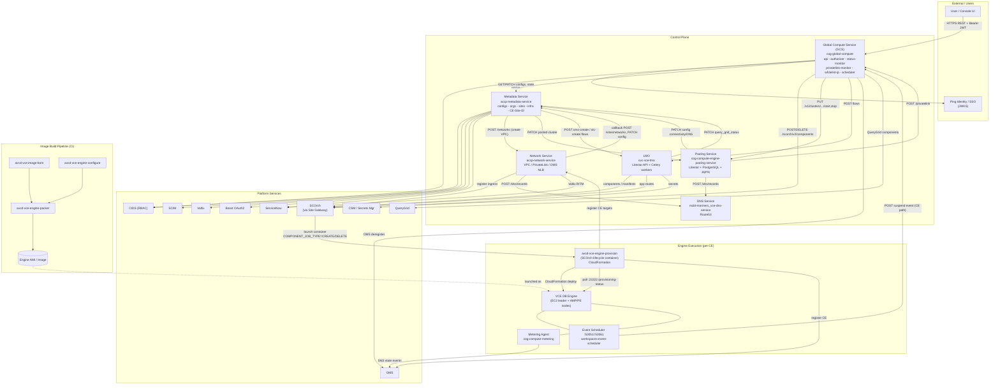
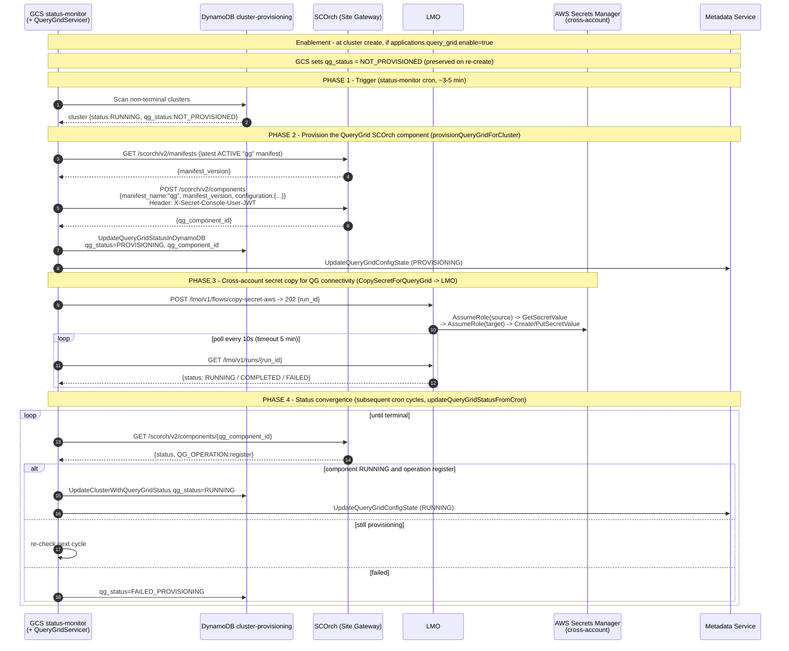
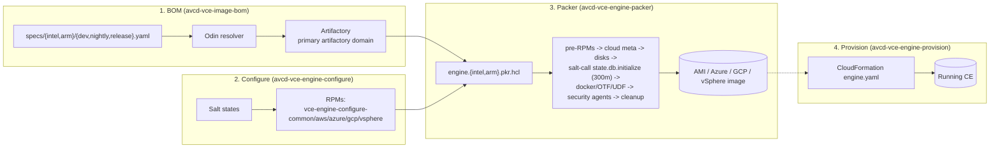

# Teradata VantageCloud Lake — Compute Engine (CE) Provisioning & Deprovisioning

> **Scope:** How a Compute Engine (CE) is provisioned, configured, monitored, suspended, and torn down across the Teradata `Teradata-PE` / `Teradata-TIO` repositories in this workspace, and exactly how the services talk to each other and to platform services.
>
> **Repos covered (13):** `cog-global-compute`, `accp-metadata-service`, `accp-network-service`, `svc-vce-lmo`, `cog-compute-engine-pooling-service`, `avcd-vce-image-bom`, `avcd-vce-engine-packer`, `avcd-vce-engine-configure`, `avcd-vce-engine-provision`, `workspaces-event-scheduler`, `cog-compute-metering`, `mcld-mariners_vce-dns-service`, `ce-assistant`.
> **Excluded by request:** `ce-agent`.
>
> **Method:** Findings below were verified against source code (handlers, routers, service layers, CloudFormation/Salt/Packer templates, proto/SQL). Where this document corrects the older `diagrams-mermaid-code.md` / `cog-global-compute/SPEC.md`, it is flagged in **§13 Discrepancies**.

---

## Table of Contents

1. [What a Compute Engine is](#1-what-a-compute-engine-is)
2. [Service catalog](#2-service-catalog)
3. [System architecture](#3-system-architecture)
4. [Authentication & authorization model](#4-authentication--authorization-model)
5. [Inter-service API matrix](#5-inter-service-api-matrix)
6. [Prerequisite: org & site onboarding + network provisioning](#6-prerequisite-org--site-onboarding--network-provisioning)
7. [Provisioning flow — STANDARD (SCOrch) cluster](#7-provisioning-flow--standard-scorch-cluster)
8. [Provisioning flow — POOLED cluster](#8-provisioning-flow--pooled-cluster)
9. [The engine deploy container & CloudFormation](#9-the-engine-deploy-container--cloudformation)
10. [Post-provisioning side-effects (OMS, QueryGrid, PrivateLink, secrets)](#10-post-provisioning-side-effects)
11. [Status reconciliation](#11-status-reconciliation)
12. [Deprovisioning, suspend & scheduling](#12-deprovisioning-suspend--scheduling)
13. [The engine image build pipeline](#13-the-engine-image-build-pipeline)
14. [Data stores](#14-data-stores)
15. [State machines](#15-state-machines)
16. [Discrepancies vs prior docs & notable risks](#16-discrepancies-vs-prior-docs--notable-risks)
17. [Per-repo quick reference](#17-per-repo-quick-reference)

---

## 1. What a Compute Engine is

A **Compute Engine (CE)** is an on-demand Teradata database cluster (TDBMS) that runs inside a customer **VantageCloud Lake "site"** on a cloud provider (AWS fully supported; Azure/GCP partially). Each CE is described by a **Compute Engine Config** (stored in the Metadata Service) and is realized by one of two **provisioner backends**:

| Provisioner | Backend | Tenancy | Realized by |
|---|---|---|---|
| **STANDARD** (`SCORCH`) | SCOrch component platform launches a per-CE deploy container that runs CloudFormation | Single-tenant (dedicated infra) | `avcd-vce-engine-provision` container → CloudFormation stack of EC2 instances |
| **POOLED** | Pooling Service allocates nodes from a warm EC2 Auto Scaling Group pool | Multi-tenant (shared warm pool) | `cog-compute-engine-pooling-service` → detaches pooled EC2 instances into a cluster |

Every cluster request enters through the **Global Compute Service (GCS)** REST API, which reads the config from the Metadata Service to decide which backend to route to (`compute.type == POOLED` → Pooling, else → SCOrch).

**Key identifiers**
- `site_id` — the VantageCloud Lake site (partition for most data).
- `config_id` / `compute_engine_config_id` — the CE configuration's primary key.
- **CE Site ID** — a 17-char ID minted by the Metadata Service: `CE` + platform code (`AM`=AWS, `AZ`=Azure) + 8-char org name + base36 per-org counter, e.g. `CEAMEXAMPLE10001X`.
- `component_id` — the SCOrch component ID (or pooled cluster UUID), stored as the reverse-lookup GSI key in GCS.

---

## 2. Service catalog

| # | Service (repo) | Language / runtime | Deployment | Role in CE lifecycle |
|---|---|---|---|---|
| 1 | **Global Compute Service — GCS** (`cog-global-compute`) | Go 1.25 | Lambdas: `api`, `authorizer`, `status-monitor`, `privatelink-monitor`, `whitelist-ip` + ECS Fargate `scheduler` | **Central control plane.** Receives all `/clusters` & `/configs` requests, routes to SCOrch/Pooling, drives status reconciliation, auto-suspend, PrivateLink, OMS/QueryGrid lifecycle |
| 2 | **Metadata Service** (`accp-metadata-service`) | Go | Lambda + API GW; + DynamoDB-Stream, SQS, and scheduled processor Lambdas | **Canonical store** of CE configs, orgs, sites, infrastructure snapshots, CE-Site-ID counter. Owns config `state`. Onboards orgs/sites and kicks network provisioning |
| 3 | **Network Service** (`accp-network-service`) | Go | ECS Fargate `:8080` | Provisions per-site **VPC / subnets / NAT / SGs / OMS NLB / VPC-endpoint-service / PrivateLink**; registers ingress with Site Gateway; deploys Valtix; calls back to Metadata |
| 4 | **LMO — Lifecycle/Management Orchestrator** (`svc-vce-lmo`) | Python | Litestar API (Granian `:8000`) + Celery workers (ECS Fargate); SQS-FIFO broker; Redis/Valkey results | **Async workflow engine.** Runs named multi-step "flows" (QueryGrid provisioning, OMS component create/delete, secret copy/delete/rotate, manifest sync, health checks) on behalf of GCS & Metadata; reports back via signed webhook |
| 5 | **Pooling Service** (`cog-compute-engine-pooling-service`) | Python | Litestar + ALB on **ECS Fargate**; **PostgreSQL (RDS)** + **pgmq** queue; in-process async consumer | **Pooled-cluster manager.** Keeps warm EC2 ASG pools, allocates nodes into multi-tenant clusters, configures nodes over HTTP, scales/terminates |
| 6 | **Engine Image BOM** (`avcd-vce-image-bom`) | YAML + Odin | CI | Defines the package **bill-of-materials** for the engine image (dev/nightly/release × intel/arm) |
| 7 | **Engine Packer** (`avcd-vce-engine-packer`) | Packer HCL | CI | **Bakes** the multi-cloud engine image (AWS AMI / Azure / GCP / vSphere) from the BOM + Salt states |
| 8 | **Engine Configure** (`avcd-vce-engine-configure`) | SaltStack → RPMs | CI | The Salt states/config assembled into the engine; pre-init states (bake-time) + post-init RPMs (boot-time) |
| 9 | **Engine Provision** (`avcd-vce-engine-provision`) | Bash container + CloudFormation / Bicep / Terraform | Launched by **SCOrch** as a "lifecycle container" | **Actually provisions/deprovisions one single-tenant CE.** `COMPONENT_JOB_TYPE=CREATE/DELETE` → deploy/destroy the per-CE CloudFormation stack, poll engine health, register OMS/network targets |
| 10 | **Event Scheduler** (`workspaces-event-scheduler`) | Go | **On the engine**; gRPC `:50051` + REST `:50061` | Detects **inactivity** and signals suspend; collects **telemetry** (Parquet via `WRITE_NOS`) and crashdumps |
| 11 | **Metering Agent** (`cog-compute-metering`) | Python | systemd service **on the engine node** (leader) | Emits CE **state/health events** (RUNNING/STOPPED + autoscale sizing) to an **AWS SNS topic** every 5 min — the billing signal (NOT consumption SQL) |
| 12 | **DNS Service** (`mcld-mariners_vce-dns-service`) | Python | Lambda + API GW + **Route53** (two-tier: Chalice proxy → FastAPI worker) | CRUD of CE endpoint DNS records (A / CNAME / TXT); called by Network Service & Pooling Service |
| 13 | **CE Assistant** (`ce-assistant`) | Go + AWS Bedrock | ECS Fargate | **Read-only advisory** tool (sizing/cost recommendations via LLM). NOT in the runtime provisioning critical path |

**External / platform services** these depend on: **SCOrch** (component orchestration, reached via **Site Gateway** `https://{site_id}.gateway.{env}.cloud.<CORP_DOMAIN>`), **OMS** (Operations Management System), **QueryGrid**, **CIDS** (RBAC), **Ping Identity / SSO** (JWT/JWKS), **Boost** (OAuth2 client-credentials), **SCIM** (identity), **Valtix** (firewall), **ServiceNow** (CMDB / site records), **CSM** (Central Secrets Manager), **Viewpoint** (monitoring), **Artifactory + Odin** (artifacts).

---

## 3. System architecture



**The three planes**
- **Control plane** (GCS, Metadata, LMO, Pooling, Network, DNS) — long-running services that decide *what* should exist and reconcile state.
- **Platform services** (SCOrch, OMS, CIDS, Boost, Ping, SCIM, Valtix, ServiceNow, CSM) — shared Teradata infrastructure.
- **Engine execution** — the per-CE container that builds infra, plus the on-engine agents (Event Scheduler, Metering Agent).

---

## 4. Authentication & authorization model

| Mechanism | Used by | How |
|---|---|---|
| **Ping / Customer JWT** (user-facing) | GCS `authorizer` Lambda, Pooling Service, LMO | Bearer token validated against JWKS. GCS authorizer determines issuer (`PingIssuer` / `CustomerIssuer`), RSA-verifies against `{pingHost}/pf/JWKS` (Ping) or `{issuer}/v1/keys` (customer), then applies path-based authorization for the requester type. One-Teradata: a `cat`-scope token is exchanged at `{issuer}/idp/userinfo.openid` for a `customer_token`. |
| **CIDS RBAC** (service layer) | GCS, Metadata | `POST {cids}/v1/rbac/resolve` (Ping/VCE) or `/v1/resources/resolve` (customer). GCS privilege map: create→`compute_engine:start_stop`, get/list→`compute_engine:read`, update→`compute_engine:create_update`, delete→`compute_engine:start_stop`. Service-account tokens skip RBAC. |
| **GCS service token** | GCS → SCOrch/Metadata/Pooling/OMS/LMO/QueryGrid | Ping **password-grant** OAuth2 bearer. Credentials retrieved with a 3-tier fallback: **CSM primary → CSM backup → AWS Secrets Manager**. Cached via single-flight. |
| **Boost OAuth2** | Metadata → Network/Pooling/CIDS/SCIM/SSO-Ping/Boost callback | Client-credentials bearer; client id/secret from Secrets Manager. |
| **HTTP Basic** | →ServiceNow | Creds from a Secrets Manager secret; SNOW domain from SSM. |
| **AWS SigV4** | Metadata→Valtix; GCS→CSM (plus `X-Api-Key`) | Signed AWS requests. |
| **HMAC webhook signature** | Metadata `setup-callback`, LMO callbacks | LMO posts terminal results to `X-LMO-Callback-URL` signed `sha256=<hmac>` using `X-LMO-Callback-Secret`. |
| **IAM / STS AssumeRole** | All AWS-resource ops, cross-account suspend/privatelink/secrets | e.g. GCS auto-suspend assumes `GlobalComputeRole` in the target account; privatelink-monitor double-hops in non-prod via intermediate account `<PRIVATELINK_MONITOR_ACCT>`; provision container assumes `VCE-Secret-Role`. |
| **Engine API keys** | Event Scheduler gRPC/REST | `authorization-key` / `Authorization` validated against the on-engine SQLite `user_api_keys` table. |

> **All internal service-to-service HTTP uses OAuth2 bearer tokens (Ping- or Boost-issued) validated as JWTs.** The Pooling Service in particular validates **Ping JWT** (not IAM/SigV4 as older diagrams claimed); callers present a Ping/Boost-derived bearer.

---

## 5. Inter-service API matrix

This is the heart of "which APIs the services use to interact." URLs are shown as templates; `{env}` is dropped in prod and the host shortens to the prod domain.

### 5.1 APIs that GCS (`cog-global-compute`) consumes

| Target | Method + path | Why | Auth |
|---|---|---|---|
| Metadata | `GET /v1/compute-engine-configs/{id}` | Route decision, status-monitor, OMS/QG | GCS token |
| Metadata | `GET /v1/compute-engine-configs/{id}/provisioning-config` | Full provisioning payload at create | GCS/SA token |
| Metadata | `PATCH /v1/compute-engine-configs/{id}` `{state, cluster:{…}}` | Push config `state` (TERMINATED→NOT_PROVISIONED remap) | GCS token |
| Metadata | `PUT /v1/compute-engine-configs/{id}/infrastructure` | Write node IPs/infra when RUNNING | GCS token |
| SCOrch (Site GW) | `POST /scorch/v2/components` | Create CE (manifest `ce`, desired_status RUNNING) | fresh GCS token |
| SCOrch | `DELETE /scorch/v2/components/{componentID}` | Delete CE | GCS token |
| SCOrch | `GET /scorch/v2/components/{id}` | Poll status | GCS token |
| SCOrch | `GET /scorch/v2/manifests` | Resolve latest ACTIVE manifest version | GCS token |
| Pooling | `PUT /v1/clusters/{cluster_id}/start` | Provision a pooled CE | GCS token |
| Pooling | `PUT /v1/clusters/{cluster_id}/stop` | Deprovision a pooled CE | GCS token |
| Pooling | `GET /v1/clusters[/{id}]` | List / status | GCS token |
| OMS (Site GW) | `POST /oms/ce-admin/v1/compute-engines` | **[as-deployed — no longer called from GCS]** Register CE with OMS. The live registrar is the **provision container** (dedicated) or **LMO** (pooled) — see KB §5.6 #4 | GCS token |
| OMS | `GET /oms/ce-admin/v1/compute-engine-jobs/{jobId}` | **[as-deployed — see row above]** Poll registration job | GCS token |
| OMS | `DELETE /oms/ce-admin/v1/compute-engines/{engineId}` | Deregister (POOLED delete / failed cleanup) | GCS token |
| OMS db-admin | `{gw}/oms/db-admin/v1/global-databases…` | Global DB management API (proxied) | CIDS-exchanged OMS token |
| QueryGrid (Site GW) | `POST /scorch/v2/components` (manifest `qg`), `PATCH/DELETE …` | QG add-on lifecycle (token in header `X-Secret-Console-User-JWT`) | GCS token |
| QueryGrid | `GET /querygrid/api/v1/config/{connectors,fabrics}` | Read QG config | caller token |
| LMO | `POST /lmo/v1/flows/copy-secret-aws`, `…/delete-secret-aws` + `GET /lmo/v1/runs/{run_id}` | Cross-account secret copy (QG) / delete (config delete) | GCS token + callback headers |
| CIDS | `POST /v1/rbac/resolve` or `/v1/resources/resolve` | Authorization | GCS token |
| Ping | `POST /as/token.oauth2`, `GET /pf/JWKS` | Service token + JWKS | client creds |
| ServiceNow | `GET /api/now/table/u_cmdb_ci_siteid?name={siteID}` | Account/region lookup (auto-suspend, privatelink) | Basic |
| CSM | `GET /secretmanager/secret?secret_id=` | Service password | API key + SigV4 |

### 5.2 APIs that Metadata (`accp-metadata-service`) consumes

| Target | Method + path | Why |
|---|---|---|
| Network | `POST /networks` / `DELETE /networks` / `GET /networks/status/{requestId}` | Create/teardown/poll site VPC network |
| Network | `POST/PATCH/DELETE /networks/{siteId}/compute-engines/{ceConfigId}/private-link` | Per-CE PrivateLink |
| Network | `POST /quotas` | CSP quota adjustment |
| Pooling | `POST/PUT/DELETE/GET /v1/clusters[/{id}]` | Pooled cluster record lifecycle + network-settings propagation |
| LMO | `POST /lmo/v1/flows/{oms-create,oms-delete,stc-create}` + `GET /lmo/v1/runs/{id}` | OMS / SCOrch (STC) component workflows; callback = `…/v1/site-settings/{siteId}/setup-callback` |
| CIDS | `/v1/resources…`, `/v1/rbac/roles`, `POST /v1/resources/resolve` | RBAC resource registration + per-request resolve |
| SCIM | proxy + `POST /tdscim/v1/config/targets`, `DELETE …/{ceId}`, `POST …/resolve-group-users` | Register/deregister CE as SCIM target; resolve groups→users |
| Valtix | `PUT /transit-connectivity/api/v2/egress/{siteId}` | Whitelist IdP FQDN for CE egress (SigV4) |
| ServiceNow | `GET …/siteDetails`, `POST …/create_ce_site`, `PATCH …/deinstall_ce_site`, `GET …/checkPoolingSite` | Org/site sync + CE site notifications |
| Boost | `POST tokenURL` (client_credentials); `POST callbackURL` | Service token; org-onboarding-ready callback |
| SSO-Ping | `GET /idp-connections` | issuer→IdP→sites scoping |

### 5.3 APIs that the other services consume

| Caller | Target | Method + path | Why |
|---|---|---|---|
| **Network** | Site Gateway | register/PATCH ingress `/{siteId}` (poll 10s, 5min) | Register NAT + OMS endpoint IPs |
| Network | DNS | `POST /dns/records` (TXT), `DELETE /dns/records` | CE DNS records |
| Network | ServiceNow | create/poll/teardown RITM | Deploy/teardown Valtix |
| Network | Metadata | `POST /sites/networks` (callback), `PATCH /compute-engine-configs/{id}`, `DELETE /organizations/{id}?notify=true` | Status callbacks |
| **LMO workers** | SCOrch | `POST/GET/PATCH/DELETE /scorch/v2/components`, `/scorch/v2/manifests` | OMS/QG components, manifest sync |
| LMO workers | Site Gateway | `/v2/approutes[/{site_id}/{app}]` | App-route lifecycle for OMS |
| LMO workers | Artifactory | `POST /api/search/aql`, `GET /{artifact}` | BOM/manifest artifacts |
| LMO workers | Metadata | `GET`/`PATCH /compute-engine-configs/{id}` | Read POOLED/QG flags; write `query_grid_status` |
| LMO workers | AWS STS + Secrets Manager | AssumeRole + Get/Put/Create/Delete Secret | Secret-lifecycle flows |
| **Pooling** | Metadata | `PATCH /compute-engine-configs/{config_id}` | Report connectivity/PrivateLink + DNS name |
| Pooling | DNS | `GET/POST/PATCH/DELETE /dns/records` | Cluster A record |
| Pooling | GCS | `POST /privatelink` | Request VPC interface endpoint |
| Pooling | Ping | `POST /as/token.oauth2` | Service token for the above |
| Pooling | Node agents | `POST :8080/poolclusterconfig`, `:8080/execute`; `GET :22222/{provisioning-status,dbs-state,system-info}` | Configure nodes; read CMDB/health |
| **Provision container** | Network | `PATCH/DELETE /networks/{site}/compute-engines/{name}/targets`, `GET /networks/status/{rid}` | Register CE leader/QG node IPs as NLB targets |
| Provision container | OMS | `POST/DELETE /ce-admin/v1/compute-engines`, `GET /ce-admin/v1/compute-engine-jobs/{id}` | Register/deregister CE with OMS |
| Provision container | Viewpoint | `GET/DELETE /api/v2/public/monitored_systems` | Remove monitored system on delete |
| Provision container | Engine on-box | `GET :22222/provisioning-status`, `POST :50061/scheduler-telemetry-stop` | Poll readiness; stop telemetry on delete |
| **Event Scheduler (CE path)** | GCS | `POST` suspend event (HTTPS, OAuth2) | Signal cloud-side suspend |
| **Event Scheduler (classic)** | Workspaces svc | gRPC `EngineSuspend` → `localhost:3282` | Suspend AI-Unlimited workspace engine |
| **Metering Agent** | AWS SNS | `Publish` to `global-compute-engine-metering-service-{env}` | Cluster state/billing signal |
| Metering Agent | Engine node | `GET :22222/{dbs-state,cluster-health}` | Local health |

### 5.4 APIs each service **exposes** (entry points)

| Service | Notable exposed routes |
|---|---|
| **GCS** | `POST/GET/DELETE /clusters[/{id}]`, `POST/GET/PATCH/DELETE /configs[/{id}]`, `…/roles-map`, `GET /organizations[/{id}]`, `/oms/db-admin/global-databases…`, `POST /privatelink`, `GET /querygrid/{connectors,fabrics,health-check}`, `GET /sites/{site_id}/{resource}`, `/site-settings…`, `GET /health` |
| **Metadata** | `GET/POST/GET/PATCH/DELETE /compute-engine-configs[/{id}]`, `…/{id}/provisioning-config`, `…/{id}/infrastructure`, `…/{id}/roles-map`, `…/{id}/db-settings`, `GET/POST/GET/POST/DELETE /organizations[/{id}]`, `PUT /organizations/{id}/networks`, `POST /sites/networks` (network callback), `GET /sites[/{id}[/{resource}]]`, `/site-settings/{id}` + `POST …/setup-callback` (LMO HMAC callback), `GET /health` |
| **Network** | `GET/POST/DELETE /networks`, `GET /networks/{vce_site_id}`, `GET /networks/status/{request_id}`, `…/targets`, `POST/PATCH/DELETE …/compute-engines/{ce}/private-link`, `DELETE /networks/cleanup`, `POST /quotas`, `GET /health` |
| **LMO** | `GET /lmo/v1/flows`, `POST /lmo/v1/flows/{flow_name}` (one route per registered flow → `202 {run_id}`), `GET /lmo/v1/runs[/{run_id}]`, `POST …/runs/{id}/cancel`, `/lmo/v1/schedules…`, `/lmo/v1/monitor/{workers,queues,…}` |
| **Pooling** | `GET /alive`, `GET /ready`, `/v1/pools…`, `GET /v1/clusters/sizes`, `GET /v1/clusters[/{uuid}]`, `GET …/{uuid}/infrastructure`, `POST /v1/clusters`, `DELETE …/{uuid}`, `PUT …/{uuid}` (update), `PUT …/{uuid}/start`, `PUT …/{uuid}/stop`, `/maintenance/…` |
| **DNS** | (worker) `POST/PATCH/DELETE/GET /dns/records`, `POST /dns/validate/acm-cert`, `GET /dns/health`; (proxy) `ANY /dns/{proxy+}`, `/version[s]…` |
| **Event Scheduler** | gRPC `:50051` (`schedulerApi`, `configAPI`); REST `:50061` (`/start-scheduler`, `/scheduler-status`, `/scheduled-projects`, `/project-event-{add,update,delete}`, `/scheduler-[vce-]telemetry-{start,stop,status}`, `/scheduler-crashdump-{start,stop,status}`, `/healthcheck`) |
| **Metering Agent** | `POST /scale` on `127.0.0.1:23000` (loopback, leader only) |
| **CE Assistant** | `GET /v1/healthz`, `/v1/sites/{site_id}/ces`, `/v1/ces/{config_id}`, `POST /v1/cost:estimate`, `POST /v1/recommendations`, `POST /v1/provisions` (gated, 501 by default) |

---

## 6. Prerequisite: org & site onboarding + network provisioning

Before any CE can be provisioned, the **organization**, **site**, and **site network** must exist. This is owned by the Metadata Service + Network Service.

```mermaid
sequenceDiagram
    autonumber
    participant ADMIN as Admin / Console
    participant META as Metadata Service
    participant SNOW as ServiceNow
    participant NET as Network Service
    participant AWS as AWS (VPC/EC2/ELB)
    participant SGW as Site Gateway
    participant VALTIX as Valtix
    participant DNS as DNS Service

    ADMIN->>META: POST /organizations  (202 Accepted, async)
    META->>META: Mint CE-Site-ID counter; normalize org name
    META->>SNOW: GET siteDetails / create_ce_site
    META->>NET: POST /networks {vce_site_id, csp, region, cidr}
    NET->>NET: Lock requestId in network-svc-status (IN_PROGRESS); return 202
    NET->>AWS: CreateVpc, Subnets (3/AZ), IGW, 2x EIP+NAT, SGs, RouteTables, FlowLogs
    NET->>AWS: OMS NLB + VPC Endpoint Service + VPC Endpoints
    NET->>VALTIX: Deploy access controller (via ServiceNow RITM, poll 15s/60m)
    NET->>SGW: Register ingress (NAT + OMS IPs), poll 10s/5min
    NET->>DNS: POST /dns/records (TXT)
    NET->>NET: Write network-svc-sites row; status COMPLETED
    NET->>META: POST /sites/networks (callback) {request_id, status, data}
    META->>META: Update vce-sites.standard_network_details
    Note over META,ADMIN: org-sync-processor periodically reconciles ServiceNow sites -> vce-sites
```

**Network resources created per site (AWS)** — verified in `accp-network-service/src/internal/providers/aws/vpc/aws_vpc_deploy.go`:
- VPC (CIDR from request, **not** a hardcoded `10.0.0.0/16`), VPC Flow Logs.
- **3 subnets per AZ**: CE-private, Valtix-private (datapath), Valtix-public (NAT).
- Internet Gateway; **2 Elastic IPs + 2 NAT Gateways** (Valtix mgmt + datapath).
- Security groups (CE / Valtix / inter-node); route tables.
- **OMS Network Load Balancer (internal) + TargetGroup + Listener**; **VPC Endpoint Service** for OMS + **VPC Endpoints** for CE↔OMS PrivateLink.
- Valtix access controller via ServiceNow; Site Gateway ingress registration; DNS TXT records.

The Network Service status table (`network-svc-status`, PK `requestId`, TTL ~4 weeks) drives both async-status polling and **entity locking** (concurrency control via `TransactWriteItems`).

---

## 7. Provisioning flow — STANDARD (SCOrch) cluster

This is the single-tenant path: `POST /clusters` with a config whose `compute.type != POOLED`.

```mermaid
sequenceDiagram
    autonumber
    participant USER as User / Console
    participant AUTH as GCS authorizer Lambda
    participant GCS as GCS api Lambda
    participant CIDS as CIDS (RBAC)
    participant META as Metadata Service
    participant DDB as DynamoDB cluster-provisioning
    participant SCORCH as SCOrch (Site Gateway)
    participant PROV as Engine Provision container
    participant CFN as CloudFormation
    participant ENGINE as VCE DB Engine

    USER->>AUTH: POST /clusters {config_id}  (Bearer JWT)
    AUTH->>AUTH: Validate JWT vs JWKS; path-based authz; return IAM policy
    AUTH->>GCS: Proxy with auth context (correlation/request IDs)
    GCS->>META: GET /v1/compute-engine-configs/{id}  (route decision)
    Note over GCS: compute.type != POOLED -> ClusterServicer (SCOrch)
    GCS->>META: GET .../{id}/provisioning-config  (SA token)
    GCS->>GCS: Guards - connectivity.status must be PRIVATE_LINK_COMPLETED/SUCCESS;<br/>CheckConfigStateAvailable (409 if in-use; FAILED_PROVISIONING is allowed -> retry)
    GCS->>CIDS: resolve create -> compute_engine:start_stop
    GCS->>SCORCH: GET /scorch/v2/manifests  (latest ACTIVE, or by database_version if non-prod)
    GCS->>SCORCH: POST /scorch/v2/components<br/>{name=lower(config_id), manifest_name:"ce", manifest_version,<br/> platform, desired_status:"RUNNING", configuration:{...}}
    SCORCH-->>GCS: {component_id}
    GCS->>DDB: upsert {site_id, config_id, status=PROVISIONING, component_id, provisioner=SCORCH}
    GCS->>META: PATCH state=PROVISIONING (+ cluster info)
    GCS-->>USER: 202 Accepted

    Note over SCORCH,ENGINE: Async execution
    SCORCH->>PROV: Launch lifecycle container (COMPONENT_JOB_TYPE=CREATE)
    PROV->>PROV: Phase 1 setup (AMI, IAM, S3, subnet, SQS, prefix-list, DNS, OMS, viewpoint)
    PROV->>CFN: Phase 2 deploy CloudFormation (engine.yaml)
    CFN-->>ENGINE: EC2 leader + AMP/PE nodes (encrypted EBS, SGs, per-cluster secrets)
    PROV->>ENGINE: Phase 3 poll GET :22222/provisioning-status until stage=completed,state=configured
    PROV->>PROV: Phase 6/7 register network targets + OMS (conditional)
    PROV-->>SCORCH: status/output files

    Note over GCS,ENGINE: GCS status-monitor (CloudWatch cron ~3-5 min) reconciles -> RUNNING (gated on OMS)
```

> ⚠️ **"gated on OMS" above is pre-GPSC-3735 — do not route on it.** KB §5.6 #2 records that the
> infra PUT is no longer OMS-gated (`e0a0cb80`: *"OMS registration is handled downstream and must
> not gate this path"*), and KB §5 states the **dedicated** path never had an OMS gate at all
> (KB §8.3 triage tree, §5 state model). Treat the note as `[as-deployed]` history: a dedicated CE
> sitting at Starting is **not** explained by an OMS gate. Confirm against the tree before
> concluding otherwise.

**Key control-plane mechanics** (`cog-global-compute`):
- **Routing** (`internal/api/router_helper.go`): GCS fetches the config to detect POOLED vs SCOrch — one extra Metadata round-trip per request.
- **Guards** (`ClusterServicer.FetchConfigFromMetadata`): connectivity must be PrivateLink-complete; config `state` must not already be in-use (409). `FAILED_PROVISIONING` is **not** blocked → a conditional `UpdateItem` CAS (`FAILED_PROVISIONING → PROVISIONING`) enables a single retry; the loser gets 409.
- **Manifest resolution**: `GetManifestVersionByDatabaseVersion` (non-prod + explicit `database_version`) else `GetLatestActiveManifestVersion`.
- **Cluster name** = `strings.ToLower(config_id)`.
- **Persistence**: GCS writes its own DynamoDB row (status/component_id/provisioner) **and** PATCHes Metadata `state`. These are two non-atomic writes — divergence is possible if the second fails.

---

## 8. Provisioning flow — POOLED cluster

Multi-tenant path: `POST /clusters` with `compute.type == POOLED`. GCS delegates to the Pooling Service, which allocates nodes from a **warm EC2 ASG pool**.

> **Important correction:** the Pooling Service is **ECS Fargate + Litestar + ALB + PostgreSQL + pgmq + an in-process async consumer + Ping-JWT auth** — *not* the API/Worker/Job Lambdas + SQS + DynamoDB design shown in the old diagrams. There is one logical queue (`deployment`, pgmq), and pooled instances are **terminated on release** (the warm *pool* stays, individual cluster instances do not return to it).

```mermaid
sequenceDiagram
    autonumber
    participant GCS as GCS api Lambda
    participant META as Metadata Service
    participant POOL as Pooling Service (Litestar)
    participant PG as PostgreSQL
    participant Q as pgmq "deployment" queue
    participant CON as In-process consumer
    participant ASG as EC2 ASG (warm pool)
    participant NODE as Node agents (:8080 / :22222)
    participant DNS as DNS Service

    Note over META,POOL: At POOLED config creation a cluster record (UUID) is created via POST /v1/clusters
    GCS->>META: GET /v1/compute-engine-configs/{id}  (type=POOLED)
    GCS->>POOL: PUT /v1/clusters/{cluster_id}/start  (Bearer)
    POOL->>PG: state -> PROVISIONING
    POOL->>Q: enqueue TaskClusterStart
    POOL-->>GCS: 202 Accepted
    GCS->>GCS: DynamoDB upsert (POOLED) + PATCH Metadata state

    CON->>Q: read_with_poll(vt=40, qty=1)
    CON->>ASG: ensure capacity (zone-aware multiplier); find InService+Healthy instances
    CON->>ASG: detach chosen instances (ShouldDecrementDesiredCapacity=false -> pool refills)
    CON->>NODE: POST :8080/poolclusterconfig (leader) / :8080/execute (followers)
    CON->>NODE: poll :22222/provisioning-status until configured
    CON->>PG: state -> RUNNING; record instances/resources
    POOL->>META: PATCH /compute-engine-configs/{id} (connectivity, DNS name)
    POOL->>DNS: POST /dns/records (A record)
    POOL->>GCS: POST /privatelink (if private-link connectivity)

    Note over GCS: status-monitor polls GET /v1/clusters/{id} -> normalizes status -> RUNNING (gated on OMS)
```

> ⚠️ **"gated on OMS" above is pre-GPSC-3735.** The pooled OMS gate was real — `poolingService.go`
> fired the infra PUT only when `oms_status == REGISTERED` — but GPSC-3735 removed it and GPSC-3811
> escalates `FAILED`/`TIMEOUT` to `FAILED_PROVISIONING`. **That is not the whole story:** open
> lifecycle defect 16 cites a *second* gate (`clusterService.go:2375-2410`) that can still wedge a
> pooled CE at `CONFIGURING`. Read KB §5.6 #1–#2 **and** §8.3's caveat before using this diagram to
> explain a stuck pooled CE. `[as-deployed]`

**Pooling internals** (`cog-compute-engine-pooling-service/pool_manager/`):
- **Pools** = LaunchTemplate (350 GB encrypted EBS, instance profile, SG, cloud-config UserData) + Auto Scaling Group (MixedInstancesPolicy). Declarative reconcile via `PUT /v1/pools`; scale via `PUT /v1/pools/{id}/scale`.
- **Allocation**: `_choose_instances` picks per-zone InService+Healthy instances, **detaches** them from the pool ASG so the pool refills, tags them with cluster/site, adds the cluster SG, and gives the leader a per-cluster IAM instance profile. Autoscaling clusters get a follower ASG with AMP-weighted capacity.
- **Async work**: single coroutine consumer (`queue/consumer.py`) polls the pgmq `deployment` queue; task types `TaskClusterStart`, `TaskClusterStartDeployment`, `TaskClusterMonitorDeployment`, `TaskClusterCommand`. Retry via pgmq `read_ct`; visibility extended by `task.heartbeat()`. No SQS DLQ.
- **Config from SSM**: `INFRA_CONFIG_PATH` parameter holds VPC, subnets, instance profile/SG/key, DSN, NAT IPs, KMS/PCA ARNs, etc.

---

## 9. The engine deploy container & CloudFormation

`avcd-vce-engine-provision` is the SCOrch **lifecycle container** that actually stands up (and tears down) a single-tenant CE. SCOrch launches it with the component `configuration` mapped to environment variables; the selector is **`COMPONENT_JOB_TYPE`**.

**Entry/dispatch:** `entrypoint.sh` validates env (`CLOUD_PLATFORM`, `SITE_ID`, `COMPONENT_JOB_TYPE`), then sources `src/{aws|azure|gcp}/engine/runner.sh`. The container reports back to SCOrch by writing status/output to runtime-injected files `${STATUS_FILE_PATH}` / `${OUTPUT_FILE_PATH}` (and reads component config from `${COMPONENTS_FILE_PATH}`).

| `COMPONENT_JOB_TYPE` | Component | Effect |
|---|---|---|
| `CREATE` | engine | setup → deploy CFN → poll engine health → (network targets) → (OMS register) |
| `DELETE` | engine | OMS deregister → telemetry stop → viewpoint remove → network targets remove → SQS/S3 cleanup → **delete CFN stack** → delete IAM |
| `CREATE`/`UPDATE`/`DELETE` | aws-secrets (separate component) | deploy/update/delete the secrets + admin CloudFormation stacks (incl. rotation Lambda) |

> There is **no START/STOP/SUSPEND/RESUME or resize** job type in this container — suspend/resume is owned by GCS + SCOrch + the on-engine Event Scheduler.

### CREATE phases (AWS) — `src/aws/engine/runner.sh`
1. **Setup** (parallelized): resolve AMI (`tdc-vce-engine-v{maj}-{min}-{patch}-*`, arch-matched i4i/i7i↔i8g), compute DNS `{component}.ce.{env}.<NONPROD_CLOUD_DOMAIN>`, create IAM role + instance profile, persist IDP/ACL/DBS controls, managed prefix-list of Teradata CIDRs, an **SQS status queue** named `{stack}`, an S3 bucket `{site_id}`, look up the CE subnet; conditionally set up IP-abstraction / OMS / Viewpoint.
2. **Deploy**: `aws cloudformation deploy --template-file engine.yaml --capabilities CAPABILITY_NAMED_IAM …` (~40 params), then parse stack Outputs into the output file.
3. **Network targets** (phase 6, if private + privatelink): `PATCH {network-svc}/networks/{site}/compute-engines/{name}/targets` (leader IP as `compute-engine` target, all node IPs as `query-grid` targets), poll status.
4. **Configure / health** (phase 3): poll `GET :22222/provisioning-status` until `stage=completed, state=configured` (timeout 1200s). **Fallback**: if `:22222` is unreachable, read engine status from the **SQS status queue** the engine pushes to.
5. **OMS registration** (phase 7, if `ENABLE_OMS && !SKIP_PRIVATELINK && !PUBLIC`): `POST {OMS}/ce-admin/v1/compute-engines`, poll `…/compute-engine-jobs/{id}` until `SUCCEEDED`.

**CloudFormation `engine.yaml`** creates per-CE: a cluster **placement group**, a **launch template**, **1–32 EC2 instances** (leader `001` + AMP/PE nodes; encrypted root EBS + NVMe instance store; `#cloud-config` UserData driving Salt highstate + `orch.engine`), optional second ENI for IP-abstraction, **3 security groups** (cluster/services :50061,:22222/SQL+SSH), an inline IAM policy, and **3 Secrets Manager secrets** (cluster join token, leader IP, jupyter). **Telemetry & Viewpoint are seeded as cloud-init roles** (`td_unlimited_telemetry`, `td_unlimited_viewpoint`) so the engine self-registers — the container does *not* actively start them on CREATE.

> The **password-rotation Lambda is in the separate `aws-secrets` component**, not the engine stack. It creates/rotates the `{site}-ce-tdaas_s1/s2/maint`, `{site}-ce-dbc` secrets on 80–90-day schedules and writes new passwords to Secrets Manager; an on-engine Salt cron syncs them into the DB.

### DELETE phases (AWS)
OMS deregister → telemetry stop (`POST :50061/scheduler-telemetry-stop`) → remove monitored system from Viewpoint → remove network targets → purge+delete SQS queue → delete the S3 folder (bucket preserved) → **`delete-stack` + wait** (terminates instances, ENIs, SGs, per-cluster secrets) → delete IAM role/instance-profile. The site VPC/subnets/prefix-list and the secrets component are preserved (torn down by their own owners).

---

## 10. Post-provisioning side-effects

After a CE's infrastructure exists, several add-ons are wired up. These have **overlapping owners** (control plane and the engine container), so the table clarifies who does what.

| Concern | Mechanism | Owner(s) |
|---|---|---|
| **CE → OMS registration** (so OMS monitors the CE) | `POST /oms/ce-admin/v1/compute-engines` + poll `…/compute-engine-jobs/{id}` | The **engine provision container** (phase 7, when private+OMS enabled) **and/or** GCS **status-monitor** (`RegisterCEWithOMS`) as reconciliation. POOLED delete + failed-cluster cleanup deregister via GCS. |
| **OMS component** (the OMS service for a site) | LMO flows `oms-create` / `oms-create-v1`: create OMS SCOrch component + Site Gateway app route, wait RUNNING | **LMO** (triggered by Metadata). `oms-delete[-v1]` for teardown. |
| **QueryGrid** add-on | `POST /scorch/v2/components` (manifest `qg`), status polled to RUNNING; deregister on delete | **GCS** `QueryGridServicer` (and status-monitor lifecycle), **and** LMO `ce-post-provisioning-aws` has `provision_query_grid` + `poll_query_grid_status` steps (implemented). |
| **Cross-account secret copy** (for QueryGrid) | `POST /lmo/v1/flows/copy-secret-aws`, polled | **GCS** `OrchestrationService` / **LMO**. |
| **PrivateLink (consumer interface endpoints)** for POOLED | GCS `privatelink-monitor` Lambda self-invokes (≤28×, ~30s) creating **2 VPC interface endpoints** (main + `-OMS`), polls to `available`, then whitelist-ip Lambda adds NAT IPs to the Site Gateway allow-list | **GCS** (`privatelink-monitor`, `whitelist-ip`). |
| **PrivateLink (site NLB / endpoint service)** | OMS NLB + VPC endpoint service + endpoints; per-CE target registration | **Network Service** (`/private-link`, `/targets`); the **provision container** registers the engine's IPs as targets. |
| **DNS records** | `POST /dns/records` (A/CNAME/TXT) | **Network Service** (TXT at onboarding), **Pooling Service** (A record for pooled CE), and CE DNS name computed by the provision container. |
| **SCIM identity** | Register CE as a SCIM target; resolve groups→users for roles-map | **Metadata Service**. |
| **Config-delete secret cleanup** | `POST /lmo/v1/flows/delete-secret-aws` | **GCS** on `DELETE /configs/{id}` (pooled-gated). |

> **LMO stubs:** in `ce-post-provisioning-aws`, the `register_oms`, `copy_secrets_scim`, and `telemetry` steps are currently **placeholders** that only log. The fully-realized LMO capabilities today are QueryGrid provisioning/poll, the OMS-component flows, manifest sync, health checks, and the Secrets-Manager lifecycle (copy/delete/randomize).

### 10.1 QueryGrid provisioning sequence

QueryGrid (QG) is an optional per-config add-on, enabled by `applications.query_grid.enable = true`. It is deployed as a **separate SCOrch component** (manifest `qg`) and is provisioned **only after the CE itself reaches `RUNNING`**. The primary, verified path is driven by the GCS `status-monitor` reconciling `qg_status`; the cross-account secret copy is delegated to LMO.



**Notes**
- **Two provisioning entry points exist.** (1) The **GCS status-monitor** path shown above (`QueryGridServicer.ProvisionQueryGrid` → `provisionQueryGridForCluster` / `updateQueryGridStatusFromCron`). (2) The **LMO `ce-post-provisioning-aws`** flow, whose `provision_query_grid` + `poll_query_grid_status` steps are implemented and perform the equivalent SCOrch manifest/component calls. The two are alternative drivers of the same SCOrch `qg` component lifecycle.
- **Auth quirk:** QG SCOrch calls carry the service token in the **`X-Secret-Console-User-JWT`** header (not the usual `Authorization` bearer).
- **State fields:** tracked on the GCS DynamoDB row as `qg_component_id` + `qg_status` (`NOT_PROVISIONED → PROVISIONING → RUNNING`; `TERMINATING → TERMINATED`; `FAILED_PROVISIONING`) and mirrored to the Metadata config via `UpdateQueryGridConfigState`. `GetAllQueryGridClusters` scans for `qg_status IN (NOT_PROVISIONED, PROVISIONING, TERMINATED)`.
- **Teardown:** on `DELETE /clusters/{id}` GCS calls `QueryGridServicer.UpdateQueryGrid(operation=deregister)`, sets `qg_status=TERMINATING`, and the status-monitor later converges it to `TERMINATED` + Metadata `NOT_PROVISIONED` (re-registering if it instead finds `RUNNING + TERMINATED` drift).

---

## 11. Status reconciliation

The GCS **`status-monitor`** Lambda (CloudWatch cron, ~3–5 min) is the convergence engine. It does **not** rely on push; it polls upstreams and reconciles.

```mermaid
sequenceDiagram
    autonumber
    participant CW as CloudWatch (cron)
    participant SM as GCS status-monitor
    participant DDB as DynamoDB cluster-provisioning
    participant SCORCH as SCOrch
    participant POOL as Pooling Service
    participant OMS as OMS
    participant META as Metadata Service

    CW->>SM: scheduled trigger
    SM->>DDB: Scan non-terminal (PROVISIONING, CONFIGURING, TERMINATING,<br/>FAILED_*, RUNNING)
    loop per cluster (semaphore = MONITOR_CONCURRENCY, <=500)
        alt SCORCH cluster
            SM->>SCORCH: GET /scorch/v2/components/{id}
        else POOLED cluster
            SM->>POOL: GET /v1/clusters/{id}
        end
        SM->>SM: normalize status (MapPoolingStatus for pooled)
        opt upstream RUNNING
            SM->>OMS: RegisterCEWithOMS / poll job -> REGISTERED
            Note over SM: CE -> RUNNING only AFTER OMS COMPLETED, also PUTs infrastructure (node IPs)
        end
        opt FAILED_* cluster
            SM->>SCORCH: DELETE component  (or POOL stop)  - idempotent cleanup
        end
        opt QueryGrid status drift
            SM->>SCORCH: poll qg component; converge register/deregister
        end
        SM->>DDB: UpdateItem status
        SM->>META: PATCH config state (TERMINATED -> NOT_PROVISIONED)
    end
```

Notable: reaching `RUNNING` was **gated on OMS registration completing** — `[as-deployed]`, and **only ever for pooled**; GPSC-3735 removed that gate (KB §5.6 #2) and the dedicated path never had one. What remains current is that `RUNNING` still depends on a successful `PUT …/infrastructure` (node IPs). A failure to write infrastructure flips the cluster to `FAILED_PROVISIONING`. `TERMINATED` clusters are deleted from DynamoDB and the Metadata state is set to `NOT_PROVISIONED`.

---

## 12. Deprovisioning, suspend & scheduling

There are several distinct teardown/suspend paths.

### 12.1 Auto-suspend (on-engine inactivity → cloud)

> **Two distinct mechanisms exist.** The CE-relevant one is an **HTTPS POST to GCS**, *not* the gRPC path.

```mermaid
sequenceDiagram
    autonumber
    participant WES as Event Scheduler (on engine)
    participant DB as VCE DB Engine
    participant SSM as SSM auto-suspend param
    participant GCS as GCS (api Lambda)
    participant SQS as GCS auto-suspend SQS
    participant SCHED as GCS scheduler (Fargate)
    participant SCORCH as SCOrch
    participant DDB as DynamoDB
    participant META as Metadata

    loop every PollInterval minutes
        WES->>DB: SELECT COUNT(*) FROM DBC.SESSIONINFO WHERE USERNAME NOT IN (system_users)
        alt active sessions > 0
            WES->>WES: active - skip
        else no sessions
            WES->>DB: FLUSH QUERY LOGGING WITH ALLDBQL; MERGE MAX(collecttimestamp) -> inactivemon.qrylog_ts
            WES->>DB: COUNT(*) FROM inactivemon.qrylog_ts WHERE maxtimestamp > (now - N min)
            alt recent activity OR engine is new (init_time guard)
                WES->>WES: active - skip
            else idle
                WES->>SSM: read /compute-engine-configs-{engine} (auto_suspend enabled?)
                WES->>GCS: HTTPS POST {event_type:"suspend", cluster_id, site_id, ...} (OAuth2)
            end
        end
    end

    Note over GCS,META: cloud side
    GCS->>SQS: (auto_suspend / suspend events)
    SQS->>SCHED: ReceiveMessage (WORKER_MODE=SQS_PROCESSOR)
    SCHED->>GCS: GET /clusters/{config_id}; if terminatable -> DELETE /clusters/{config_id}?event_source=auto_suspend_event
    GCS->>SCORCH: DELETE /scorch/v2/components/{id} (or POOL stop)
    GCS->>DDB: status -> TERMINATING
    GCS->>META: PATCH state
```

- **CE path** (`workspaces-event-scheduler/service/task/inactive-ce/inactive_ce.go`): on idle, reads the SSM auto-suspend config, mints an OAuth2 token, and **POSTs a `suspend` event to GCS**. Verified idle SQL: `DBC.SESSIONINFO` session count (excluding system users) → `FLUSH QUERY LOGGING WITH ALLDBQL` + `MERGE … MAX(collecttimestamp) FROM dbc.qrylog` into `inactivemon.qrylog_ts` → `COUNT(*) … WHERE maxtimestamp > CURRENT_TIMESTAMP - INTERVAL 'N' Minute`, with a "new system" guard against `inactivemon.init_time`.
- **Classic path** (`…/inactive/inactive.go`): dials gRPC `EngineSuspend` to the Workspaces service at `localhost:3282` (AI-Unlimited workspaces, not the CE cloud path).
- **Cloud side** (GCS `scheduler` Fargate, `WORKER_MODE=SQS_PROCESSOR`): consumes `auto_suspend` (writes auto-suspend config to SSM/Secrets in the target account after assuming `GlobalComputeRole`) and `suspend` (invokes the GCS Lambda `DELETE /clusters/{config_id}`) events.

### 12.2 Scheduled start/stop

In default (DynamoDB-poll) mode the GCS scheduler runs a per-cluster `robfig/cron` goroutine: the **start cron** invokes GCS `POST /clusters`, the **end cron** invokes GCS `DELETE /clusters/{id}`. Schedules come from the config's `start_time`/`end_time` cron expressions.

### 12.3 Cluster delete (`DELETE /clusters/{id}`)

```mermaid
sequenceDiagram
    autonumber
    participant USER as User / Scheduler / Auto-suspend
    participant GCS as GCS api Lambda
    participant DDB as DynamoDB
    participant SCORCH as SCOrch
    participant POOL as Pooling Service
    participant OMS as OMS
    participant META as Metadata

    USER->>GCS: DELETE /clusters/{config_id}
    GCS->>DDB: resolve site_id + component_id (GetItem or scan fallback)
    GCS->>GCS: RBAC delete -> compute_engine:start_stop
    alt SCORCH
        GCS->>SCORCH: DELETE /scorch/v2/components/{componentID}
        Note over SCORCH: launches provision container COMPONENT_JOB_TYPE=DELETE -> delete CFN stack
    else POOLED
        GCS->>POOL: PUT /v1/clusters/{cluster_id}/stop
        GCS->>OMS: DELETE /oms/ce-admin/v1/compute-engines/{id}  (deregister)
    end
    GCS->>DDB: UpdateItem status (TERMINATING / mapped)
    GCS->>META: PATCH state
    opt QueryGrid enabled
        GCS->>SCORCH: QG deregister; status -> TERMINATING
    end
    Note over GCS,META: status-monitor later sees TERMINATED -> delete DDB row, set state NOT_PROVISIONED
```

- **SCORCH delete** removes the SCOrch component (which triggers the provision container's DELETE phases) and deregisters QueryGrid; it does **not** itself call OMS deregister (status-monitor handles failed-cluster cleanup).
- **POOLED delete** stops the pooled cluster and deregisters OMS.

### 12.4 Config delete (`DELETE /configs/{id}`)

GCS resolves the site, **asynchronously invokes `privatelink-monitor` (operation=delete)** to tear down the VPC endpoints, `DELETE`s the config from Metadata, deletes the QueryGrid component if present, runs the **LMO `delete-secret-aws`** flow (pooled-gated), and deletes its DynamoDB row.

### 12.5 Network teardown

`DELETE /networks` on the Network Service: refuses if CE slots are still occupied, then tears down Valtix (ServiceNow), deregisters Site Gateway ingress, deletes OMS endpoints/endpoint-service/NLB, route tables, SGs, NAT GWs, EIPs, subnets, IGW, and the VPC; deletes the `network-svc-sites` row; and notifies Metadata (`DELETE /organizations/{id}?notify=true`). `DELETE /networks/cleanup` sweeps orphaned VPCs.

### 12.6 Metering on suspend/terminate

The on-node Metering Agent has a SIGTERM handler + an `agent-shutdown.service` oneshot that publishes a **terminal `STOPPED`** event to SNS so downstream billing stops.

---

## 13. The engine image build pipeline

A linear CI pipeline produces the engine image consumed at provision time.



- **BOM** (`avcd-vce-image-bom`): Odin resolves package versions from Artifactory into `bom.{arch}.yaml` + a JFrog `filespec.json`, then triggers the Packer repo's workflow with `{arch, bom_build_name, bom_build_version}`.
- **Configure** (`avcd-vce-engine-configure`): Salt states packaged into 5 RPMs (`-common` + per-cloud). Pre-init states run at bake time (`state.db.initialize`, `*.pre`); post-init states run at boot via the leader's cloud-init `state.orchestrate orch.engine`.
- **Packer** (`avcd-vce-engine-packer`): bakes the image with ordered provisioners (install pre-RPMs like Datadog/Qualys/Prisma, cloud metadata, disk partitions, **`salt-call state.db.initialize` with a 300-minute timeout**, docker/OTF/UDF, security agents, scrub & finalize). Outputs AWS AMI / Azure managed image / GCP image / vSphere template.
- **Provision** (`avcd-vce-engine-provision`): consumes the AMI at deploy time (§9).

---

## 14. Data stores

| Store | Owner | Keys / structure | Purpose |
|---|---|---|---|
| **DynamoDB `cluster-provisioning-{env}`** | GCS | PK `site_id` + SK `config_id`; GSI `ComponentIndex` on `component_id` | Per-cluster runtime state: `status`, `component_id`, `provisioner`, `start/end_time`, `qg_status`, `oms_status/oms_job_id`, `pooled_private_link_status`, `region` |
| **DynamoDB `…-compute-engine-configs`** | Metadata | PK `compute_engine_config_id`; GSIs: `erp-…`, `orgname-…`, `orgname-name` (KEYS_ONLY), `issuer-…`, `site-id-…`; **stream NEW_AND_OLD_IMAGES** | Canonical CE config + `state`, ACL, schedule, IDP, applications, CSP details |
| **DynamoDB `…-organizations`** | Metadata | PK `id`; GSIs `erp-index`, `name-index` | Org registry (erp, name, csp, status, last_sync) |
| **DynamoDB `…-vce-sites`** | Metadata | PK `site_id`; GSIs `erp-site-id`, `org-name-site-id` | Site registry: network details, setup/teardown step maps, allowed accounts/CIDRs, OMS endpoint IPs |
| **DynamoDB `…-ce-site-id-counter`** | Metadata | PK `org_name` | Atomic per-org counter for 17-char CE Site IDs |
| **DynamoDB `…-compute-engine-infrastructure`** | Metadata | PK `compute_engine_config_id` | Infra snapshot: vpc/subnet/instances/IPs, tdbms/os/bom versions, image id |
| **DynamoDB `network-svc-{env}-sites`** | Network | PK `siteId` (deletion-protected) | One record per provisioned site network (provider, account, region, Valtix ids) |
| **DynamoDB `network-svc-{env}-status`** | Network | PK `requestId`; TTL `expirationTime` (~4 wks) | Async op status + **entity locking** |
| **PostgreSQL (RDS)** | Pooling | tables `pool`, `cluster` (UUID), `instance`, `resource` (IaC ledger), `accounting`; + `pgmq` | All pooled-cluster state + the `deployment` queue |
| **SQS FIFO** | GCS | `auto-suspend-queue-{env}` (+ DLQ) | Auto-suspend / suspend events consumed by the scheduler |
| **SQS FIFO (Celery broker)** | LMO | task queue; `visibility_timeout=3600` | Celery task transport |
| **ElastiCache Redis/Valkey** | LMO | result backend + RedBeat scheduler; `result_expires=86400` | Run state / task results / schedules |
| **SQS (per-CE status)** | provision container + engine | queue named `{stack}` | Engine pushes provisioning status (health-poll fallback) |
| **SQLite `workspaces.db`** | Event Scheduler (on engine) | `projects`, `collaborators`, `users`, `user_api_keys`, `tasks`, `event_history`, `system_users` | On-engine scheduler state (optionally SQLCipher) |
| **Teradata `inactivemon` schema** | Event Scheduler (on engine) | `qrylog_ts`, `init_time` | Inactivity tracking |
| **SNS topic** | Metering Agent | `global-compute-engine-metering-service-{env}` | Cluster state/billing events |
| **Route53 hosted zone** | DNS Service | A/CNAME/TXT records | CE endpoint DNS |
| **SSM Parameter Store** | GCS / Pooling / Engine | `/compute-engine-configs-{id}` (auto-suspend), Pooling `INFRA_CONFIG_PATH` | Runtime config |
| **S3** | provision container | per-site bucket `{site_id}` (CFN template staging) | Stack staging; preserved on delete |

---

## 15. State machines

**Cluster `status`** (GCS DynamoDB) — SCORCH:
```
PROVISIONING → RUNNING
PROVISIONING → FAILED_PROVISIONING ──(retry CAS)──► PROVISIONING
TERMINATING  → TERMINATED
TERMINATING  → FAILED_TERMINATING
```
**POOLED → normalized** (`MapPoolingStatus`): PROVISIONING→PROVISIONING, CONFIGURING→CONFIGURING, RUNNING→RUNNING, STOPPING→TERMINATING, STOPPED→NOT_PROVISIONED, FAILED_RUNNING→FAILED_PROVISIONING, FAILED_STOPPING→FAILED_TERMINATING.

**Metadata config `state`** (12 values, uppercase-normalized): `NOT_PROVISIONED, PROVISIONING, CONFIGURING, FAILED_PROVISIONING, RETRYING, RUNNING, STOPPED, TERMINATING, FAILED_TERMINATING, DELETION_IN_PROGRESS, FAILED_PRIVATELINK_DELETE, FAILED_CLUSTER_DELETE`. (No strict transition graph is enforced in code — only membership is validated. GCS writes `TERMINATED` as `NOT_PROVISIONED`.)

**`oms_status`**: `NOT_REGISTERED → PROVISIONING → REGISTERED` / `FAILED_REGISTRATION`; `DEREGISTERED` / `FAILED_DEREGISTRATION`.
**`qg_status`**: `NOT_PROVISIONED → PROVISIONING → RUNNING`; `TERMINATING → TERMINATED`; `FAILED_PROVISIONING`.
**PrivateLink**: `IN_PROGRESS → SUCCESS` / `FAILED_PROVISIONING` / `PRIVATE_LINK_FAILED`.
**Network op status**: `NOT_FOUND, LOCKED, IN_PROGRESS, SUCCESS, FAILED, COMPLETED`.

---

## 16. Discrepancies vs prior docs & notable risks

These corrections were verified against current source; the older `diagrams-mermaid-code.md` and `cog-global-compute/SPEC.md` are stale on several points.

### Corrections to the architecture diagrams
1. **Pooling Service is NOT Lambda + SQS + DynamoDB.** It is **ECS Fargate + Litestar + ALB + PostgreSQL + pgmq + an in-process consumer + Ping-JWT auth**. There is one `deployment` queue (pgmq), task types `TaskClusterStart/StartDeployment/MonitorDeployment/Command`, retries via `read_ct` (not "16-min visibility, max 3"). Pooled instances are **terminated on release**; the warm pool persists. It also has a full **Azure** implementation and an ML predictive-scaling subsystem.
2. **Two distinct auto-suspend mechanisms.** The CE path **POSTs an HTTPS `suspend` event to GCS** (`inactive-ce`), not gRPC. gRPC `EngineSuspend → localhost:3282` is the legacy AI-Unlimited path. The on-engine→cloud handoff is HTTP, then SQS on the cloud side.
3. **Metering Agent emits SNS state events, not consumption.** No SQL/DBC/Marketplace metering; the README's "Parquet → S3" is stale. Usage **telemetry** (CPU/IO/DBQL via `WRITE_NOS` Parquet) lives in the **Event Scheduler**, a separate sink.
4. **Telemetry & Viewpoint are seeded via cloud-init** on engine CREATE, not actively driven by the provision container (which only stops them on DELETE / on Azure CREATE).
5. **Password-rotation Lambda is in the `aws-secrets` component**, not the engine CloudFormation stack.
6. **GCS RBAC privileges**: create & delete map to `compute_engine:start_stop` (not `create_update`/`delete`); update→`create_update`.
7. **OMS job-poll URL** is `…/oms/ce-admin/v1/compute-engine-jobs/{id}` (not `/jobs/{id}`).
8. **Metadata→Pooling/Network/etc. use Boost OAuth2 bearer**, not IAM/SigV4.
9. **Customer-ACL validation has been removed** from GCS service layer; authz is CIDS RBAC only (customer audience validated by CIDS `resources/resolve`).
10. **Pooling URL is HTTPS in all envs** (the old "prod plaintext HTTP ELB" note is false).
11. **ServiceNow lookup** uses table `u_cmdb_ci_siteid` (not `cmdb_ci_cloud_management_system`).
12. **No state-only PATCH** on Metadata — the `PATCH /compute-engine-configs/{id}` route is a general update; infra/metering-driven state transitions go through `PUT …/infrastructure`.
13. **Network** uses request-supplied CIDR (not hardcoded `10.0.0.0/16`), **3 subnets + 2 NATs per AZ**, and builds a full OMS NLB + VPC endpoint service.
14. **`privatelink-monitor` creates 2 endpoints** (main + `-OMS`), is cloud-agnostic, uses **ServiceNow** for site details, and **double-hops** AssumeRole in non-prod via intermediate account `<PRIVATELINK_MONITOR_ACCT>`.
15. **LMO `ce-post-provisioning-aws`** has **stub** `register_oms` / `copy_secrets_scim` / `telemetry` steps; LMO example flows (`/lmo/v1/flows/example`, `assume-role-test`, …) are publicly registered endpoints.
16. **CE Assistant is read-only/advisory** and not in the provisioning critical path (its apply path is hard-gated, off by default).

### Notable risks (from code)
- **No transactions** between GCS DynamoDB and Metadata `state` — a failed second write diverges the two stores permanently; the scheduler logs and continues.
- **Table-scan fallback** in GCS `GetClusterItem` when `site_id` is unknown (GET/DELETE by `config_id`) — O(table) at scale.
- **Per-request HTTP amplification**: routing + service-layer config fetches mean ≥2 Metadata calls per `/clusters` request.
- **Unbounded scheduler goroutine map** in GCS DynamoDB-poll mode.
- **Hardcoded developer artifacts** in committed code: Event Scheduler `constants.DSN` points to a personal path and a static `PassEncryptKey`; default `dbc/dbc` creds assumed for telemetry init; Metering Agent embeds account IDs / role ARNs / STS ExternalId / Azure tenant ids in `config.yaml`.
- **Engine `:22222` health-poll** depends on SCOrch routing; the SQS fallback mitigates but adds a second status channel.
- **DNS** `DELETE /version/{service_version}` is a no-op stub; the `Route53Service.update_dns_records()` helper hardcodes `Type:"A"` (latent, not on the live PATCH path).
- **Event Scheduler `swagger.json`** documents only 3 of ~18 REST routes.

---

## 17. Per-repo quick reference

| Repo | Branch (this checkout) | One-line role | Key entry points |
|---|---|---|---|
| `cog-global-compute` | `ga1base` | Central control plane / orchestrator | `cmd/{lambda,authorizer,status-monitor,privatelink-monitor,whitelist-ip,scheduler}`, `internal/api/router.go`, `internal/service/*` |
| `accp-metadata-service` | `CCP-region-aware-pooling-service` | Canonical config/org/site store | `restapi/*.go`, `cmd/{service,config-change-processor,event-processor,org-sync-processor}`, `cdk/lib/dynamodb.go`, `clients/*` |
| `accp-network-service` | `main` | VPC / PrivateLink / OMS NLB provisioning | `src/internal/restapis/*`, `src/internal/providers/aws/vpc/aws_vpc_deploy.go`, `src/internal/clients/*` |
| `svc-vce-lmo` | `feat/GPSC-3092b` | Async workflow flows | `src/lmo/api/v1/flows/router.py`, `src/lmo/flows/**`, `src/lmo/celery.py`, `services/{scorch,sitegateway,artifactory}` |
| `cog-compute-engine-pooling-service` | `fix-github-actions-job` | Pooled-cluster manager | `pool_manager/api.py`, `pool_manager/csp/aws/*`, `queue/{consumer,client,tasks}.py`, `clients/{metadata,dns,gcs,auth}.py` |
| `avcd-vce-image-bom` | `develop` | Engine image BOM | `specs/{intel,arm}/*.yaml`, Odin build |
| `avcd-vce-engine-packer` | `develop` | Bakes engine images | `configs/engine.{intel,arm}.pkr.hcl` |
| `avcd-vce-engine-configure` | `develop` | Salt states → RPMs | `src/salt/**`, `spec/rpm.spec` |
| `avcd-vce-engine-provision` | `master2` | Per-CE infra deploy/teardown (SCOrch container) | `entrypoint.sh`, `src/aws/engine/{runner.sh,templates/engine.yaml,modules/*}`, `src/aws/secrets/*` |
| `workspaces-event-scheduler` | `db-session-closure` | On-engine inactivity/telemetry/crashdump | `service/task/inactive-ce/inactive_ce.go`, `service/server/*`, `rpc/api.proto` |
| `cog-compute-metering` | `main2` | Cluster state → SNS | `metering-agent/{agent.py,config.yaml,agent.spec}` |
| `mcld-mariners_vce-dns-service` | `main` | Route53 DNS records | `runtime/app.py`, `runtime/lambdas/dns/{app.py,services/route53.py}` |
| `ce-assistant` | `main` | Read-only sizing/cost advisor (Bedrock) | `service/internal/{httpapi,llm,data,provision}` |

---

*Generated from a code-verified analysis of the repos in `~/workspace/compute-engine` (excluding `ce-agent`). Where this document and the older `diagrams-mermaid-code.md` / `SPEC.md` disagree, this document reflects the current source — see §16.*
