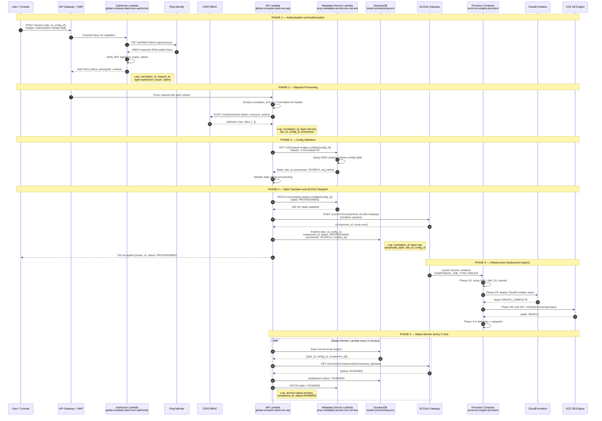
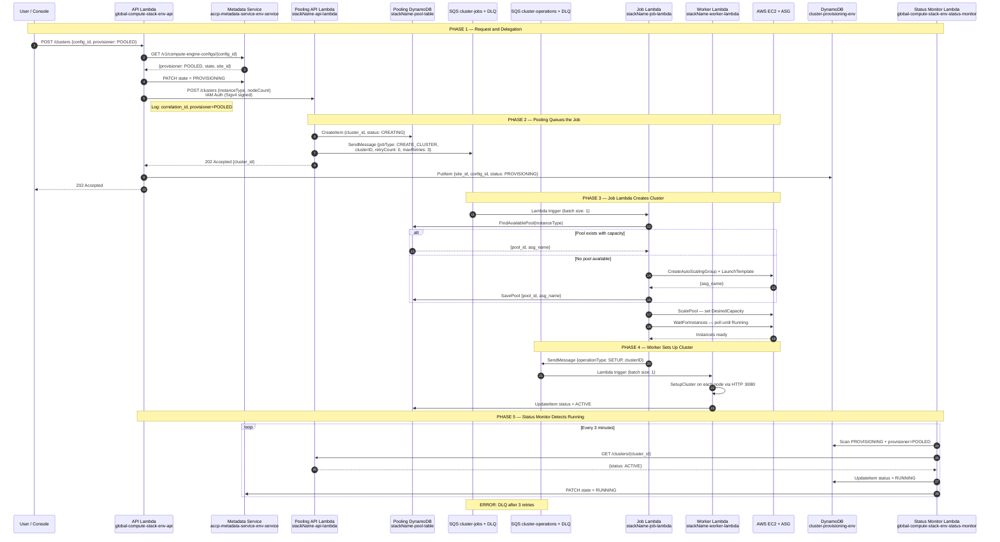
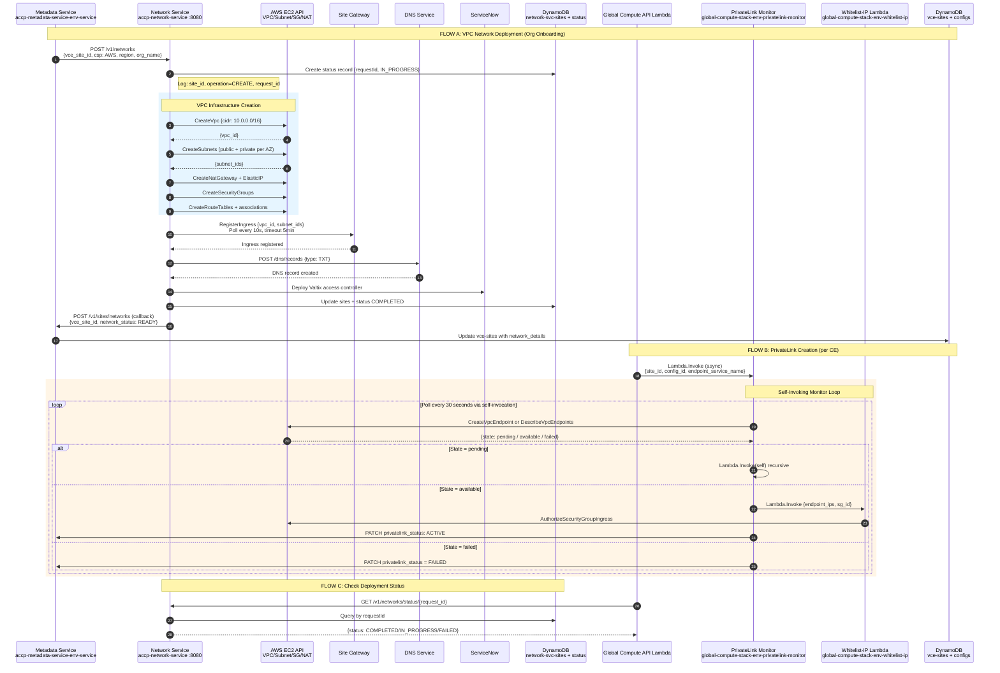
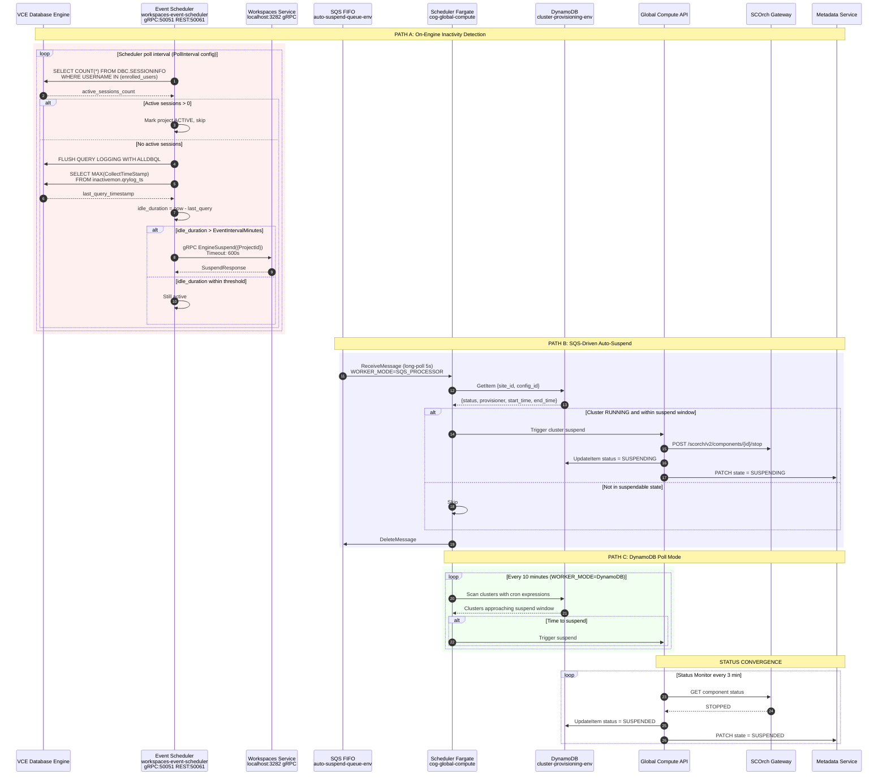
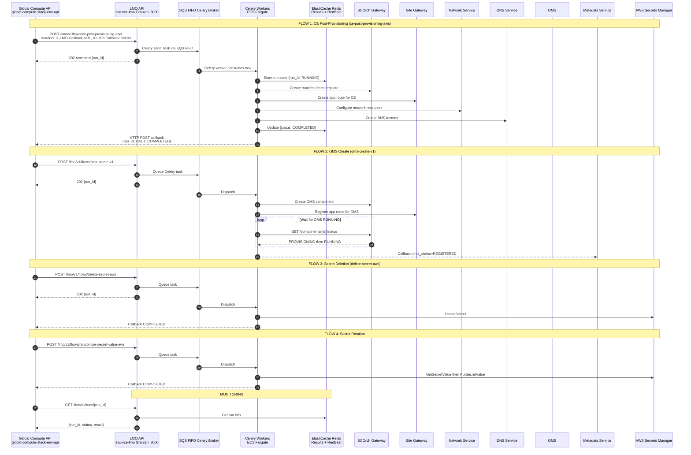
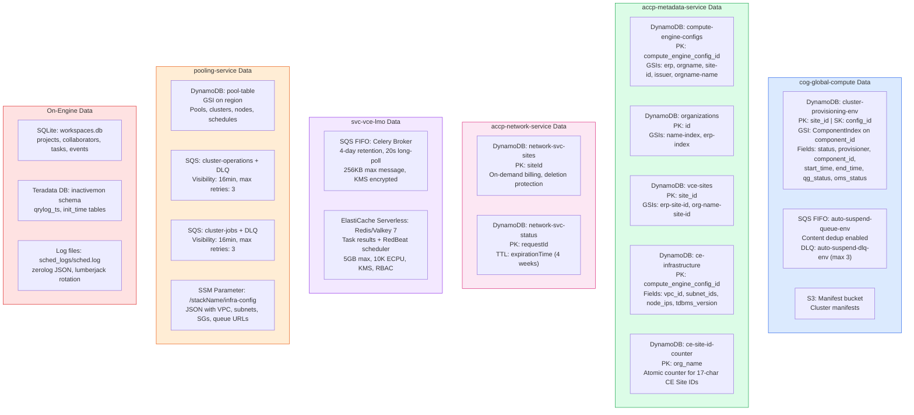

# Compute Engine — Mermaid Diagram Code

All 8 diagrams as importable Mermaid code.

---

## Diagram 1: Complete System Architecture

```mermaid
graph TB
    subgraph EXT["External / User Layer"]
        USER["User / Console UI"]
        PING["Ping Identity IDP / JWKS"]
        SNOW["ServiceNow ITSM"]
    end

    subgraph APIGW["API Gateway Layer"]
        APIGW_GC["API Gateway<br/>cog-global-compute<br/>REST + WAF"]
        APIGW_META["API Gateway<br/>accp-metadata-service<br/>REST"]
        APIGW_POOL["API Gateway<br/>pooling-service<br/>IAM Auth"]
        APIGW_NET["HTTP API Gateway<br/>accp-network-service<br/>VPC Link"]
    end

    subgraph GC["cog-global-compute — Central Orchestrator"]
        GC_AUTH["Authorizer Lambda<br/>JWT Validation<br/>256MB / 30s"]
        GC_API["API Lambda<br/>Cluster CRUD + Config<br/>1024MB / 60s"]
        GC_STATUS["Status Monitor Lambda<br/>CloudWatch Events 3min<br/>2048MB / 15min"]
        GC_PL["PrivateLink Monitor<br/>Self-invoking 30s<br/>Lambda"]
        GC_WL["Whitelist-IP Lambda<br/>Security Group Rules"]
        GC_SCHED["Scheduler<br/>ECS Fargate<br/>SQS or DDB poll"]
        GC_DDB[("DynamoDB<br/>cluster-provisioning-env<br/>PK:site_id SK:config_id")]
        GC_SQS["SQS FIFO<br/>auto-suspend-queue-env"]
    end

    subgraph META["accp-metadata-service — Config and State Store"]
        META_API["Service Lambda<br/>Config/Org/Site CRUD<br/>localhost:5005 dev"]
        META_CCP["Config Change<br/>Processor Lambda<br/>DDB Streams trigger"]
        META_EVT["Event Processor<br/>Lambda<br/>SQS metering events"]
        META_DDB_CFG[("DynamoDB<br/>compute-engine-configs<br/>5 GSIs")]
        META_DDB_ORG[("DynamoDB<br/>organizations<br/>2 GSIs")]
        META_DDB_SITE[("DynamoDB<br/>vce-sites<br/>2 GSIs")]
        META_DDB_INFRA[("DynamoDB<br/>ce-infrastructure")]
        META_DDB_CTR[("DynamoDB<br/>ce-site-id-counter<br/>Atomic counter")]
    end

    subgraph NET["accp-network-service — VPC and Networking"]
        NET_API["Network Service<br/>ECS Fargate :8080<br/>Go REST API"]
        NET_DDB_SITE[("DynamoDB<br/>network-svc-sites")]
        NET_DDB_STATUS[("DynamoDB<br/>network-svc-status<br/>TTL: 4 weeks")]
    end

    subgraph LMO["svc-vce-lmo — Lifecycle Orchestrator"]
        LMO_API["LMO API<br/>Granian :8000<br/>Litestar Python"]
        LMO_WORKER["Celery Workers<br/>ECS Fargate<br/>20+ workflow flows"]
        LMO_SQS["SQS FIFO<br/>Celery Broker"]
        LMO_REDIS[("ElastiCache<br/>Redis/Valkey 7<br/>Results + Scheduler")]
    end

    subgraph POOL["pooling-service — Pooled Clusters"]
        POOL_API["API Lambda<br/>Pool/Cluster REST<br/>512MB / 5min"]
        POOL_WORKER["Worker Lambda<br/>SQS Operations<br/>1024MB / 15min"]
        POOL_JOB["Job Lambda<br/>SQS Jobs<br/>1024MB / 15min"]
        POOL_SQS_OPS["SQS<br/>cluster-operations<br/>+ DLQ"]
        POOL_SQS_JOBS["SQS<br/>cluster-jobs<br/>+ DLQ"]
    end

    subgraph VCE["VCE Engine Build and Deploy Pipeline"]
        BOM["avcd-vce-image-bom<br/>Package BOM<br/>dev.yaml / release.yaml"]
        PACKER["avcd-vce-engine-packer<br/>Packer HCL<br/>AMI / Image Builder"]
        CONFIG["avcd-vce-engine-configure<br/>Salt States to RPMs<br/>Pre/Post Init"]
        PROVISION["avcd-vce-engine-provision<br/>Scorch Container<br/>CloudFormation Deploy"]
    end

    subgraph ENGINE["On-Engine Runtime"]
        WES["workspaces-event-scheduler<br/>gRPC:50051 REST:50061<br/>Inactivity + Telemetry"]
        DB_ENGINE["VCE Database Engine<br/>Teradata TDBMS"]
    end

    subgraph PLATFORM["Platform Services"]
        SCORCH["SCOrch Gateway"]
        CIDS["CIDS — RBAC"]
        CSM["CSM — Secrets"]
        SITEGW["Site Gateway"]
        DNS_SVC["DNS Service"]
        VALTIX["Valtix Firewall"]
        BOOST["Boost OAuth2"]
        SCIM["SCIM Identity"]
    end

    USER -->|"HTTPS REST"| APIGW_GC
    APIGW_GC --> GC_AUTH
    GC_AUTH -->|"JWKS Fetch"| PING
    APIGW_GC --> GC_API
    APIGW_META --> META_API
    APIGW_POOL --> POOL_API
    APIGW_NET --> NET_API

    GC_API -->|"GET/PATCH configs"| META_API
    GC_API -->|"POST /clusters"| POOL_API
    GC_API -->|"Component lifecycle"| SCORCH
    GC_API -->|"RBAC resolve"| CIDS
    GC_API -->|"Site resources"| SITEGW
    GC_API -->|"Async flows"| LMO_API
    GC_API -->|"Credentials"| CSM
    GC_API -->|"R/W state"| GC_DDB
    GC_API -->|"Invoke async"| GC_PL
    GC_API -->|"Invoke"| GC_WL
    GC_STATUS -->|"Scan clusters"| GC_DDB
    GC_STATUS -->|"Poll status"| SCORCH
    GC_STATUS -->|"Poll pooled"| POOL_API
    GC_SCHED -->|"Poll/Receive"| GC_SQS
    GC_SCHED -->|"R/W"| GC_DDB

    META_API -->|"VPC deploy"| NET_API
    META_API -->|"Pooled CRUD"| POOL_API
    META_API -->|"Site lifecycle"| SNOW
    META_API -->|"RBAC"| CIDS
    META_API -->|"Identity"| SCIM
    META_API -->|"Firewall"| VALTIX
    META_API -->|"OAuth2"| BOOST
    META_API --> META_DDB_CFG
    META_API --> META_DDB_ORG
    META_API --> META_DDB_SITE
    META_API --> META_DDB_INFRA
    META_API --> META_DDB_CTR
    META_CCP -->|"Stream"| META_DDB_CFG

    NET_API -->|"Cross-acct"| SITEGW
    NET_API -->|"Status callback"| META_API
    NET_API -->|"DNS records"| DNS_SVC
    NET_API -->|"Valtix deploy"| SNOW
    NET_API --> NET_DDB_SITE
    NET_API --> NET_DDB_STATUS

    LMO_API -->|"Queue tasks"| LMO_SQS
    LMO_SQS --> LMO_WORKER
    LMO_WORKER --> LMO_REDIS
    LMO_WORKER -->|"Components"| SCORCH
    LMO_WORKER -->|"App routes"| SITEGW
    LMO_WORKER -->|"Network"| NET_API
    LMO_WORKER -->|"DNS"| DNS_SVC
    LMO_WORKER -->|"Identity"| SCIM

    POOL_API --> POOL_SQS_OPS
    POOL_API --> POOL_SQS_JOBS
    POOL_SQS_OPS --> POOL_WORKER
    POOL_SQS_JOBS --> POOL_JOB

    BOM -->|"Version specs"| PACKER
    CONFIG -->|"RPM artifacts"| PACKER
    CONFIG -->|"Post-init"| PROVISION
    SCORCH -->|"Launch container"| PROVISION
    PROVISION -->|"CloudFormation + Wait"| DB_ENGINE

    WES -->|"SQL: DBC.QRYLOG"| DB_ENGINE
    GC_SQS -.->|"Suspend signal"| WES

    style EXT fill:#fef3c7,stroke:#d97706
    style GC fill:#dbeafe,stroke:#2563eb
    style META fill:#dcfce7,stroke:#16a34a
    style NET fill:#fce7f3,stroke:#db2777
    style LMO fill:#f3e8ff,stroke:#9333ea
    style POOL fill:#ffedd5,stroke:#ea580c
    style VCE fill:#e0e7ff,stroke:#4f46e5
    style ENGINE fill:#fee2e2,stroke:#dc2626
    style PLATFORM fill:#f0fdf4,stroke:#15803d
    style APIGW fill:#f0f9ff,stroke:#0284c7
```

---

## Diagram 2: Standard (SCORCH) Cluster Provisioning

---

## Diagram 3: Pooled Cluster Provisioning

---

## Diagram 4: Network and PrivateLink Setup

---

## Diagram 5: Auto-Suspend and Inactivity Detection

---

## Diagram 6: LMO Lifecycle Orchestrator Workflows

---

## Diagram 7: VCE Engine Image Build and Deploy Pipeline

```mermaid
graph LR
    subgraph BOM_STAGE["Stage 1: Bill of Materials"]
        BOM_DEV["specs/dev.yaml<br/>Development BOM"]
        BOM_REL["specs/release.yaml<br/>Release BOM"]
        ODIN["Odin CLI<br/>Package Resolver"]
        ARTIF["Artifactory<br/>secondary artifactory domain"]
    end

    subgraph CONFIG_STAGE["Stage 2: Salt Configuration"]
        SALT_PRE["Pre-init Salt States<br/>Run during image bake"]
        SALT_POST["Post-init Salt States<br/>Packaged as RPMs"]
        RPM_COMMON["vce-engine-configure-common.rpm"]
        RPM_AWS["vce-engine-configure-aws.rpm"]
        RPM_AZURE["vce-engine-configure-azure.rpm"]
        RPM_GCP["vce-engine-configure-gcp.rpm"]
    end

    subgraph PACKER_STAGE["Stage 3: Image Building"]
        PACKER_HCL["engine.pkr.hcl<br/>Multi-cloud Packer"]
        subgraph PROV_STEPS["Provisioning Steps"]
            P1["1. Install pre-RPMs<br/>Datadog Qualys Prisma"]
            P2["2. Cloud metadata packages"]
            P3["3. Disk partitions"]
            P4["4. salt-call state.db.initialize<br/>300min timeout"]
            P5["5. Docker + OTF + UDF"]
            P6["6. Security agents"]
            P7["7. Cleanup + finalize"]
        end
        AMI["AWS AMI"]
        AZURE_IMG["Azure Managed Image"]
        GCP_IMG["GCP Image"]
    end

    subgraph DEPLOY_STAGE["Stage 4: Provision via Scorch"]
        RUNNER["runner.sh"]
        subgraph CREATE_PHASES["CREATE Phases"]
            D1["Phase 1: setup<br/>AMI IAM S3 subnet"]
            D2["Phase 2: deploy<br/>CloudFormation"]
            D3["Phase 3: configure<br/>Poll :22222 health"]
            D4["Phase 4: telemetry"]
            D5["Phase 5: viewpoint"]
        end
        CFN["CloudFormation Stack"]
        LAMBDA_ROT["Password Rotation Lambda"]
    end

    subgraph ENGINE_STAGE["Stage 5: Running Engine"]
        ENGINE["VCE Database Engine"]
        WES["Event Scheduler<br/>gRPC:50051 REST:50061"]
    end

    BOM_DEV --> ODIN
    BOM_REL --> ODIN
    ODIN -->|"Fetch packages"| ARTIF
    ARTIF -->|"RPMs"| PACKER_HCL

    SALT_PRE --> RPM_COMMON
    SALT_POST --> RPM_COMMON
    SALT_PRE --> RPM_AWS
    SALT_PRE --> RPM_AZURE
    SALT_PRE --> RPM_GCP
    RPM_COMMON --> PACKER_HCL
    RPM_AWS --> PACKER_HCL

    PACKER_HCL --> P1 --> P2 --> P3 --> P4 --> P5 --> P6 --> P7
    P7 -->|"AWS"| AMI
    P7 -->|"Azure"| AZURE_IMG
    P7 -->|"GCP"| GCP_IMG

    AMI --> RUNNER
    RUNNER --> D1 --> D2 --> D3 --> D4 --> D5
    D2 --> CFN
    D2 --> LAMBDA_ROT
    CFN --> ENGINE
    D5 --> ENGINE
    ENGINE --- WES

    style BOM_STAGE fill:#fef3c7,stroke:#d97706
    style CONFIG_STAGE fill:#dcfce7,stroke:#16a34a
    style PACKER_STAGE fill:#dbeafe,stroke:#2563eb
    style DEPLOY_STAGE fill:#fce7f3,stroke:#db2777
    style ENGINE_STAGE fill:#fee2e2,stroke:#dc2626
```

---

## Diagram 8: Data Store and Queue Map

